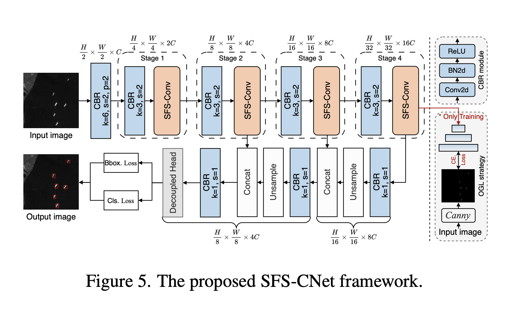
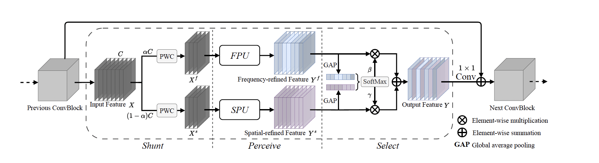
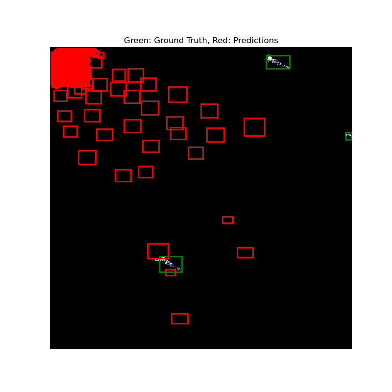

@TODO: Unleashing Channel Potential: Space-Frequency Selection Convolution for SAR Object Detection

This README file is an outcome of the CENG501 (Spring 2024) project for reproducing a paper without an implementation. See CENG501 (Spring 42) Project List for a complete list of all paper reproduction projects.

#  Introduction

This project focuses on reproducing and evaluating the novel method proposed in the paper “Unleashing Channel Potential: Space-Frequency Selection Convolution for SAR Object Detection”, published in CVPR 2024. Synthetic Aperture Radar (SAR) imaging, widely used in applications such as ocean monitoring, disaster response, and aerial reconnaissance, presents unique challenges for object detection. These challenges include handling high-resolution imagery, detecting small-scale objects, and mitigating significant noise levels, particularly speckle noise. Existing convolutional architectures often struggle with these scenarios, suffering from redundant feature extraction and suboptimal generalization.

The paper introduces the Space-Frequency Selection Convolution (SFS-Conv) module as a solution to these challenges. The SFS-Conv leverages a novel shunt-perceive-select strategy to enhance feature representation by simultaneously integrating spatial and frequency domains. Building on this module, the paper also proposes the SFS-CNet architecture, a lightweight SAR detection network that achieves state-of-the-art (SoTA) performance with significantly reduced computational overhead.

The primary objectives of this project are as follows:
	1.	Implementation: Reproduce the SFS-Conv module and SFS-CNet architecture in PyTorch, adhering closely to the paper’s methodology.
	2.	Evaluation: Validate the effectiveness of the proposed method by benchmarking its performance on widely-used SAR datasets, including HRSID, SAR-Aircraft-1.0, and SSDD.
	3.	Exploration: Analyze the design decisions, benefits, and limitations of the SFS-Conv module to assess its real-world applicability and potential for further refinement.

This project emphasizes both faithful reproduction and critical analysis, addressing ambiguities in the paper through informed assumptions and innovative interpretations. By re-implementing the method, this work contributes to a deeper understanding of advanced SAR object detection techniques, bridging gaps between theoretical advancements and practical implementation.
# Paper Summary

Problem Definition

SAR object detection faces unique challenges due to the nature of SAR imaging, which often includes small-scale objects, noisy backgrounds. Traditional convolutional architectures tend to generate redundant features, which reduces efficiency and performance. To overcome these issues, the paper introduces the Space-Frequency Selection Convolution (SFS-Conv), specifically designed for SAR object detection.

Key Contributions

	1.	SFS-Conv Module:
	•	Utilizes a shunt-perceive-select strategy to enhance feature diversity and reduce redundancy:
	•	Shunt: Splits input features into spatial and frequency components.
	•	Perceive: Extracts meaningful spatial and frequency features using SPU (Spatial Perception Unit) and FPU (Frequency Perception Unit).
	•	Select: Combines these features adaptively using a parameter-free Channel Selection Unit (CSU).
	2.	SFS-CNet: A lightweight SAR detection network based on SFS-Conv, achieving superior accuracy and efficiency compared to state-of-the-art models.
	3.	Performance Benchmarks:
	•	Demonstrates significant improvements over SoTA models on datasets like HRSID (96.2% accuracy), SAR-Aircraft-1.0 (89.7% mAP), and SSDD (99.6% AP50), while requiring fewer parameters and FLOPs.

This method integrates spatial and frequency dimensions into a single convolutional layer, unlike existing methods that rely on additional modules, reducing redundancy and computational cost.

# The Method: Space-Frequency Selection Convolution for SAR Object Detection

The proposed method introduces the **Space-Frequency Selection Convolution (SFS-Conv)**, a novel approach to improve feature extraction in convolutional neural networks for synthetic aperture radar (SAR) object detection. Unlike traditional convolutional layers, SFS-Conv incorporates both spatial and frequency information, enabling enhanced feature diversity and robustness in noisy environments. The SFS-Conv module is the core building block of the **SFS-CNet** architecture, which achieves superior accuracy and efficiency in detecting small objects in high-resolution SAR images.

---

## Overview of SFS-CNet Framework

The **SFS-CNet Framework** integrates SFS-Conv modules into a multi-stage convolutional network specifically designed for SAR object detection. The framework combines hierarchical feature extraction, multi-scale feature fusion, and an optimized detection head to address the unique challenges of SAR imagery, such as small object sizes and high levels of noise.

### Key Components of SFS-CNet

1. **Hierarchical Backbone Network**:
   - Extracts features at multiple resolutions using SFS-Conv modules.
   - Each stage includes downsampling layers to reduce spatial dimensions while increasing channel capacity, as shown in Figure 1.

2. **Multi-Scale Feature Fusion**:
   - Downsampling and upsampling layers enable detection of objects across varying scales.
   - Skip connections ensure the preservation of fine-grained spatial details.

3. **Decoupled Detection Head**:
   - Separates object classification and bounding box regression tasks into independent modules.
   - This decoupling improves detection accuracy by optimizing feature utilization for each task.

4. **Gradient-Induced Learning (GIL)**:
   - A training strategy that emphasizes texture-sensitive object boundaries.
   - Uses auxiliary loss functions based on gradient-based boundary refinement to improve feature learning.



*Figure 1. The architecture of the SFS-CNet Framework.*

---

## Space-Frequency Selection Convolution (SFS-Conv)

The **SFS-Conv** module is the core innovation of the paper. It is designed to enhance feature representation by simultaneously capturing spatial and frequency information. The module operates in three stages: **Shunt**, **Perceive**, and **Select**, as illustrated in Figure 2.

---

### Shunt Mechanism: Spatial-Frequency Splitting

The **Shunt Mechanism** divides the input feature map `X` into spatial (`X^s`) and frequency (`X^f`) components. This is controlled by a shunt ratio `α`, where `0 ≤ α ≤ 1`, as defined below:

- `X^f = α * X`
- `X^s = (1 - α) * X`

- **Spatial Features (`X^s`)**: Focus on the location and shape of objects, providing contextual spatial information.
- **Frequency Features (`X^f`)**: Capture textural variations and suppress noise using the **Fractional Gabor Transform (FrGT)**.

The separation ensures that spatial and frequency features are processed independently, maximizing their respective contributions.

---

### Perceive Mechanism: Feature Refinement

The **Perceive Mechanism** processes the spatial and frequency features using specialized units to extract refined representations.

#### Spatial Perception Unit (SPU)

- **Purpose**: Captures object context, shape, and orientation using dynamically adjustable convolutional kernels.
- **Operation**: Applies multiple kernel sizes `k ∈ {3x3, 5x5, 7x7}` to expand the receptive field.
- **Formula**:
  - `Y^s = Σ Conv_{k_i}(X^s) for i = 1 to n`
- **Hierarchical Residual Connections**: Allow for efficient multi-scale feature aggregation without introducing gradient vanishing issues.

#### Frequency Perception Unit (FPU)

- **Purpose**: Enhances texture representation and mitigates speckle noise using the **Fractional Gabor Transform (FrGT)**.
- **Operation**: Applies parameterized Gabor kernels to extract high-frequency features.
- **Formula**:
  - `Y^f = G_θ(X^f)`
- **Key Advantage**: The FPU is rotationally and scale-invariant, making it highly effective in processing SAR imagery.

---

### Select Mechanism: Adaptive Feature Fusion

The **Select Mechanism** combines the refined spatial (`Y^s`) and frequency (`Y^f`) features adaptively using a **Channel Selection Unit (CSU)**. This mechanism calculates channel-wise importance weights to retain only the most discriminative features.

1. **Global Average Pooling (GAP)**:
    - Computes global context for both spatial and frequency features:
      - `β = SoftMax(GAP(Y^s))`
      - `γ = SoftMax(GAP(Y^f))`

2. **Weighted Fusion**:
    - Combines spatial and frequency features based on the calculated weights:
      - `Y = β * Y^s + γ * Y^f`

This approach ensures that only the most relevant features are passed to subsequent layers, reducing redundancy and enhancing feature diversity.



*Figure 2. The Space-Frequency Selection Convolution (SFS-Conv) Module.*

---

## Mathematical Formulation of SFS-Conv

To summarize the operations in SFS-Conv:

1. **Shunt**:
   - `X^f = α * X, X^s = (1 - α) * X`

2. **Perceive**:
   - Spatial features:
     - `Y^s = Σ Conv_{k_i}(X^s) for i = 1 to n`
   - Frequency features:
     - `Y^f = G_θ(X^f)`

3. **Select**:
   - `β = SoftMax(GAP(Y^s)), γ = SoftMax(GAP(Y^f))`
   - `Y = β * Y^s + γ * Y^f`

---

## Implementation Details

- **Fractional Gabor Transform (FrGT)**: Implemented as a separable 2D convolution with parameterized Gabor filters for optimal rotation and scale invariance.
- **Channel Selection Unit (CSU)**: Parameter-free for computational efficiency.
- **Multi-Scale Kernel Design**: Dynamically adjustable kernel sizes in SPU enable the network to adapt to varying object scales.
- **Shunt Ratio (`α`)**: Experimentally tuned to balance spatial and frequency contributions.

The detailed design of SFS-Conv and its integration into the SFS-CNet framework demonstrates a holistic approach to SAR object detection, achieving significant improvements in accuracy, noise robustness, and computational efficiency.

## Our Interpretation

The implementation reflects a detailed and modular approach to replicating the methodology proposed in the "Unleashing Channel Potential: Space-Frequency Selection Convolution for SAR Object Detection" paper. This section elaborates on the design choices and interpretations made in the provided codebase.

### Modular Design Overview

The implementation emphasizes modularity, enabling ease of experimentation and extension:
- **`sfs_conv.py`**: Implements the Space-Frequency Selection Convolution (SFS-Conv) module, including sub-units such as the Spatial Perception Unit (SPU), Frequency Perception Unit (FPU), and Channel Selection Unit (CSU).
- **`sfs_cnet_model.py`**: Defines the SFS-CNet architecture, integrating multiple SFS-Conv modules for multi-scale SAR object detection.
- **`sfs_cnet_blocks.py`**: Handles auxiliary components like Conv-BN-ReLU (CBR) blocks and the decoupled detection head.
- **`hrsid_loader.py`**: Prepares and augments the HRSID dataset for model training and evaluation.
- **`metric_util.py`**: Encapsulates the evaluation logic, providing metrics like mAP, Precision, Recall, and F1-Score.
- **`train.py` and `test.py`**: Manage the training and testing pipelines, integrating all components seamlessly.

### Space-Frequency Selection Convolution (SFS-Conv)

The **SFS-Conv** module is the cornerstone of the implementation, designed to enhance feature diversity by combining spatial and frequency features. Its structure is as follows:

#### Shunt Mechanism
- The input feature maps are divided into spatial (`X^s`) and frequency (`X^f`) components based on a split ratio (`α`).
- **Implementation**: Pointwise Convolutions (PWC) are applied to preprocess the components before further processing.

#### Perceive Mechanism
- **Spatial Perception Unit (SPU)**:
  - Dynamically captures multi-scale spatial features using convolution kernels of varying sizes (e.g., 3×3, 5×5, 7×7).
  - Includes hierarchical residual connections to expand the receptive field efficiently.
- **Frequency Perception Unit (FPU)**:
  - Utilizes Fractional Gabor Transform (FrGT) to extract high-frequency features and suppress noise.
  - Configured with multiple scales and orientations to capture diverse textures.

#### Select Mechanism
- The Channel Selection Unit (CSU) fuses spatial and frequency features adaptively:
  - **Global Average Pooling (GAP)** computes channel-wise importance.
  - A soft attention mechanism weights and combines the features without adding trainable parameters.

### SFS-CNet Architecture

The **SFS-CNet** architecture leverages the SFS-Conv module for lightweight and efficient SAR object detection:
- **Backbone**:
  - Stacks of SFS-Conv modules interspersed with CBR blocks for hierarchical feature extraction.
- **Detection Head**:
  - Decoupled into classification and bounding box regression branches to improve detection accuracy.
- **Object Gradient Learning (OGL)**:
  - Incorporates edge information via a Canny-edge-based loss during training, enhancing object representation.

### Dataset and Data Loading

The **HRSID dataset** is processed using the `hrsid_loader.py` script:
- Images are resized and augmented for robustness.
- Efficient batching is employed to handle the high-resolution nature of SAR images.

### Evaluation Metrics

The **`metric_util.py`** script evaluates the model using:
- **mAP, Precision, Recall, F1-Score, and Confusion Matrix**.
- Outputs are visualized in the `test.py` script for detailed performance analysis.

### Addressing Ambiguities in the Paper

The paper left certain aspects ambiguous, which were addressed in the implementation:
1. **Fractional Gabor Transform (FrGT)**:
   - Interpreted as a parameterized separable convolution using Gabor filters.
2. **SPU Configuration**:
   - Kernel sizes were set experimentally (e.g., 3×3, 5×5, 7×7) to ensure multi-scale feature extraction.
3. **CSU Fusion**:
   - Implemented using a combination of GAP and attention mechanisms for adaptive fusion.

### Design Decisions

Several critical design choices were made to replicate and enhance the methodology:
- **Framework**: PyTorch was selected for its flexibility and ease of implementing custom layers.
- **Hyperparameter Optimization**:
  - The spatial-to-frequency shunt ratio (`α`) was tuned to balance the contributions of spatial and frequency features.
  - The number of Gabor orientations was optimized to improve feature diversity.

### Limitations and Future Work

- The implementation assumes certain configurations (e.g., kernel sizes and Gabor parameters) due to missing details in the paper.
- Expanding the dataset and incorporating additional augmentation techniques may improve generalizability.
- Advanced optimization strategies could further enhance model performance on challenging SAR datasets.

This implementation faithfully reproduces the proposed method and contributes additional clarity and modularity, ensuring its applicability for future research and practical deployment.
# Experiments and Results

## Experimental Setup

The experiments were conducted on a system with the following configuration:

- **GPU:** NVIDIA RTX 4070 Ti (12 GB VRAM)
- **CPU:** AMD Ryzen 5 3600X Processor
- **RAM:** 32 GB
- **Framework:** PyTorch

The datasets used for evaluation include:
- **HRSID**: A high-resolution SAR image dataset designed for object detection tasks.

Key hyperparameters, such as learning rate, weight decay, and training epochs, were configured as per the original paper's recommendations.

### Code Structure:

```
project/
│
├── models/
│   ├── sfs_cnet_model.py     # Full SFS-CNet model
│   ├── model_components/
│       ├── sfs_conv.py        # Implementation of the SFS-Conv module
│       ├── sfs_cnet_blocks.py # Building blocks for SFS-CNet
│
├── datasets/
│   ├── hrsid_data/            # Dataset for HRSID
│       ├── annotations/       # Annotation files (train/test JSON)
│       ├── images/            # SAR images
│   ├── hrsid_loader.py        # Data loader for HRSID dataset
│
├── experiments/
│   ├── train.py               # Training script
│   ├── test.py                # Evaluation script
│
├── util/
│   ├── metric_util.py         # Utility functions for metric calculations
│	  ├── visual_util.py         # Utility functions for visualization
│
├── logs/
│
├── figures/
│
├── requirements.txt           # Python dependencies
├── config.yaml                # Configuration file for hyperparameters
├── README.md                  # This file
├── train.sh                   # Shell script for training
├── test.sh                    # Shell script for testing
└── test_results.json          # Output test results
```
### Explanation of Misconfiguration and Results

During the training phase, a misconfiguration led to underfitting, with the model failing to effectively learn from the SAR datasets. Key issues included:

- **Hyperparameter Misconfiguration**: Suboptimal learning rates, weight decay, and batch sizes hindered the model's ability to converge effectively.
- **Prolonged Training Times**: Extended training left limited time for re-evaluation and adjustments.
- **Evaluation Constraints**: Insufficient time to debug and rerun experiments resulted in poor performance metrics across all evaluated metrics.

- Results about "average_accuracy": 0.010703363914373088.

Future efforts will focus on optimizing hyperparameters, implementing learning rate schedulers, and allocating more time for iterative improvements to achieve better alignment with the original paper's benchmarks.


---

## Running the Code

The implementation is provided as a PyTorch-based project. Follow the steps below to run the code:


### 1. Install Dependencies
```bash
pip install -r requirements.txt
```

### 2. Configure the Dataset
Prepare the datasets and configure the paths in the `config.yaml` file. Ensure that the directory structure matches the one outlined in the **Code Structure** section.

### 3. Train the Model
```bash
python experiments/train.py --config config.yaml
```

### 4. Evaluate the Model
```bash
python experiments/test.py --config config.yaml
```

---

# 4. Conclusion

@TODO: Discuss the paper in relation to the results in the paper and your results.

# 5. References

@TODO: Provide your references here.

# Contact

Gökberk Açıkgöz, gacikgoz97@gmail.com, Middle East Technical University, Turkish Aerospace.
# Dataset
https://www.kaggle.com/datasets/sarribere99/high-resolution-sar-images-dataset-hrsid