# MotionTrack: Learning Robust Short-term and Long-term Motions for Multi-Object Tracking

This readme file is an outcome of the [CENG501 (Spring 2024)](https://ceng.metu.edu.tr/~skalkan/DL/) project for reproducing a paper without an implementation. See [CENG501 (Spring 42) Project List](https://github.com/CENG501-Projects/CENG501-Fall2024) for a complete list of all paper reproduction projects.

# 1. Introduction

This project aims to introduce and implement the paper [MotionTrack: Learning Robust Short-term and Long-term Motions for Multi-Object Tracking](https://arxiv.org/pdf/2303.10404) [1], which was published in CVPR 2023. The goal of this project is evaluate the reproducibility and proposed solution in the paper. The paper introduces a new set of methods for object tracking, especially in crowded places.

Multi Object Tracking is one of the hot topics in computer vision and machine learning spaces. The primary challenge of MOT is deciding on accurate trajectories for objects across frames in video files, especially places like dense crowds. Although there are some existing methods, handling object tracking in dense crowds including lost ones still a problematic subject. Hence, challenges such as Multi Object Tracking (MOT) Challenge started to happen for a few years. This paper also uses MOT datasets to compare the results with several other papers.

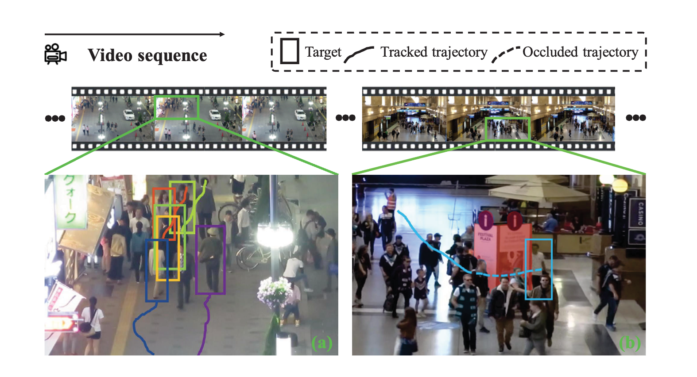

## 1.1. Paper summary

The paper focuses on solving problems in Multi-Object Tracking (MOT), such as keeping track of objects in crowded areas and when they're not visible from the view of the camera. It introduces a method called MotionTrack, which combines two ideas:

- Interaction Module: Helps predict how objects will move in crowded spaces by understanding how they affect each other.
- Refind Module: Helps find and reconnect objects that were lost by using their past movements.

The paper shows that MotionTrack performing better than other methods on two popular datasets (MOT17 and MOT20). Its main contributions are:

- A way to predict movements in crowded areas.
- A way to reconnect lost objects by using their history.
- A method that works well with existing object detection systems.

More details can be found in Section 2.1.

# 2. The method and our interpretation

## 2.1. The original method

MotionTrack solves two main problems in tracking objects:

- Tracking objects between nearby frames (short-range association).
- Reconnecting objects that are lost for a while (long-range association).

It uses an approach called tracking-by-detection, where objects are first detected in each frame and then connected across the video.

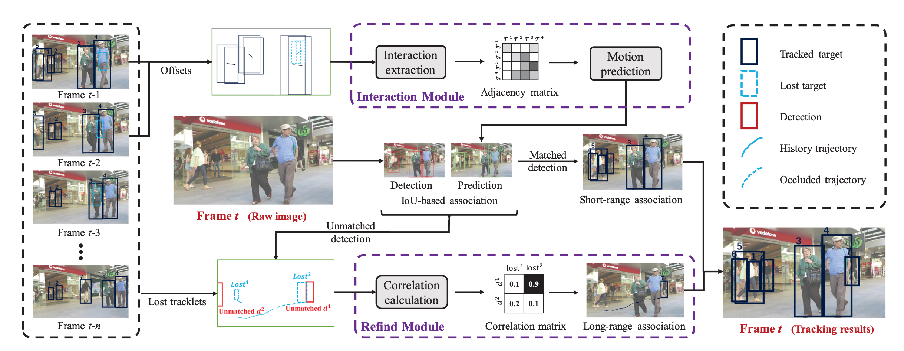

### 2.1.1 Object Detection

In this paper, first frames are processed by YOLOX[2] to detect the location of the items in each frame. Then, the locations of the people detected in each frames, and the delta values between frames are being used to train the algorithm.

### 2.1.2 Interaction Module (Short-range Association)

This module exists specifically for detecting the relation of people between frames. The main goal is detect people not being lost during frames. Refind Module will take the lead of finding the missing people between frames.

- It creates a special matrix to detect how much one person affect each another.
- A type of neural network being used in this matrix to predict how objects will move.
- This makes it easier to track objects that might overlap or partially block each other in crowded scenes.

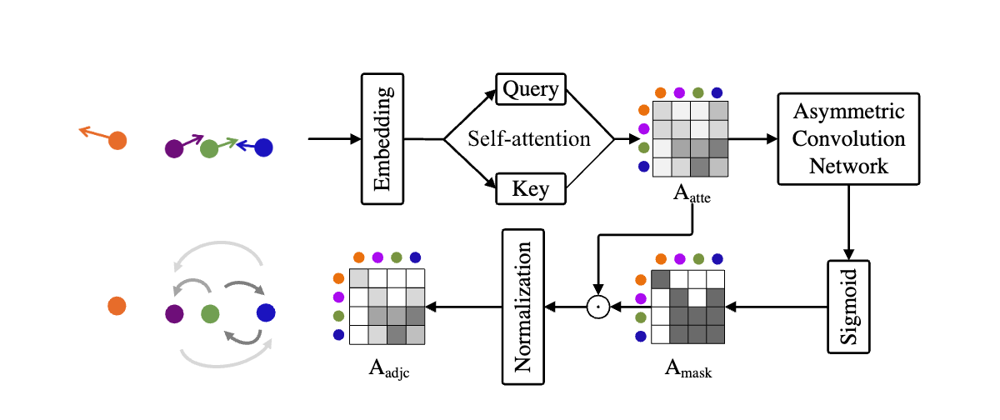

The figure above demonstrates how the interaction module works.

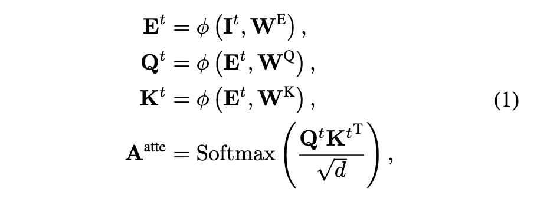

First, an attention mechanism being used for the locations. `I` in here represents the input, namely `x, y, w, h, Δx, Δy, Δw, Δh`.

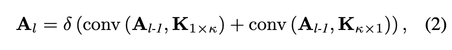

Then, the result of the attention is given to two convolution networks. Then, the results of the convolution networks being added and a PReLu function is applied.

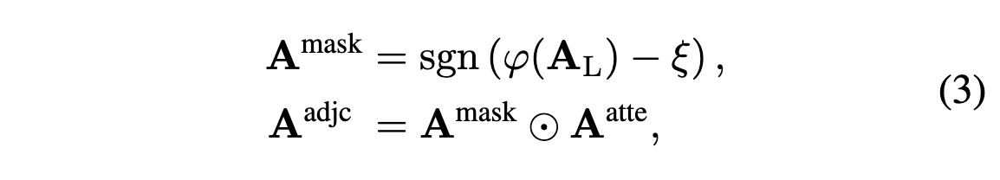

Then, the result of the operation above filtered by a sign function, and done an element-wise multiplication with the result of the attention matrix.

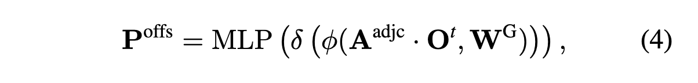

Lastly, the result of this operation is multiplied by the embedding of the `O`. `O` here represents the second part of the data input `I`. Then, the results are given to a PReLu function.

Then, the results are given to a Multi Layer Perception. At the end, we have `Poffs`, which represents the predicted delta values for `Δx, Δy, Δw, Δh` that will be applied for the next frame.

### 2.1.3 Refind Module (Long-range Association)

This module exists specifically for detecting/predicting the lost people during frames. The algorithm uses old behaviors of people to be able to understand and refind the lost people across frames.

- It uses the object’s past movements to calculate a score between the lost object and new detections.
- If a match is found, it fixes the object’s position during the time it was hidden to make the tracking smoother

The result of this module will be given back to interaction module to continue creating relations between frames.

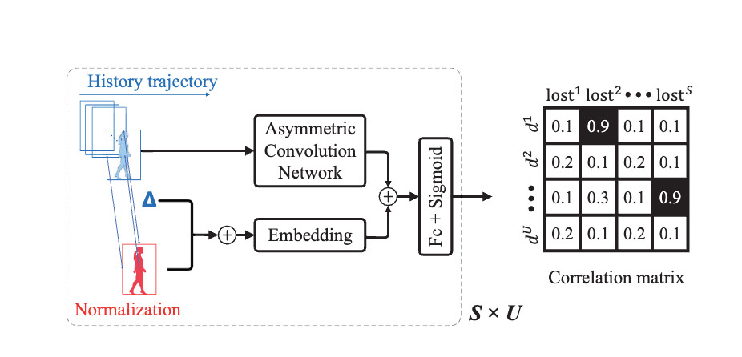

The figure above demonstrates how the correlation matrix work in the refind module.

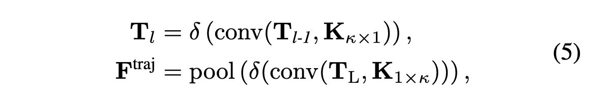

Refind module takes two different data as it's input. The first data `T` includes the lost tracklets between previous and current frame. The second data `D` represents the current non-matches (or newly matched) detections in the current frame. Each data point has 5 values, namely `t, x, y, w, h`. `t` here represents the frame id of where the data belongs.

First, the data `T` is given to a convolution network. Then, the result of this network is given to another convolution network once more, and a pooling algorithm to be applied. This gives us the `Ftraj`.

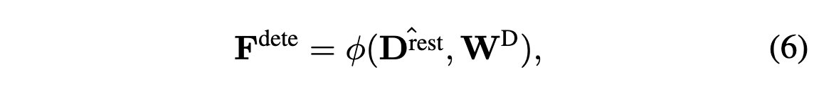

Then, `Drest` is calculated. Drest is the differences between each detection and last known location of each tracklet. Then, a linear transformation applied to get `Fdete`.

Lastly, `Fdete` and `Ftraj` are combined into a future matrix. Then, the future matrix is given to a fully connected layer then a sigmoid function to get the correlation matrix. The correlation matrix here represents the possibility of matches between lost tracklets and detections.

### 2.1.5 Loss Functions

For interaction module, Interaction over Union (IoU) loss function is being used. The exact formula of the function is:

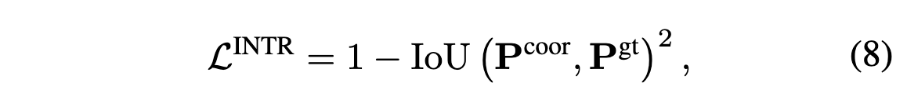

For refind module, a binary cross-entropy function is used for the loss function. In here, a 1-0 matrix is given to calculate this loss.

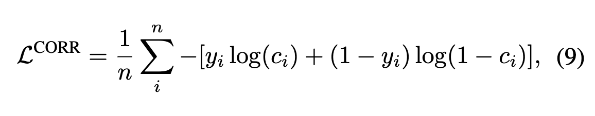

### 2.1.4 Overall Process

- The system uses an object detection model (YOLOX [2]) to find objects in each frame.
- The Interaction Module predicts where objects will move and links them across frames.
- If an object is missing, the Refind Module uses its past movements to find it and reconnect it.
- The system combines all the information to create paths for each object.

## 2.2. Our interpretation

For object detection, in the paper, it's not quite stated which trained version of YOLOX [2] is being used. I've done several tests, and found YOLOX trained with yolox_x dataset performed the best results. I'll be using PyTorch for my implementation for Interaction and Refind modules. The modules are trained by MOT17 and MOT20 datasets, like in the paper.

The formats provided by MOT datasets (MOT17 and MOT20) and the required format by the paper is a bit different. Hence, I've wrote a data conversion script to change the format of the data before starting the training. MOT gives the location (the coordinates) of the people detected in the each frame. However, the implementation requires the both the coordinates and the size of each detection (width and height in the image) should also be given.

We've setup an environment such that first the input is given to the interaction module. Then based on the findings of the interaction module we expect the next position of each tracklet between frames. Then, refind module is run in the pipeline to get the results of locations of loss tracklets.

The pipeline keeps track of each tracklet, whether the item is lost in the frames or not. Due to this, a reset to the memory of the pipeline is necessary for each dataset, since they're representing different frames.

# 3. Experiments and results

## 3.1. Experimental setup

I'm using a MacBook Air M2 with 16 GB of ram with 8 GPUs to setup my environment. I'll be using PyTorch for implementations. The inputs will be first sent to YOLOX for object detection by frame by frame. Then, the two stage machine learning architecture will be used (interaction and refind modules) to find the relationship between frames for each person.

## 3.2. Running the code

### 3.2.1 Setting up YOLOX and Pytorch.

First, one has to setup YOLOX, pytorch and necessary modules to local. Python 3 is required to run the project.

- Install Python 3
- Run `pip3 install -r requirements.txt` to install dependencies.
- Run `git apply` for each patch in the `patches` folder.

We had to create some patches for the YOLOX library to ensure the compatibility of the code with our environment.

### 3.2.2 Downloading Pre-Trained YOLOX

Download a pre-trained version of the YOLOX from [here](https://github.com/Megvii-BaseDetection/YOLOX/blob/main/README.md).

### 3.2.3 Downloading Datasets

Download [MOT17](https://motchallenge.net/data/MOT17/) and [MOT20](https://motchallenge.net/data/MOT20/) datasets. In datasets, `gt.txt` files are being used to train the system.

## 3.3. Results

In the paper, it's not actually stated some details of the implementation, such as:
- How many layers are being used for convolution networks. (It's stated with `N`)
- The details about MLP (Multi Layer Perception)
- How exactly Correlation matrix is calculated from `Ftraj` and `Fdete`.
- How the metrics are calculated.

Hence, We filled those information with the most logical way.

Here are the some difference values we used from the paper

|                                         |                   |           |
|-----------------------------------------|-------------------|-----------|
| Value name                              | Paper             | Us        |
| Sigmoid Threshold in interaction module | 0.6               | 0.5       |
| Tracklet initilization score            | 0.7               | 0.5       |
| Refind module reject threshold          | 0.9               | 0.5       |
| Lost tracklet frame memory size         | 60 and 120 frames | 30 frames |

Here are the training loss of interaction and refind modules.

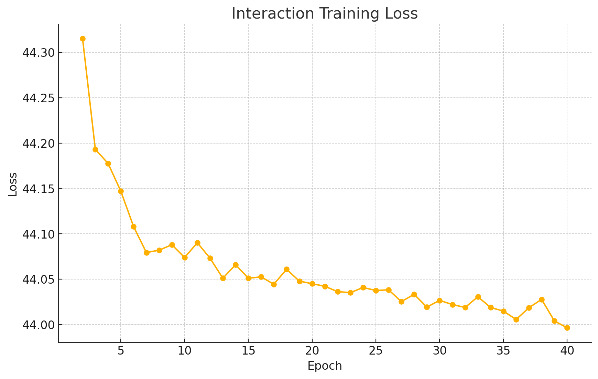

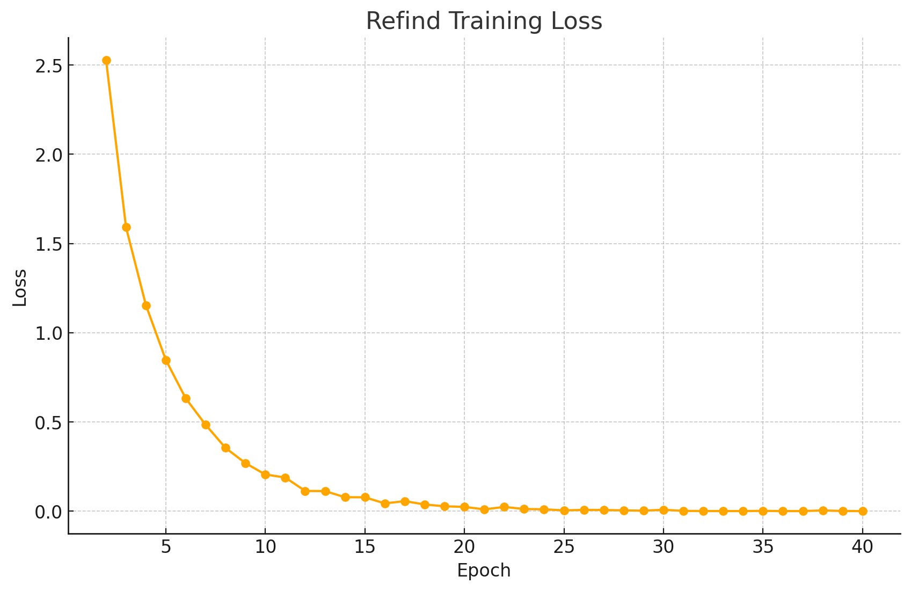

# 4. Conclusion

In this project, we've implemented the paper entitled with "Motiontrack: Learning robust short-term and long-term motions for multi-object tracking". The paper introduced an algorithm to track people in videos for crowded areas. The paper especially introduces state-of-the-art algorithm to detect lost people and refind them in the crowded areas.

Although the paper is mostly implemented, it's quite hard to build the pipeline with 100% compatible with like the paper suggested. First, it's quite hard to connect the inputs and outputs of the modules together, and keep a memory of the tracklets and detections throughout the training. Moreover, since it's hard to compare the results with the actual framework before finishing the two learning models.

The idea that is provided by the paper is a simple but effective idea. This paper basically introduces the algorithm to predict the people behavior by how they're affecting each other, and using this data to connect the lost people in crowded areas. By calculating a projectory for each people, this paper connects the lost tracklets with detections.

# 5. References

1. Qin, Z., Zhou, S., Wang, L., Duan, J., Hua, G., & Tang, W. (2023). Motiontrack: Learning robust short-term and long-term motions for multi-object tracking. In Proceedings of the IEEE/CVF conference on computer vision and pattern recognition (pp. 17939-17948).
2. Zheng Ge, Songtao Liu, Feng Wang, Zeming Li, and Jian Sun., YOLOX: Exceeding yolo series in 2021. arXiv preprint, arXiv:2107.08430, 2021.

# Contact

OZAN AKIN [ozan.akin@metu.edu.tr](mailto:ozan.akin@metu.edu.tr)
