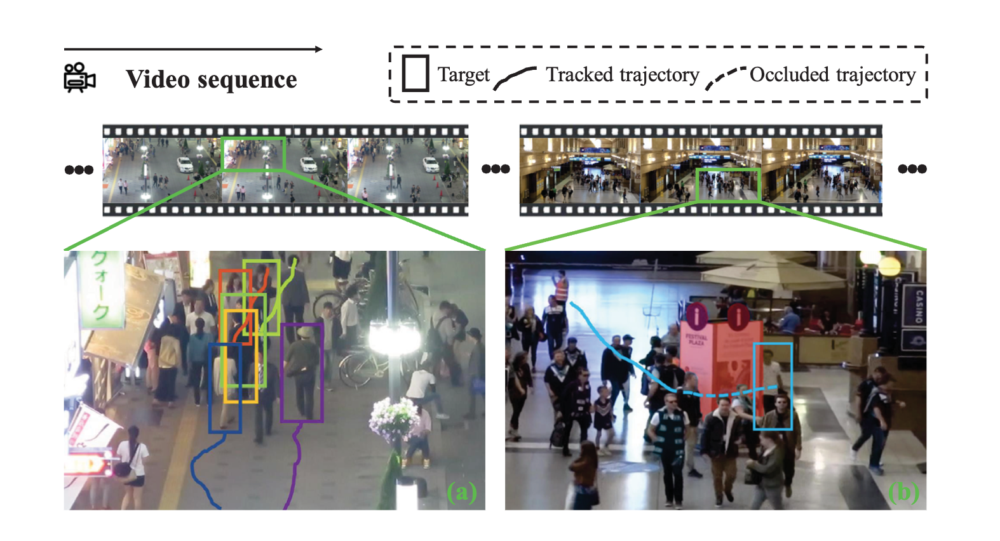
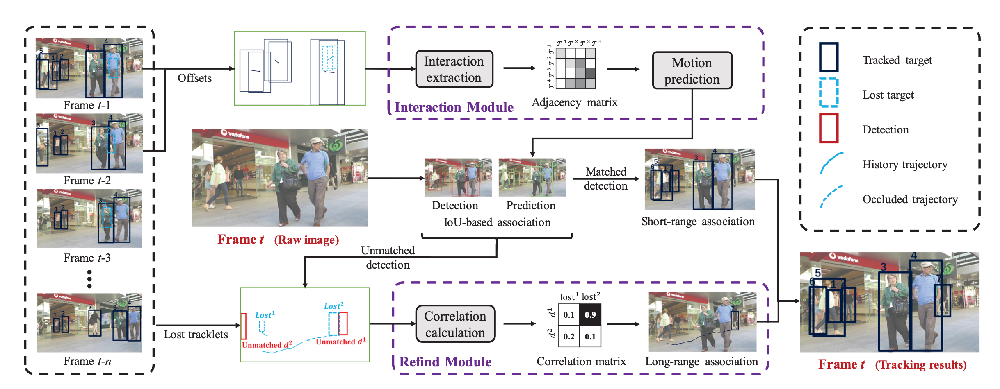

# MotionTrack: Learning Robust Short-term and Long-term Motions for Multi-Object Tracking

This readme file is an outcome of the [CENG501 (Spring 2024)](https://ceng.metu.edu.tr/~skalkan/DL/) project for reproducing a paper without an implementation. See [CENG501 (Spring 42) Project List](https://github.com/CENG501-Projects/CENG501-Fall2024) for a complete list of all paper reproduction projects.

# 1. Introduction

This project aims to introduce and implement the paper [MotionTrack: Learning Robust Short-term and Long-term Motions for Multi-Object Tracking](https://arxiv.org/pdf/2303.10404) [1], which was published in CVPR 2023. The goal of this project is evaluate the reproducibility and proposed solution in the paper. The paper introduces a new set of methods for object tracking, especially in crowded places.

Multi Object Tracking is one of the hot topics in computer vision and machine learning spaces. The primary challenge of MOT is deciding on accurate trajectories for objects across frames in video files, especially places like dense crowds. Although there are some existing methods, handling object tracking in dense crowds including lost ones still a problematic subject. Hence, challenges such as Multi Object Tracking (MOT) Challenge started to happen for a few years. This paper also uses MOT datasets to compare the results with several other papers.

## 1.1. Paper summary

The paper focuses on solving problems in Multi-Object Tracking (MOT), such as keeping track of objects in crowded areas and when they're not visible from the view of the camera. It introduces a method called MotionTrack, which combines two ideas:

- Interaction Module: Helps predict how objects will move in crowded spaces by understanding how they affect each other.
- Refind Module: Helps find and reconnect objects that were lost by using their past movements.

The paper shows that MotionTrack performing better than other methods on two popular datasets (MOT17 and MOT20). Its main contributions are:

- A way to predict movements in crowded areas.
- A way to reconnect lost objects by using their history.
- A method that works well with existing object detection systems.

More details can be found in Section 2.1.

# 2. The method and our interpretation

## 2.1. The original method

MotionTrack solves two main problems in tracking objects:

- Tracking objects between nearby frames (short-range association).
- Reconnecting objects that are lost for a while (long-range association).

It uses an approach called tracking-by-detection, where objects are first detected in each frame and then connected across the video.

### 2.1.1 Object Detection

In this paper, first frames are processed by YOLOX[2] to detect the location of the items in each frame. Then, the locations of the people detected in each frames, and the delta values between frames are being used to train the algorithm.

### 2.1.2 Interaction Module (Short-range Association)

This module exists specifically for detecting the relation of people between frames. The main goal is detect people not being lost during frames. Refind Module will take the lead of finding the missing people between frames.

- It creates a special matrix to detect how much one object affect each another.
- A type of neural network being used in this matrix to predict how objects will move.
- This makes it easier to track objects that might overlap or partially block each other in crowded scenes.

### 2.1.3 Refind Module (Long-range Association)

This module exists specifically for detecting/predicting the lost people during frames. The algorithm uses old behaviours of people to be able to understand and refind the lost people across frames.

- It uses the object’s past movements to calculate a score between the lost object and new detections.
- If a match is found, it fixes the object’s position during the time it was hidden to make the tracking smoother

The result of this module will be given back to interaction module to continue creating relations between frames.

### 2.1.4 Overall Process

- The system uses an object detection model (YOLOX [2]) to find objects in each frame.
- The Interaction Module predicts where objects will move and links them across frames.
- If an object is missing, the Refind Module uses its past movements to find it and reconnect it.
- The system combines all the information to create paths for each object.

## 2.2. Our interpretation

For object detection, in the paper, it's not quite stated which trained version of YOLOX [2] is being used. I've done several tests, and found YOLOX trained with yolox_x dataset performed the best results. Moreover, the dataset will be using to train the interaction and refind modules data also performs much better results. Due to this, I'll be looking into more detailed/better performing trained models for my YOLOX setup.

I'll be using PyTorch for my implementation for Interaction and Refind modules. The modules are trained by MOT17 and MOT20 datasets, like in the paper. If I'll have some time, I'll also doing some extra training with other datasets to see how it effect the results from the paper.

# 3. Experiments and results

## 3.1. Experimental setup

I'm using a MacBook Air M2 with 16 GB of ram with 8 GPUs to setup my environment. I'll be using PyTorch for implementations.

## 3.2. Running the code

@TODO: Explain your code & directory structure and how other people can run it.

## 3.3. Results

@TODO: Present your results and compare them to the original paper. Please number your figures & tables as if this is a paper.

# 4. Conclusion

@TODO: Discuss the paper in relation to the results in the paper and your results.

# 5. References

1. Qin, Z., Zhou, S., Wang, L., Duan, J., Hua, G., & Tang, W. (2023). Motiontrack: Learning robust short-term and long-term motions for multi-object tracking. In Proceedings of the IEEE/CVF conference on computer vision and pattern recognition (pp. 17939-17948).
2. Zheng Ge, Songtao Liu, Feng Wang, Zeming Li, and Jian Sun., YOLOX: Exceeding yolo series in 2021. arXiv preprint, arXiv:2107.08430, 2021.

# Contact

OZAN AKIN [ozan.akin@metu.edu.tr](mailto:ozan.akin@metu.edu.tr)
