# IFL-GAN: Improved Federated Learning Generative Adversarial Network With Maximum Mean Discrepancy Model Aggregation

This readme file is an outcome of the [CENG501 (Fall 2024)](https://ceng.metu.edu.tr/~skalkan/DL/) project for reproducing a paper without an implementation. See [CENG501 (Fall 2024) Project List](https://github.com/CENG501-Projects/CENG501-Fall2024) for a complete list of all paper reproduction projects.

# 1. Introduction
Generative Adversarial Networks (GANs) are powerful generative models that simulate data distributions by training a generator-discriminator pair in a competitive setting. However, traditional GANs often require centralized and independent, identically distributed (i.i.d.) training data, which is impractical in many real-world scenarios. Data is often distributed among multiple clients and is non-i.i.d., posing challenges for effective GAN training.

Federated Learning (FL) has been applied to address this issue by training GANs in a decentralized manner. Existing approaches, like Federated Learning GAN (FL-GAN), aggregate updates using Federated Averaging (FedAvg), but this method suffers in non-i.i.d. cases, leading to poor convergence and low-quality outputs.

This paper proposes Improved Federated Learning GAN (IFL-GAN), which uses Maximum Mean Discrepancy (MMD) to aggregate updates, assigning weights based on local GAN convergence status. This approach achieves faster training convergence and higher-quality outputs on non-i.i.d. datasets.

## 1.1 Paper Summary
The contributions of the paper can be summarized as:

- A novel framework called IFL-GAN that replaces federating average strategy (FedAvg) with MMD for aggregating local GAN updates, improving performance in non-i.i.d. data settings.
- Theoretical and empirical comparisons of MMD and FedAvg aggregation methods.
- Extensive experimental validation showing superior performance in terms of data diversity and quality across MNIST, CIFAR10, and SVHN datasets.
The IFL-GAN system model is depicted in Figure 1:

<p align="center">
  <br>
  <em>Figure 1: IFL-GAN system model</em>
</p>
 

# 2. Methodology
## 2.1. Key Concepts

### Generative Adversarial Networks
Generative Adversarial Networks (GANs) consist of two neural networks: a Generator (G) and a Discriminator (D), trained in an adversarial manner. The generator creates synthetic data, while the discriminator attempts to distinguish between real and generated data. The GAN objective function is:

$$min_G  max_D V(G, D) = E_{x ~~ p_r(x)} [log D(x)] + E_{z ~~ p_z(z)} [log (1 - D(G(z)))]$$

Where:

$D(x)$: Probability that x is a real data sample.

$G(z)$: Synthetic data generated from input noise z.

$p_r(x)$: Real data distribution.

$p_z(z)$: easy-to-sample Noise distribution (e.g., Gaussian or uniform).

### Federated Learning for GANs
Federated Learning (FL) enables decentralized training across multiple clients without transferring raw data, preserving privacy. Instead, clients train local models and share their updates with a central server. However, training GANs in a federated setting introduces challenges such as:

- Non-i.i.d. Data: Data across clients often have unique distributions.

- Stability Issues: The adversarial nature of GANs makes distributed training more complex.
FL-GAN extends federated learning to GANs by aggregating updates from multiple local GANs to train a global GAN.

### Federated Learning GAN (FL-GAN)
FL-GAN uses a Federated Averaging (FedAvg) strategy to aggregate updates from local GANs into a global GAN model. Each client maintains a local GAN, with a generator (G_i) and a discriminator (D_i).

FL-GAN Objective Function:
The FL-GAN training objective is:

$min_G max_D V(G, D) = (1/K) * Σ_{i=1}^{K} [E_{x ~ p_{r_i}(x)} log D_i(x) + E_{z ~ p_z(z)} log (1 - D_i(G_i(z)))]$

Where:

$K$: Number of clients.

$G_i, D_i$: Local generator and discriminator for client i.

$p_{r_i}(x)$: Real data distribution for client i.

$G_i(z)$: Data generated by the local generator for client i.

### Challenges in FL-GAN
Despite its utility, according to the writers FL-GAN faces several challenges:

Non-i.i.d. Data: FedAvg assumes equal contribution from all clients, which is ineffective when data distributions vary.

Convergence Instability: Aggregating updates from clients with different convergence statuses can destabilize training.

Low Diversity: Uniform weighting may reduce diversity and fidelity in generated data.

These limitations motivate the development of Improved Federated Learning GAN (IFL-GAN), which uses Maximum Mean Discrepancy (MMD) for weighted aggregation to address these issues effectively.

## 2.1.1 IFL-GAN

IFL-GAN introduces an MMD-based mechanism to aggregate local GAN updates, assigning weights dynamically based on each local GAN's convergence status. 

$min_G max_D V(G, D) = (1/K) * Σ_{i=1}^{K} α_i * [E_{x ~ p_{r_i}(x)} log D_i(x) + E_{z ~ p_z(z)} log (1 - D_i(G_i(z)))]$

Unlike traditional Federated Averaging (FedAvg), which equally weights updates ($α_i={1/K}$ for all i), this method ensures that poorly converged models contribute more to the global model, leading to better stability and quality of generated data in non-i.i.d. settings. The pseudocode for the algorithm is shared in Figure 2.

<p align="center">
  <br>
  <em>Figure 2: IFL-GAN Algorithm</em>
</p>

## 2.1.2. IFL-GAN Algorithm Steps

Step 1: Initialization
A global GAN model is initialized, consisting of a generator $G_{global}$, and a discriminator $D_{global}$. The global model parameters are distributed to all $K$ clients.

Step 2: Local Training
Each client trains its local GAN on its private, potentially non-i.i.d. dataset: 

1. For client $i$, a local generator $G_i$ and a discriminator $D_i$ are initialized with the global model parameters.
   
2. The local GAN is trained using the standard GAN objective function:
   
3. After a fixed number of local training epochs, the client sends the updated parameters $\theta_{G_i}$ (from the generator) and $\theta_{D_i}$(from the discriminator) to the central server.

Step 3: MMD-Based Model Aggregation
The server aggregates the local model updates using Maximum Mean Discrepancy (MMD):

1. Compute the MMD score for each client's local generator: $MMD_i = MMD(p_{r_{\text{global}}}, p_{r_i})$
2. Convert MMD scores into aggregation weights: $α_i = exp(-MMD_i) / Σ_{j=1}^{K} exp(-MMD_j)$
3. Update the global generator parameters: $θ_{G_{\text{global}}} = Σ_{i=1}^{K} α_i * θ_{G_i}$

Step 4: Discriminator Aggregation
For the discriminator, the server aggregates updates similarly, though discriminator-specific adjustments may apply.

Step 5: Synchronization
The updated global generator $G_{global}$ and discriminator $D_{global}$ are sent back to all clients, replacing their local models:
$G_i = G_{\text{global}}, D_i = D_{\text{global}}, for i in [1, K]$

## 2.2. Our interpretation

  The overall aim of the work is represented thoroughly in the paper. However, the basic model that is tried to be improved upon, namely the FL-GAN is not discussed algorithm-wise. So it has been decided that to create a better understanding of the idea a more modular approach should be followed. In this part, the nuances will be discussed and in the experimental setup part (Part 3), the modularity will be shared.

1. The Discussion of the Method of FL-GAN
  As discussed in the previous chapters, the aim of studying GANs using the framework of federated learning is to fully utilize the distributed data across different devices for learning purposes. Thus, the results obtained from FL-GAN are used as a benchmark for the performance comparison of IFL-GAN in the paper. As this is going to be the first GAN and Federated Learning implementation of the author of this repository, it is decided that the GAN structure should be studied briefly. After that, the iid local dataset division, client model aggregation and global parameter distribution mechanisms are decided to be introduced to the basic model for FL-GAN application.

2. Shared Architectural Details
   In figure 3, the architectural details used in the study are shared. In detail, the IFL-GAN framework has been tried on three different datasets: MNIST, CIFAR10, and SVHN datasets. These are divided into non-iid groups to simulate local datasets of the users. However, according to the supposed data input dimensions, the architectures shared in figure 3 are not consistent. For instance, a data from MNIST dataset is a 28x28 grayscale image but the discriminator architecture is started with a 1x28 fully connected layer. So, it is decided that to get ahold of the GAN model first, a proven GAN structure is going to be used until the original idea is understood. Also, in [2], deep convolutional networks are introduced such that fully connected hidden layers are removed for deeper architectures. Such models can be trained on edge devices for better performance as well.

   <p align="center">
  <br>
  <em>Figure 3: Architectural Details of IFL-GAN </em>
</p>


# 3. Experiments and results

## 3.1. Experimental setup

As shared in part 2.2, it is decided that since the IFL-GAN consists of a number of locally trained GANs, firstly some variations of different GAN networks are studied. 
### First Experiment with Central GAN

#### Objective and Architecture
Generator: Converts random noise (NOISE_DIM=100) into realistic 28x28 images using layers of linear transformations, reshaping, transposed convolutions, batch normalization, ReLU, and Tanh activations.

Discriminator: Distinguishes real images from fake ones using convolutional layers, batch normalization, and LeakyReLU activation, outputting a single probability value.

#### Experimental Setup
Dataset: MNIST, normalized to [-1, 1].
Hyperparameters: Learning rate = 0.0002, batch size = 256, Adam optimizer with betas = (0.5, 0.999).

#### Training Procedure
- Train Discriminator:

Calculate loss (real_loss) for real images.
Calculate loss (fake_loss) for fake images.
Minimize combined loss (real_loss + fake_loss).

- Train Generator:

Generate fake images and calculate loss (gen_loss) based on discriminator output.
Update the generator to maximize the discriminator’s error on fake images.

#### Hypothesis
Loss Trends:
Discriminator loss is expected to start high relatively, then decreases as it improves.
Generator loss decreases as generated images become realistic.
In the ideal case, both losses should converge to 50%.

#### Results

1- Generator and Discriminator Losses during 100 Epochs


2- Images after 2nd, 11th and 100th Epochs


<div style="display: flex; flex-direction: row; gap: 20px;">
    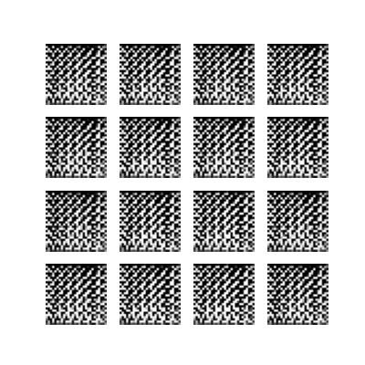
    <p><em>Images after 2nd Epoch</em></p>
    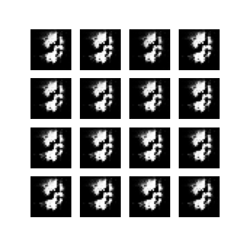
    <p><em>Images after 11th Epoch</em></p>
    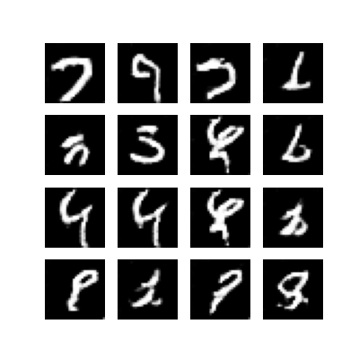
    <p><em>Images after 100th Epoch</em></p>
</div>


### Experiment with MD-GAN, FL-GAN and IFL-GAN

#### MD-GAN (Multi-Discriminator GAN)
Purpose: Introduces multiple discriminators to enhance training stability and improve the quality of generated data.
Architecture: Instead of a single discriminator, MD-GAN uses multiple discriminators, each learning different aspects or features of the data distribution. 

#### FL-GAN (Federated Learning GAN)
Purpose: Combines GANs with Federated Learning to train models across distributed devices without sharing raw data.
Architecture: Each participant device has its own local GAN (a generator and a discriminator). Model updates are aggregated and sent to a central server, enabling collaborative training while preserving data privacy. The aggregated model parameters are averaged to create the global generator parameters for the next iteration.

#### IFL-GAN (Improved Federated Learning GAN)
Purpose: IFL-GAN builds upon traditional Federated Learning GAN (FL-GAN) concepts by adding a refined mechanism(MMD) for combining and updating local generators across multiple clients.

Architecture: Each participant device has its own local GAN (a generator and a discriminator). After local training, each client computes a Maximum Mean Discrepancy (MMD) score by comparing real data samples against the locally generated samples.These MMD scores capture how well each local generator matches its client’s data distribution. Each client compares its MMD score with a threshold; if the client’s MMD is above the threshold (indicating a poorer fit), it replaces its local generator $𝐺_𝑖$ with the newly formed global generator $𝐺_{glb}$.

According to the results shared in the paper, the hypothesis and experimental structure is decided as follows:
#### Hypotheses

1- Performance Across Different Client Numbers
We hypothesize that increasing the number of clients (i.e., moving from k=2 to k=5 to k=10) in federated learning settings will have varying effects on performance depending on the GAN architecture (MDGAN, FLGAN, or IFLGAN). Specifically, we anticipate that IFLGAN will be more robust than MDGAN and FLGAN as the number of clients grows, owing to its ability to better aggregate gradients and capture global data distributions.

2- Robustness to Data Imbalance
When moving from balanced datasets to imbalanced and extremely imbalanced datasets, we hypothesize that IFLGAN will maintain higher fidelity in generated data and exhibit lower performance degradation than MDGAN and FLGAN. This is because IFLGAN is designed to mitigate divergence caused by heterogeneous data distributions and to reduce the negative effects of highly skewed data partitions across different clients.

3- Impact on Convergence and Stability
Finally, we hypothesize that the federated approach with carefully designed aggregation (IFLGAN) will converge more stably than the simpler distributed methods (MDGAN or FLGAN) as it handles partial updates more effectively. In other words, while MDGAN and FLGAN may converge faster in some cases, IFLGAN will yield more consistent and reliable convergence trends across different levels of data imbalance.

### Training Procedure
Dataset: MNIST divided into K = 2,5 with partitioning the numbers sequentially (number of clients) parts, normalized to [-1, 1].

### Balanced Scenario:

In the balanced case, each client (or “worker”) receives roughly the same number of samples for its assigned digits. For instance, if each client is supposed to handle certain MNIST digits:

#### K=2:
- Client 1 might get digits {0, 1, 2, 3, 4} (10,000 samples) 
- Client 2 might get digits {5, 6, 7, 8, 9} (10,000 samples)

#### K=5:
- Each of the 5 clients receives up to 10K samples from their assigned digit groups. For example, Client 1 = {0,1}, up to 10K samples, Client 2 = {2,3}, up to 10K samples and so on...

### Imbalanced Scenario:

In the imbalanced case, one client (often the first client) gets significantly more samples than the others. The standard approach in our code is:

Client 1 gets up to 10K samples.All other clients get a smaller limit (for example, 1K). This intentionally skews the dataset distribution so that:

#### K=2:
- Client 1 (digits {0,1,2,3,4}) => 10,000 samples
- Client 2 (digits {5,6,7,8,9}) => 1,000 samples

#### K=5:
- Client 1 => 10K samples
- Clients 2..5 => 1K each

### Hyperparameters (for all models): 
- Learning rate = 0.0002
- Batch size = 128
- Adam optimizer with betas = (0.5, 0.999).

## 3.2. Running the code

Each model implementation is included in its .py file with the same name. The models are trained on Google Colab with runtime type as "Python 3" and for faster implementation, the hardware accelerator can be chosen as "T4-GPU". At each 5 epochs, the created images by the global generator are saved to the path "/content/ifl-gan-images", "/content/generated_images", "/content/mdgan_generated_images", respectively.
### Prerequisites
Python 3.7+ (earlier versions might work, but are not tested)
PyTorch >= 1.7 (ensure CUDA is available if you plan to use GPU)
Additional Python packages:
- torchvision
- numpy
- matplotlib
- pandas
- Optional: GPU/CUDA for faster training.
Make sure your environment meets these requirements before installing and running the code.

### Usage
Running the Models
We have three main federated GAN implementations in the repository:
MD-GAN: mdgan.py
FL-GAN: flgan.py
IFL-GAN: iflgan.py
Each script provides an entry point via a main section or a dedicated function for training and testing.

### Configuration Options
Most scripts include parameters you can customize, typically near the bottom of each file or as command-line arguments:

- num_clients (k=2, 5, or 10): Number of federated clients.
- case: Data split scenario: "balanced", "imbalanced", or "extremely_imbalanced".
- epochs: Total training epochs.
- batch_size: Mini-batch size for training.
- lr: Learning rate.
- noise_dim: Dimensionality of the generator’s latent space.
- sigma: (Only in IFL-GAN) Parameter for the MMD kernel.
Adjust these in the source code at the end of the code.

Example:

```
if __name__ == "__main__":
    # Example usage:
    ifl_gan = IFLGAN(
        noise_dim=128, 
        case="balanced",     # or "imbalanced", "extremely_imbalanced"
        num_clients=5,       # 2, 5, or 10
        batch_size=128, 
        lr=0.0002
    )
    ifl_gan.ifl_training(epochs=200, sigma=1.0)
```

## 3.3. Results


### Client K=2, Balanced
   <p align="center">
  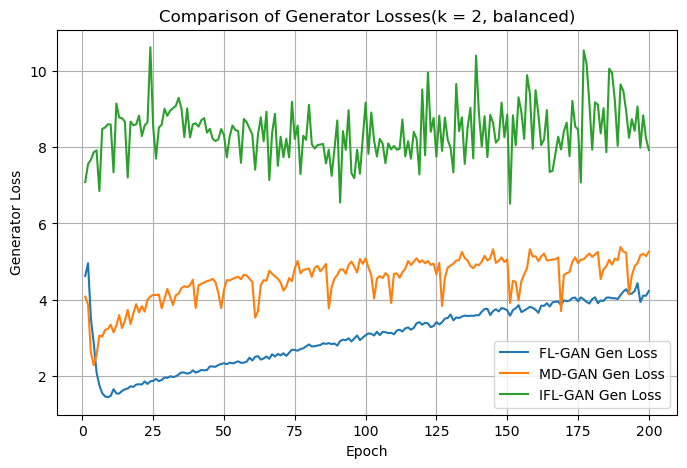<br>
  <em>Figure 7: Generator loss, balanced dataset, K=2 clients</em>
</p>
   <p align="center">
     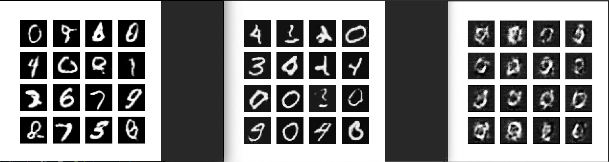<br>
     <em>Figure 8: Generator results (FL-GAN, IFL-GAN, MD-GAN), balanced dataset, K=2 clients</em>
</p>

### Client K=2, Imbalanced
   <p align="center">
  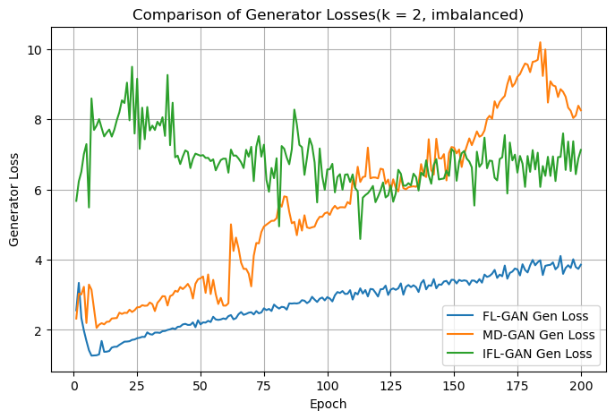<br>
  <em>Figure 9: Generator loss, imbalanced dataset, K=2 clients</em>
</p>
<p align="center">
     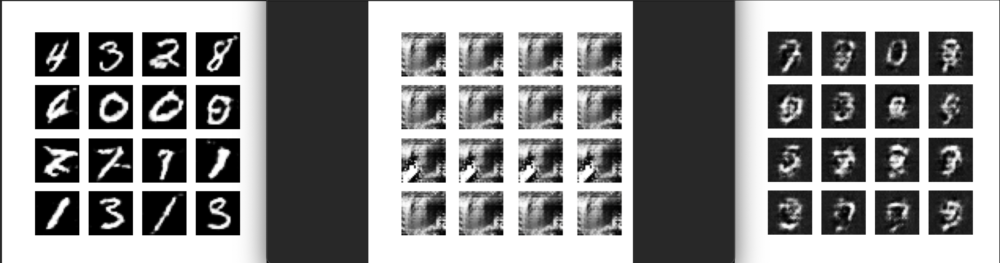<br>
     <em>Figure 10: Generator results (FL-GAN, IFL-GAN, MD-GAN), imbalanced dataset, K=2 clients</em>
</p>

### Client K=5, Balanced
   <p align="center">
  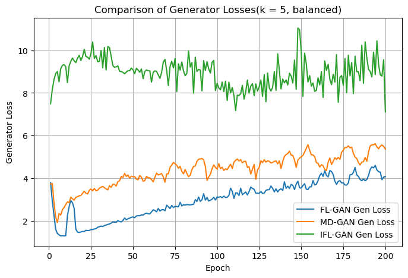<br>
  <em>Figure 11: Generator loss, balanced dataset, K=5 clients</em>
</p>
<p align="center">
     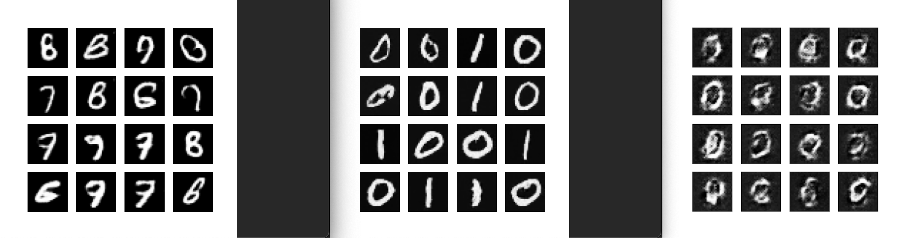<br>
     <em>Figure 12: Generator results (FL-GAN, IFL-GAN, MD-GAN), balanced dataset, K=5 clients</em>
</p>

### Client K=5, Imbalanced
   <p align="center">
  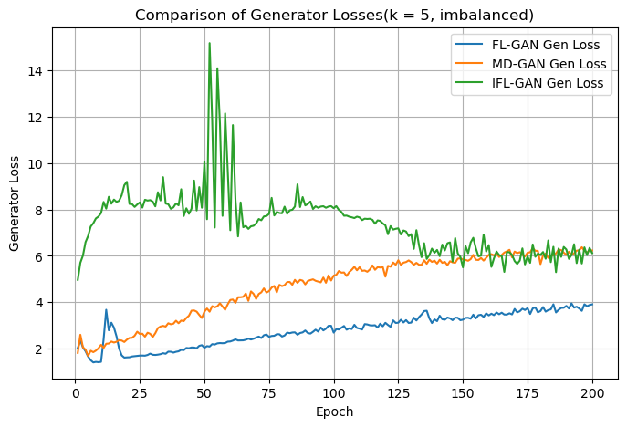<br>
  <em>Figure 13: Generator loss, imbalanced dataset, K=5 clients</em>
</p>
<p align="center">
     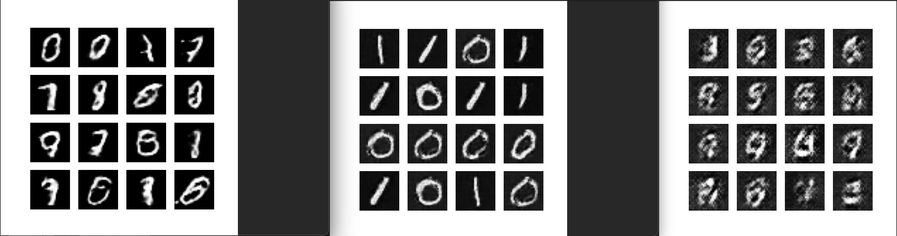<br>
     <em>Figure 14: Generator results (FL-GAN, IFL-GAN, MD-GAN), imbalanced dataset, K=5 clients</em>
</p>

## Results from the Paper

<p align="center">
  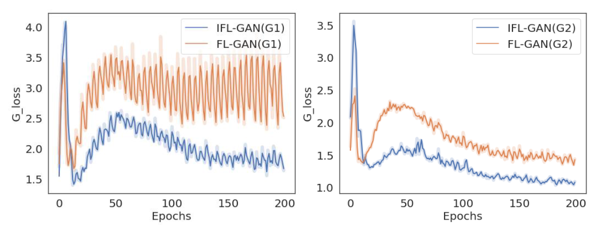<br>
  <em>Figure 15: Generator loss, balanced and imbalanced datasets, K=2 clients</em>
</p>

<p align="center">
  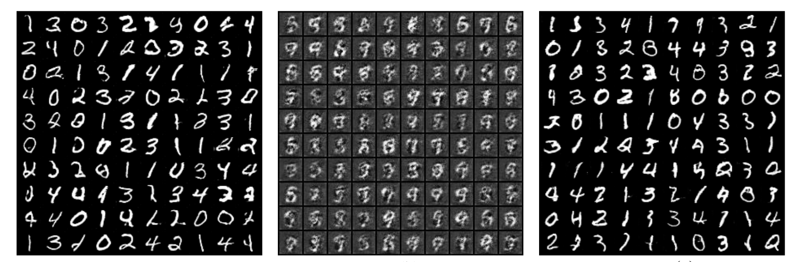<br>
  <em>Figure 16: Generator results (FL-GAN, IFL-GAN, MD-GAN), K=2 clients</em>
</p>

<p align="center">
  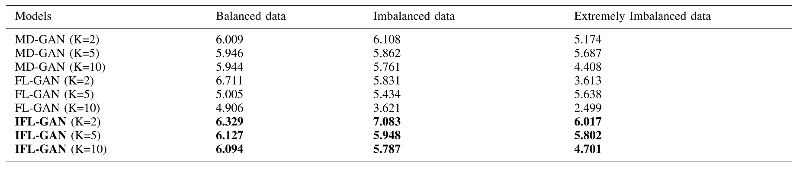<br>
  <em>Figure 17: MNIST Scores (FL-GAN, IFL-GAN, MD-GAN)</em>
</p>

# 4. Conclusion

In this part, the results shared are discussed from the perspective of the hypotheses created from the paper.

## Summary of the work:

Unlike the results shared in the paper and the expectation of the hypothesis 1, the generator loss of IFL-GAN was always the highest between other architectures. The design of the models and the choices for the parameters were at first aligned with the shared ones in the paper, but the poor results have given the encourage to change them accordingly. After settling on the sufficient results of FL-GAN with the priori knowledge of it as the worst model among the three, it was expected that other models would perform better. But that was not the case. In fact, in nearly every scenario it performed the best, both image-wise and loss-wise. Only at the imbalanced case with 5 clients, IFL-GAN showed superiority of converging, but it suffered from imbalanced data from client 1.

1- Performance Across Different Client Numbers
In the paper, it was discussed that FL-GAN had performed the worst in MNIST dataset, which can be seen in figures 15 and 17. However, in FL-GAN, one trains both local generators and discriminators, and intuition should be towards that it should be converging relatively faster than MD-GAN, which was supported by the results: since for the same number of epochs, the number of models trained is larger than MD-GAN, in which only one global generator is trained. 

2- Robustness to Data Imbalance
It was expected that directly averaging the local parameters in FL-GAN would perform worst than IFL-GAN, but in light of the results, especially in the imbalanced cases, the MMD mechanism inside the IFL-GAN architecture couldn't prevent the global model from overfitting to the dataset of the client with the largest-numbered dataset of 0's and 1's. Simple averaging mechanism of both MD-GAN and FL-GAN seems to cope with imbalanced data while MD-GAN generator fell short on converging. 

3- Impact on Convergence and Stability

Loss-wise, none of the loss graphs showed the expected 50% rate theoretical loss convergence of the generator. In addition, during the research phase, it was mentioned a number of times that instead of looking at the loss for the performance of the GAN, it is better to print the images that the model is trained to generate. This perspective have influenced the approach of examining the performance of the models and the results. It was observed that FLGAN converged faster (around 100 epochs) in all of the  cases, MD-GAN showed that parameter tuning is still necessary for obtaining meaningful results, and IFL-GAN presented unreliable convergence trends across different levels of data imbalance. However, in the most diverse case (K=5, data imbalance), it was successful at creating meaningful results, but generating only the one-fifth of what it should be generating.


# 5. References

[1] W. Li, J. Chen, Z. Wang et al., “IFL-GAN: improved federated learn‐ing generative adversarial network with maximum mean discrepancy model aggregation,” IEEE Transactions on Neural Networks and Learning Systems, doi: 10.1109/TNNLS.2022.3167482

[2] I. Goodfellow et al., "Generative adversarial nets", Proc. Adv. Neural Inf. Process. Syst., pp. 2672-2680, 2014.

[3] C. Hardy, E. Le Merrer and B. Sericola, "MD-GAN: Multi-discriminator generative adversarial networks for distributed datasets", arXiv:1811.03850, 2018.

[4] H. Brendan McMahan, E. Moore, D. Ramage, S. Hampson and B. Agüera y Arcas, "Communication-efficient learning of deep networks from decentralized data", arXiv:1602.05629, 2016.

# Contact

email: egemenalacali@gmail.com
