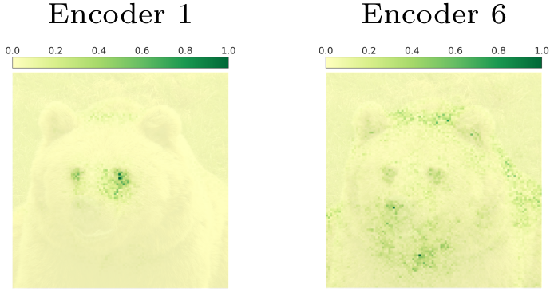
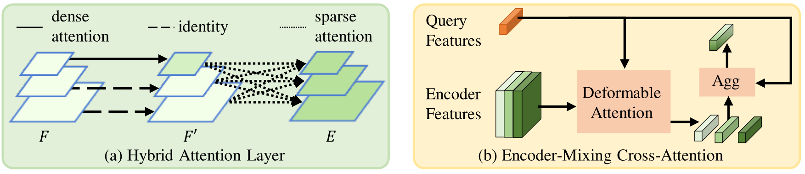
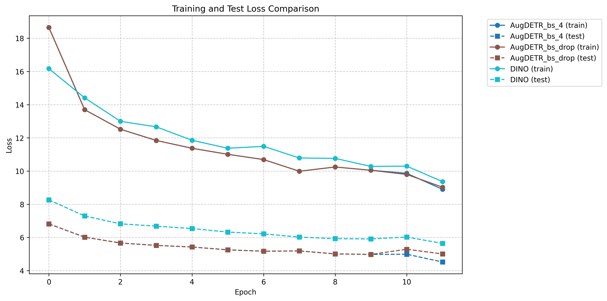
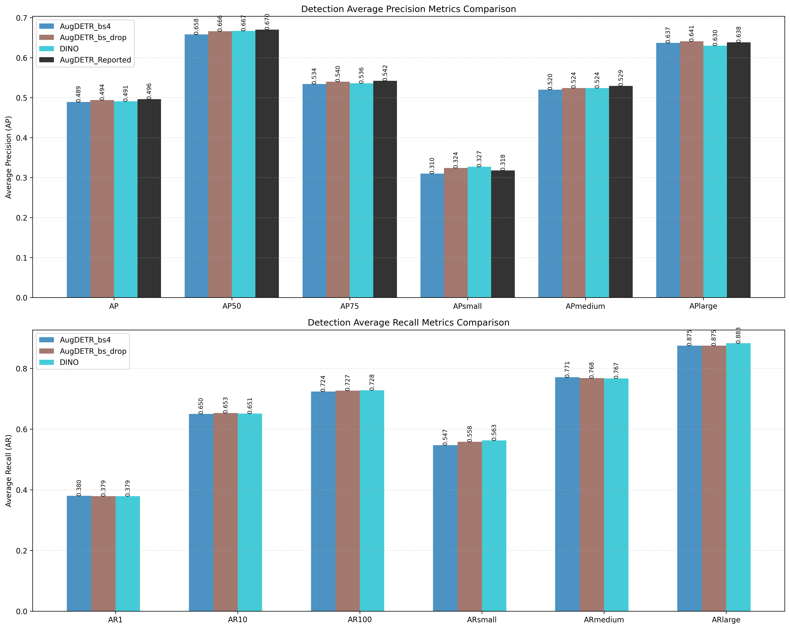

# AugDETR: Improving Multi-scale Learning for Detection Transformer

This readme file is an outcome of the [CENG501 (Spring 2024)](https://ceng.metu.edu.tr/~skalkan/DL/) project for reproducing a paper without an implementation. See [CENG501 (Spring 42) Project List](https://github.com/CENG501-Projects/CENG501-Fall2024) for a complete list of all paper reproduction projects.

# 1. Introduction

DEtection TRansformer (DETR) [1] revolutionized object detection by introducing a fully end-to-end approach that eliminated traditional heuristics like anchor generation and non-maximum suppression (NMS). Building upon DETR, Deformable DETR [2] improved performance on small objects (+7 AP) by replacing the self-attention mechanism with Multi-Scale Deformable Attention, which was subsequently adopted by state-of-the-art models like DAB-DETR [3], DN-DETR [4], and DINO [5].

This project focuses on reproducing AugDETR [6] (ECCV 2024), which addresses the limitations of Multi-Scale Deformable Attention through two components:

1. Hybrid Attention Encoder (HAE): Enhances local feature representation
2. Encoder-Mixing Cross-Attention (EMCA): Improves multi-level encoder exploitation

The paper reports the following AP improvements when integrated with existing detectors on the COCO dataset:
- DINO: +1.2 AP
- AlignDETR: +1.1 AP
- DDQ: +1.0 AP

Key experiments to be reproduced:
1. DINO (4-scale) + HAE (12 Epoch): Expected +0.6 AP
2. DINO (4-scale) + HAE + EMCA (12 Epoch): Expected +1.2 AP
3. Quantitative analysis of EMCA weights

Additional experiments that are reported in the paper, but will be conducted only if time permits:
- HAE comparison with Deformable Encoder variants
- DINO variants analysis (5-scale, varying encoder layers)
- Integration with AlignDETR and DDQ


## 1.1. Paper summary

As shown in the table below, while Deformable DETR achieves better overall AP and significantly better AP_S compared to DETR, it performs worse on large objects (AP_L). This observation motivates the paper's analysis of Multi-Scale Deformable Attention's limitations.

<div align="center">
<table>
<caption><b>Table 1:</b> Performance comparison between DETR and Deformable DETR.</caption>
<tr>
    <th>Method</th>
    <th>Epochs</th>
    <th>AP</th>
    <th>AP_S</th>
    <th>AP_M</th>
    <th>AP_L</th>
</tr>
<tr>
    <td>DETR [1]</td>
    <td>500</td>
    <td>42.0</td>
    <td>20.5</td>
    <td>45.8</td>
    <td>61.1</td>
</tr>
<tr>
    <td>Deformable DETR [2]</td>
    <td>50</td>
    <td>44.5</td>
    <td>27.1</td>
    <td>47.6</td>
    <td>59.6</td>
</tr>
</table>
</div>

This paper studies the limitations of Multi-Scale Deformable Attention in two aspects:

#### Local Feature Enhancement: 
The paper identifies that Deformable DETR's sparse attention mechanism, while computationally efficient, has limitations in its receptive field. By using a fixed number of deformable sampling points, it struggles to achieve the larger receptive fields needed for detecting large objects. Furthermore, sparse attention loses global context information that could be valuable in complex scenes. The paper empirically demonstrates this through experiments with different numbers of hybrid attention layers:

<div align="center">
<table>
<caption><b>Table 2:</b> Impact of number of hybrid attention layers on performance.</caption>
<tr>
    <th>Layers</th>
    <th>AP</th>
    <th>AP_50</th>
    <th>AP_75</th>
    <th>AP_S</th>
    <th>AP_M</th>
    <th>AP_L</th>
</tr>
<tr>
    <td>-</td>
    <td>49.0</td>
    <td>66.6</td>
    <td>53.5</td>
    <td>32.0</td>
    <td>52.3</td>
    <td>63.0</td>
</tr>
<tr>
    <td>1</td>
    <td>49.3</td>
    <td>66.6</td>
    <td>53.7</td>
    <td>31.1</td>
    <td>52.7</td>
    <td>63.7</td>
</tr>
<tr>
    <td>2</td>
    <td>49.6</td>
    <td>67.0</td>
    <td>54.2</td>
    <td>31.8</td>
    <td>52.9</td>
    <td>63.8</td>
</tr>
<tr>
    <td>3</td>
    <td>49.7</td>
    <td>67.2</td>
    <td>54.3</td>
    <td>32.3</td>
    <td>52.8</td>
    <td>64.0</td>
</tr>
<tr>
    <td>4</td>
    <td>49.3</td>
    <td>67.0</td>
    <td>53.8</td>
    <td>31.9</td>
    <td>52.7</td>
    <td>63.5</td>
</tr>
<tr>
    <td>5</td>
    <td>49.3</td>
    <td>66.8</td>
    <td>54.0</td>
    <td>31.4</td>
    <td>52.8</td>
    <td>63.1</td>
</tr>
<tr>
    <td>6</td>
    <td>48.8</td>
    <td>66.3</td>
    <td>53.4</td>
    <td>30.7</td>
    <td>52.2</td>
    <td>63.1</td>
</tr>
</table>
</div>

As shown in the table, increasing the number of hybrid attention layers initially improves performance up to 3 layers, but further increases lead to degradation, particularly affecting AP_S. This demonstrates the need for a balanced approach in combining dense and sparse attention.

####  Multi-level Encoder Exploitation: 
Current DETR-based detectors typically use six encoder layers but only utilize features from the last encoder layer in the decoder. The paper analyzes the receptive fields of different encoder layers and reveals their distinct characteristics (Fig. 1). For instance, Encoder 1 shows a more concentrated, localized attention pattern, while Encoder 6 exhibits a broader, more diffused receptive field. This observation suggests that different encoder layers capture complementary features at varying scales. However, existing methods only use the last encoder layer, potentially missing valuable information from earlier layers. The paper argues that adaptively using multi-level encoder features based on query features would better facilitate multi-scale learning, as objects at different scales may benefit from different combinations of these receptive fields.

<div align="center">

<p><b>Fig. 1:</b> Comparison of receptive fields of different encoders. Encoder 1 shows a concentrated pattern while Encoder 6 exhibits a broader receptive field.</p>
</div>

These insights led to the development of two components:

- Hybrid Attention Encoder (HAE): Combines dense and sparse attention to enhance local features
- Encoder-Mixing Cross-Attention (EMCA): Enables adaptive use of multi-level encoder features


# 2. The method and our interpretation

## 2.1. The original method

The paper introduces two main components that build upon the Deformable DETR architecture, as illustrated in Fig. 2.

<div align="center">

<p><b>Fig. 2:</b> (a) is the process of hybrid attention in the Hybrid Attention Layer. Dense attention is first applied to only the top features, and then sparse attention is applied to the multi-scale features. (b) is the details of Encoder-Mixing Cross-Attention. Deformable attention extracts multiple object features from multi-level encoder and then the extracted features are aggregated based on the adaptive fusion weights learned from the query features.</p>
</div>


### 2.1.1. Hybrid Attention Encoder (HAE)

In original DETR, self-attention (dense attention) is formulated as:

<div align="center">

$\mathbf{Q} = W_q P_5, \mathbf{K} = W_k P_5, \mathbf{V} = W_v P_5$

$\text{SelfAttention}(\mathbf{Q}, \mathbf{K}, \mathbf{V}) = \text{Softmax}(\mathbf{Q}\mathbf{K})\mathbf{V}$

</div>

where:
- $P_5$ represents the features from the last encoder layer.
- $Q$, $K$, and $V$ are query, key, and value features, respectively.


Deformable DETR replaced this with multi-scale deformable attention (sparse attention):

<div align="center">

$\mathbf{Q} = \text{Concat}(P_3, P_4, P_5), \mathbf{A} = W_a \mathbf{Q}$

$\Delta r = W_p \mathbf{Q}, \mathbf{V} = \text{Samp}(W_v\mathbf{Q}, r + \Delta r)$

$\text{DeformableAttention}(\mathbf{Q}, \mathbf{V}) = \text{Softmax}(\mathbf{A})\mathbf{V}$

</div>

where:
- $P_3, P_4, P_5$ are multi-scale features from last 3 encoder layers
- $r$ represents the reference points
- $\Delta r$ represents learnable offsets from reference points
- $\text{Samp}$ is the bilinear sampling function
- $W_a, W_p, W_v$ are learnable parameters

The proposed HAE combines standard self-attention with deformable attention in the encoder layer (Fig. 2(a)). To maintain computational efficiency, HAE employs a hybrid-scale strategy where dense attention is applied only to the last scale features $(P_5)$, while deformable attention operates on all scales.

<div align="center">

$\mathbf{Q'} = \mathbf{K'} = \mathbf{V'} = P_5$

$P_5' = \text{SelfAttention}(\mathbf{Q'}, \mathbf{K'}, \mathbf{V'})$

$\mathbf{Q} = \text{Concat}(P_3, P_4, P_5'), \mathbf{A} = W_a \mathbf{Q}$

$\Delta r = W_p \mathbf{Q}, \mathbf{V} = \text{Samp}(W_v\mathbf{Q}, r + \Delta r)$

$\text{DeformableAttention}(\mathbf{Q}, \mathbf{V}) = \text{Softmax}(\mathbf{A})\mathbf{V}$

</div>

### 2.1.2. Encoder-Mixing Cross-Attention (EMCA)

In Deformable DETR, the cross-attention in the decoder uses multi-scale deformable attention to achieve query-feature interaction with only the last encoder layer:

<div align="center">

$\mathbf{A} = W_a \mathbf{Q}, \Delta r = W_p \mathbf{Q}, \mathbf{V} = \text{Samp}(W_vE_6, r + \Delta r)$

$\text{DeformableAttention}(\mathbf{Q}, \mathbf{V}) = \text{Softmax}(\mathbf{A})\mathbf{V}$

</div>

where $E_6$ represents features from only the last encoder layer.

EMCA extends this by enabling interaction with all encoder layers (Fig. 2(b)). For each encoder layer $l$, it computes:

<div align="center">

$\mathbf{A} = W_a \mathbf{Q}, \Delta r = W_p \mathbf{Q}, \mathbf{w}_e = \sigma(W_e \mathbf{Q})$

$\mathbf{V}_l = \text{Samp}(W_{vl}E_l, r + \Delta r)$

$\text{EMCA}(\mathbf{Q}, \mathbf{E}) = \sum_{l=1}^{L} w_e^l \cdot \text{Softmax}(\mathbf{A})\mathbf{V}_l$

</div>

where:
- $\sigma$ is the Sigmoid activation
- $E_l$ represents the features from encoder layer $l$
- $w_e^l$ is the learned weight for encoder layer $l$
- $L$ is the total number of encoder layers
- $W_e$ is a learnable projection matrix for generating fusion weights

The key innovation of EMCA is its ability to adaptively weight features from different encoder layers based on query characteristics. This allows objects of different scales to leverage the most appropriate combination of encoder features, as earlier layers tend to capture more local details while later layers capture more global context.

## 2.2. Our interpretation

The paper does not specify the dimensionality and initialization of $W_e^l$ in EMCA's fusion weight generation. In the Deformable DETR source code, we apply this projection only on the last layer of the encoder output. In EMCA, we assume that shape $W_e^l$ should be adjusted to match $l^{th}$ encoder layer.

All other details seems clear right now. We may have to update this section during implementations. The authors repeatedly indicated that the modifications to baselines kept minimal and the proposed extensions are simple.

# 3. Experiments and results

## 3.1. Experimental setup

### Original Paper Setup

The authors conducted experiments on the COCO 2017 detection dataset using the following configuration:

- **Dataset**: COCO 2017 (train: 118K images, val: 5K images)
- **Backbone**: ResNet-50-4scale
- **Training Schedule**: 12 epochs and 24 epochs 
- **Batch Size**: 64
- **Optimizer**: AdamW with weight decay 1e-4
- **Learning Rate**: Initial 1e-4, decreased by 0.1 at epoch 11

### Our Modified Setup

We kept everything as described in the paper except batch-size. All details that are not mentioned in the paper are inherited from default parameters of the baseline model (DINO). Due to hardware constraints we had to reduce the batch-size. We performed the experiments in two settings: 

1. We reduced batch-size to 4 and trained 12 epoch (Will be referred as AudDETR_bs4).
2. We start training with batch-size 4 and after 9th epoch, we reduced it to 2 since we had to switch to another machine with less memory (Will be referred as AugDETR_bs_drop).

## 3.2. Running the code

Trained Checkpoints: [Google Drive](https://drive.google.com/drive/folders/12nbbSn_1UuJDJvZICWBUuo_6abNauSfN?usp=sharing)

### Installation

1. install pytorch and torchvision with cuda support. You can follow the instructions on the [official website](https://pytorch.org/get-started/locally/).
```bash
pip install torch torchvision
```

2. Install the required packages.
```bash
pip install -r requirements.txt
```
3. Compile the deformable attention module.
```bash
cd models/dino/ops
python setup.py build install
cd ../../..
```

### Training

```bash
python main.py \
	--output_dir logs/DINO/R50-MS4 -c config/DINO/DINO_4scale.py --coco_path {/path/to/coco} \
	--options dn_scalar=100 embed_init_tgt=TRUE \
	dn_label_coef=1.0 dn_bbox_coef=1.0 use_ema=False \
	dn_box_noise_scale=1.0 --use_hae
```

### Evaluation

```bash
python main.py \
  --output_dir logs/DINO/R50-MS4-%j \
	-c config/DINO/DINO_4scale.py --coco_path {/path/to/coco}
	--eval --resume {/path/to/checkpoint}
	--options dn_scalar=100 embed_init_tgt=TRUE \
	dn_label_coef=1.0 dn_bbox_coef=1.0 use_ema=False \
	dn_box_noise_scale=1.0 --use_hae
```


## 3.3. Results

### Experiment 1: DINO (4-scale) + HAE (12 Epoch) = +0.6 AP (Expected)

| Model              | AP   | AP_50 | AP_75 | AP_S | AP_M | AP_L |
|-------------------|------|-------|-------|------|------|------|
| DINO (bs=2) (reported)    | 49.0 | 66.6  | 53.5  | 32.0 | 52.3 | 63.0 |
| DINO + HAE (reported)     | 49.6 (+0.6) | 67.0 (+0.4) | 54.2 (+0.7) | 31.8 (-0.2) | 52.9 (+0.6) | 63.8 (+0.8) |
| DINO + HAE (bs=4)         | 48.9 (-0.1) | 65.8 (-0.8) | 53.4 (-0.1) | 31.0 (-1.0) | 52.0 (-0.3) | 63.7 (+0.7) |
| DINO + HAE (bs=drop 4->2) | 49.4 (+0.4) | 66.6 (+0.0) | 54.0 (+0.5) | 32.4 (+0.4) | 52.4 (+0.1) | 64.1 (+1.1) |

<div align="center">

<p><b>Figure 1:</b> Training and validation loss curves for DINO baseline and our HAE implementations with different batch size settings.</p>
</div>

<div align="center">

<p><b>Figure 2:</b> Detection metrics comparison across different object scales. The metrics include Average Precision (AP) and Average Recall (AR) at various scales and thresholds.</p>
</div>

#### Discussion

The loss curves were promising. Both the training and validation losses decreased consistently, with no signs of overfitting. Moreover, it seems both settings converged faster than the baseline DINO model. However, the AP results did not align with the expected +0.6 AP improvement. The setting with batch-size 4 had the least loss on the validation set, but the AP results were even lower than the baseline. Consistent incerease in AP_large indicates we are on the right track since the performance on large objects is the main concern of the paper. We guess that the problem might be related to the batch-size reduction, which could have affected the model's learning dynamics. We will investigate this further in the next experiments. 


# 4. Conclusion

@TODO: Discuss the paper in relation to the results in the paper and your results.

# 5. References

[1] N. Carion, F. Massa, G. Synnaeve, N. Usunier, A. Kirillov, and S. Zagoruyko, "End-to-end object detection with transformers," in European conference on computer vision, 2020, pp. 213–229.

[2] X. Zhu, W. Su, L. Lu, B. Li, X. Wang, and J. Dai, "Deformable DETR: Deformable transformers for end-to-end object detection," arXiv preprint arXiv:2010.04159, 2020.

[3] S. Liu, F. Li, H. Zhang, X. Yang, X. Qi, H. Su, J. Zhu, and L. Zhang, "DAB-DETR: Dynamic anchor boxes are better queries for DETR," in International Conference on Learning Representations, 2021.

[4] F. Li, H. Zhang, S. Liu, J. Guo, L. M. Ni, and L. Zhang, "DN-DETR: Accelerate DETR training by introducing query denoising," in Proceedings of the IEEE/CVF Conference on Computer Vision and Pattern Recognition, 2022, pp. 13619–13627.

[5] H. Zhang, F. Li, S. Liu, L. Zhang, H. Su, J. Zhu, L. M. Ni, and H.-Y. Shum, "DINO: DETR with improved denoising anchor boxes for end-to-end object detection," in The Eleventh International Conference on Learning Representations, 2022.

[6] J. Dong, Y. Lin, C. Li, S. Zhou, and N. Zheng, "AugDETR: Improving multi-scale learning for detection transformer," in ECCV 2024, 2024.

# Contact

Emirhan Bayar 
bayaremirhan07@gmail.com
