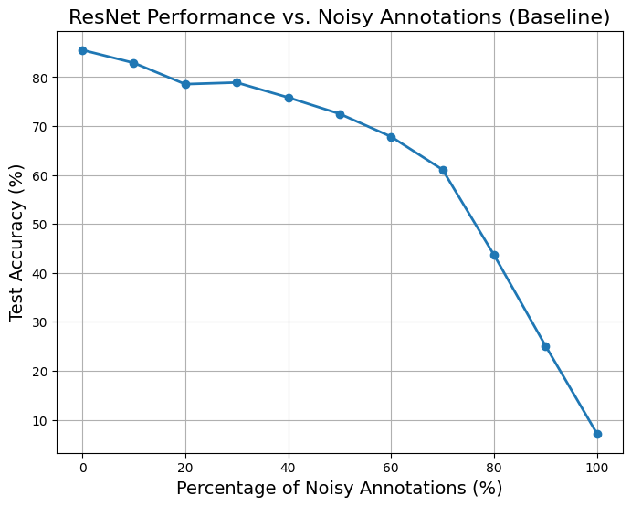
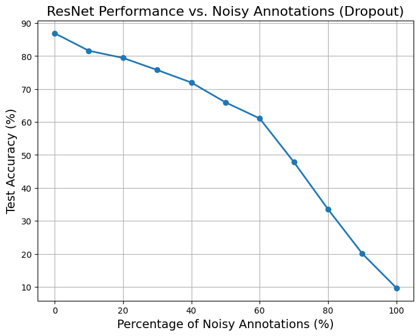

# FIGHTING OVER-FITTING WITH QUANTIZATION FOR LEARNING DEEP NEURAL NETWORKS ON NOISY LABELS

# 1. Introduction

The paper titled "Fighting Over-Fitting with Quantization for Learning Deep Neural Networks on Noisy Labels" was authored by Gauthier Tallec, Édouard Yvinec, Arnaud Dapogny, and Kevin Bailly. It was published in the 2023 IEEE International Conference on Image Processing (ICIP) and investigates how quantization-aware training can reduce overfitting in deep neural networks trained on noisy labels while simultaneously improving inference efficiency.

Project goal is to replicate the experiments described in the paper, evaluate the impact of regularization and quantization on noisy datasets CIFAR-10 and BP4D and compare quantization's effectiveness against other regularization techniques and baseline.

## 1.1. Paper summary

#### 1.1.1 Motivation and Aim

The increase in computational power has led to the emergence of highly complex neural networks. These networks require large amounts of annotated data for training. However, collecting such data without noisy labels is often very costly. As a result, techniques to handle noisy labeled data are essential. This paper suggests that restricting the expressivity of a neural network can improve its accuracy when trained on noisy labeled data. Expressivity can be restricted using classical regularization and compression techniques. The authors claim that the effectiveness of these techniques has not been thoroughly tested on noisy labels.

#### 1.1.2 Techniques 

Two main techniques are used to fight the overfitting problem on noisy labels:
- Regularization Methods: Early stopping, weight decay, dropout, and label smoothing
- Compression Techniques: Quantization and pruning.

#### 1.1.3 Datasets

Cifar10 and BP4D data sets are used in this paper. 
- Cifar10 is used with synthetic noisy labels. This allows to test regularization and quantization techniques for different noisy labels.
- BP4D dataset is used for facial Action Unit (AU) detection and contains inherently noisy annotations due to the complexity of labeling facial expressions. It is usedd as a benchmark for evaluating the techniques under real-world noisy labeling conditions.

#### 1.1.4 Models

In this paper two models are used.
- ResNet-20: A residual network architecture is used for the CIFAR-10 dataset to test the impact of synthetic label noise.
- Vanilla Architecture for AU Detection: This model is used for the BP4D dataset to test performance under real-world noisy annotations.

#### 1.1.5 Findings and Conclusion of the Paper

- Both regularization and quantization effectively combat overfitting on noisy labels by improving the accuracy of the models.
- Quantization performs better than traditional regularization methods at reducing overfitting on noisy datasets and also makes inference faster.
- CIFAR-10 Results: Quantization achieves the best accuracy under synthetic label noise for noise levels up to 40%.
- BP4D Results: On real-world noisy labels, quantization improves the average F1 score significantly compared to other methods while reducing performance variability across tasks.

# 2. The method and our interpretation

## 2.1. The original method

In this paper, 2 methods were introduced to fight over-fitting in deep neural networks. The first one is regularization techniques and the second one is compression techniques. The authors decided to use early stopping, weight decay, dropout, and label smoothing methods as regularization techniques and pruning and quantiziation methods as compression techniques. 

<h3>2.1.1. Regularization Techniques</h3>

This techniques are used by improving the generalization capability of the model. In order to get better results in test set without chaging the implementation, we can use these methods on training and validation sets. Let's define a neural network F with L layers f l, weights Wl. 

<h4>2.1.1.1. Early Stopping</h4>
During the training of F (neural network), the accuracy initially improves on both the training and validation datasets. However, overfitting occurs when the accuracy on the validation and test datasets starts to decline, even though it continues to rise on the training set. This approach is used on the training and validation datasets to identify the best point to stop training the model.

<h4>2.1.1.2. Weight Decay</h4>
This method helps prevent overfitting by imposing a constraint on the scale of all weight values in F. Specifically, it involves adding an L2 regularization term to the training loss, defined as: 

**Lw = αw ∑l=1L ‖Wl‖22**

where **1/αw** determines the scale enforced on the weights.

<h4>2.1.1.3. Dropout </h4>
Dropout helps prevent overfitting by randomly deactivating parts of **F**, encouraging the model to make predictions using smaller sub-networks and avoiding weight co-adaptation. During training, each scalar weight is set to 0 with a probability of **p** for every example. At test time, all weights are scaled by **p** to reflect their activation frequency during training.

<h4>2.1.1.4. Label Smoothing </h4>
This method helps reduce overfitting by preventing neural networks from becoming overly confident in their predictions. It achieves this by modifying the ground truth labels as follows:

**yαs = (1 − αs)y + αs * (1 / C)**

Here, **αs** controls the smoothing intensity, and **C** represents the number of classes.

In multi-task binary classification tasks, like action unit (AU) detection, label smoothing is applied separately to each label, using **C = 2** to represent the presence or absence of a label.

It’s important to highlight that these methods do not impact the network's inference runtime, leaving the efficiency problem unaddressed. As a result, the authors suggest investigating compression techniques as a potential solution for regularization.

<h3>2.1.2. Compression Techniques</h3>
<h4>2.1.2.1. Pruning </h4>
This method works on the assumption that **F** is already pre-trained. For each **fl**, it applies standard magnitude-based structured pruning to the weight tensors **Wl**, removing neurons with the largest L1 norm.

The idea behind this approach is that smaller weights lead to smaller activations, which have less influence on the decision-making process. By limiting the model's complexity, pruning reduces the likelihood of overfitting.

<h4>2.1.2.2. Quantization </h4>
### Quantization

The standard quantization operator, in **b** bits, is defined as:

**quantized(X) = ⌊X \* (2b−1 − 1) / λX⌉**

where **⌊·⌉** denotes rounding to the nearest integer, and **λX** is a scaling parameter specific to **X**. This parameter ensures that the range of **X** is correctly mapped to **[−(2b−1 − 1); 2b−1 − 1]**.

In practice, scalar values are typically used for **λX** when quantizing activations (e.g., layer inputs), while vector values are used for weight tensors (per-channel quantization). The scaling parameter for activations is estimated per batch during training as:

**λX = max{|X|}**

An exponential moving average is then used to update the inference value. Conversely, weight scales are always computed as the maximum value per channel of **|Wl|**.

When optimizing the weight values W, the rounding operator creates zero gradients in most places, making gradient-based optimization difficult. To solve this, the **straight-through estimation (STE)** method is used, which replaces the gradient of the quantization process with an identity function. This method also removes batch-normalization layers from the network architecture.

## 2.2. Our interpretation

In our implementation of the referenced paper, the following assumptions were made regarding data preprocessing, training parameters, and regularization techniques:

### Data Preprocessing:

We applied a series of standard data augmentation and normalization techniques:
- transforms.RandomHorizontalFlip() to introduce horizontal flip augmentation.  
- transforms.RandomCrop(32, padding=4) to perform random cropping with padding.  
- Normalization with mean [0.4914, 0.4822, 0.4465] and standard deviation [0.2470, 0.2435, 0.2616] using transforms.Normalize().

### Training Parameters:  
- Batch size was set to 1024 for faster training.  
- Initial learning rate was set to 0.001 as it is the default of Adam optimizer.

For all regularization and compression techniques, we used above settings as baseline model and dataset preparation.

### Early Stopping:  

- 20% of the training data was reserved as the validation set.  
- Early stopping was implemented with a patience of 10 epochs. It means that training was stopped if validation performance did not improve for 10 consecutive epochs.

# 3. Experiments and results

## 3.1. Experimental setup

In our experiments, we utilized the CIFAR-10 dataset, which consists of 50,000 training images and 10,000 test images distributed across 10 classes. To evaluate the robustness of the model to noisy training labels, we introduced label noise by randomly re-annotating a proportion s% of the training examples. Specifically, s% of the training samples were assigned random labels. The test set remained unchanged in all experiments.

For the training process, we employed a ResNet-20 architecture trained for 200 epochs using the Adam optimizer. For ResNet20, we set batch size as 1024 for faster training. We adopted widely-used hyperparameters for the regularization techniques, such as a weight decay value of wd=0.01 and learning rate value of lr=0.001.

To accelerate the training process, all experiments were conducted on a Google Colab A100 GPU, enabling faster computation.

## 3.2. Running the code

@TODO: Explain your code & directory structure and how other people can run it.

## 3.3. Results

@TODO: Present your results and compare them to the original paper. Please number your figures & tables as if this is a paper.

   
  <em> Figure 1: On Cifar10: (a) Accuracy gain with respect to the baseline model (no regularization applied) as a function of s. (b) Accuracy as a function of the percentage s of training examples randomly reannotated.(from the paper)</em>

   
  <em> Figure 2: On Cifar10: Effect of Noisy Annotations on ResNet Performance</em>

   
  <em> Figure 3: On Cifar10: Effect of Noisy Annotations on ResNet Performance with Early Stopping</em>

   
  <em> Figure 4: On Cifar10: Effect of Noisy Annotations on ResNet Performance with Weight Decay</em>

   
  <em> Figure 4: On Cifar10: Effect of Noisy Annotations on ResNet Performance with Dropout</em>

# 4. Conclusion

@TODO: Discuss the paper in relation to the results in the paper and your results.

# 5. References

@TODO: Provide your references here.

1. G. Tallec, E. Yvinec, A. Dapogny, and K. Bailly, "Fighting over-fitting with quantization for learning deep neural networks on noisy labels," arXiv, 2023. [Online]. Available: https://arxiv.org/abs/2303.11803.

2. A. Krizhevsky, "Learning Multiple Layers of Features from Tiny Images," in Proceedings of the Semantic Scholar Corpus, 2009. [Online]. Available: https://api.semanticscholar.org/CorpusID:18268744.

3. X. Zhang, L. Yin, J. F. Cohn, S. Canavan, M. Reale, A. Horowitz, P. Liu, and J. M. Girard, "BP4D-Spontaneous: A High-Resolution Spontaneous 3D Dynamic Facial Expression Database," in Image and Vision Computing, vol. 32, no. 10, pp. 692-706, 2014. [Online]. Available: https://www.sciencedirect.com/science/article/pii/S0262885614001012.

4. X. Zhang, L. Yin, J. F. Cohn, S. Canavan, M. Reale, and A. Horowitz, "A High-Resolution Spontaneous 3D Dynamic Facial Expression Database," in Proceedings of the 10th IEEE International Conference and Workshops on Automatic Face and Gesture Recognition (FG), 2013, pp. 1-6. [Online]. Available: https://doi.org/10.1109/FG.2013.6553788.

5. He, K., Zhang, X., Ren, S., & Sun, J. (2015). Deep residual learning for image recognition. arXiv. https://arxiv.org/abs/1512.03385

# Contact
Yüksel Pelin Kılıç - pelinkilic97@gmail.com
Hakan Çakmak - cakmakhakan.boun@gmail.com
