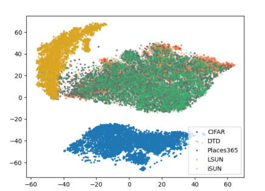

# @TODO: Paper title

This readme file is an outcome of the [CENG501 (Spring 2024)](https://ceng.metu.edu.tr/~skalkan/DL/) project for reproducing a paper without an implementation. See [CENG501 (Spring 42) Project List](https://github.com/CENG501-Projects/CENG501-Fall2024) for a complete list of all paper reproduction projects.

# 1. Introduction

@TODO: Introduce the paper (inc. where it is published) and describe your goal (reproducibility).

## 1.1. Paper summary

@TODO: Summarize the paper, the method & its contributions in relation with the existing literature.

# 2. The method and our interpretation

## 2.1. The original method

The method, named Greg+, consists of two main parts. In contrast to state-of-the-art methods which only focus on the value of the score function, Greg+ proposes a new regularization term added to the loss, obtained by regularizing the gradient of the score function. In addition, a novel energy-based sampling method is proposed to select more informative examples from the dataset during training, which is expecially important when the auxiliary dataset is large.

## 2.1.1. Gradient Regularization

The main intuition behind gradient regularization is that the distribution of ID (in distribution) and OOD tends to be well-separated, and the area around an ID sample would not include any OOD samples, and vice versa.

Regularization Suppose $x$ is a training sample, and $x$' is another sample which is sufficiently close to $x$. Using first-order Taylor approximation of the score function around $x$,

## 2.2. Our interpretation

@TODO: Explain the parts that were not clearly explained in the original paper and how you interpreted them.

# 3. Experiments and results

## 3.1. Experimental setup

@TODO: Describe the setup of the original paper and whether you changed any settings.

## 3.2. Running the code

@TODO: Explain your code & directory structure and how other people can run it.

## 3.3. Results

@TODO: Present your results and compare them to the original paper. Please number your figures & tables as if this is a paper.

# 4. Conclusion

@TODO: Discuss the paper in relation to the results in the paper and your results.

# 5. References

@TODO: Provide your references here.

# Contact

@TODO: Provide your names & email addresses and any other info with which people can contact you.
