# Gradient-Regularized Out-of-Distribution Detection

This readme file is an outcome of the [CENG501 (Spring 2024)](https://ceng.metu.edu.tr/~skalkan/DL/) project for reproducing a paper without an implementation. See [CENG501 (Spring 42) Project List](https://github.com/CENG501-Projects/CENG501-Fall2024) for a complete list of all paper reproduction projects.

# 1. Introduction

Out-of-Distribution (OOD) detection addresses a critical problem in deploying neural networks for real-world applications: how to maintain reliable performance when faced with unfamiliar data that is not part of the original training distribution. The paper “Gradient-Regularized Out-of-Distribution Detection” by Sina Sharifi et al. [1], introduces a novel approach to enhance OOD detection robustness. Traditional OOD detection methods often rely solely on scoring functions and thresholds for classification [2], but they neglect the rich local information present in the gradient of the score function.

The authors propose GReg+ [1], a method that incorporates gradient regularization and energy-based sampling. This approach not only improves the model’s ability to distinguish between In-Distribution (ID) and OOD samples but also ensures that the local score behavior is consistent, reducing sensitivity to small perturbations. GReg+ achieves this by coupling a gradient-regularized loss function (GReg) with a clustering-based sampling method to select informative OOD samples, especially in the presence of large auxiliary datasets.

As part of our CENG501 (Spring 2024) project, we aim to reproduce the results of this paper, analyze its key contributions, and interpret its method to better understand the practical application of gradient regularization and energy-based sampling.

## 1.1. Paper summary

The paper’s key contribution lies in proposing a method, GReg+, that enhances OOD detection by addressing two limitations in existing methods: reliance on score values without utilizing local gradient information and inefficient handling of large auxiliary datasets.

**1. Gradient Regularization (GReg):** 
The central insight is that ID and OOD data tend to occupy distinct regions in the input space, and regularizing the gradient of the score function around these samples promotes stability in classification. This ensures that points in the neighborhood of an ID (or OOD) sample are consistently classified. 
-By penalizing the gradient norm only for correctly detected samples, the method reduces sensitivity to small changes in the input, leading to a smoother score manifold.

 
**2. Energy-Based Sampling:** 
The authors propose a clustering-based sampling strategy that leverages normalized features and energy scores to select the most informative OOD samples during training. This approach ensures computational efficiency and avoids bias toward specific regions of the feature space.

**3. Implementation and Results:** 
The loss function used combines cross-entropy loss, gradient regularization, and energy-based sampling penalties. Empirical results demonstrate superior performance over state-of-the-art methods across multiple benchmarks, including CIFAR and ImageNet datasets.

By introducing these innovations, the paper provides a robust framework that not only enhances detection performance but also makes efficient use of large auxiliary datasets. Our project builds on this foundation to analyze and verify the reproducibility of these results.

# 2. The method and our interpretation

## 2.1. The original method

As stated in the paper, the main approach in the literature for OOD detection is to define a scoring function S and use a threshold γ to distinguish different samples. If the score of a sample is below the threshold, then it is classified as an ID sample, and the label is OOD otherwise. Most relevant to the setup used in the paper, [2] uses the scoring function $S_{En}(x) = -LSE(f(x))$, and defines the following loss equation to make the model better differentiate ID and OOD samples:

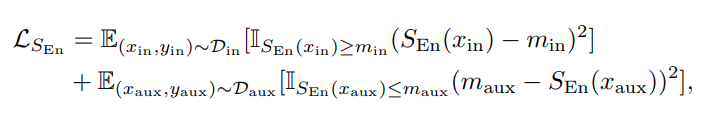

where $m_{in}$ and $m_{aux}$ are threshold used to filter out ID and OOD samples. If the energy score of an ID (or OOD) sample is low (high) enough, then it is excluded from the loss calculation.

The method, named Greg+ [1], consists of two main parts. In contrast to state-of-the-art methods which only focus on the value of the score function, Greg+ proposes a new regularization term added to the loss, obtained by regularizing the gradient of the score function. In addition, a novel energy-based sampling method is proposed to select more informative examples from the dataset during training, which is expecially important when the auxiliary dataset is large.

## 2.1.1. Gradient Regularization

The main intuition behind gradient regularization is that the distribution of ID (in distribution) and OOD samples tend to be well-separated, and the area around an ID sample would not include any OOD samples, and vice versa.

**Figure 1: t-SNE plot showing the representation of ID and OOD datasets for CIFAR experiments**

Regularization term is used to promote smoothness of the loss function around the training samples by penalizing the norm of its gradient. For the first-order Taylor approximation of the score function $S(x)$,

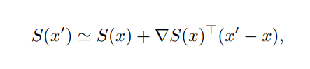

Suppose $x$ is a training sample, and $x$' is another sample which is sufficiently close to $x$. If the gradient $\Delta_x S(x)$ is small, then $|S(x) - S(x')|$ becomes small for nearby points $x$'. This ensures ID points classified as ID remain stable within their neighborhood.
As the paper mainly focuses on the energy loss as the score function, $L_{\Delta S}$ is defined as follows:

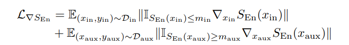

Thresholds $m_{in}$ and $m_{aux}$ are selected such that the loss only penalizes the gradient for the correctly detected samples. For a sample $x$, if $S(x)$ is below the threshold, we label it as ID, and label it as OOD otherwise.
Following two cases could be considered to better understand the intuition behind this choice:
1. If an ID (or OOD) sample is correctly detected, penalizing the gradient around that sample reduces sensitivity to small changes in the input, providing stable ID (OOD) classification. So this sample should be included in the loss calculation.
2. If a sample is misclassified, gradient regularization is not applied.

The models mentioned in the experiments are trained using the following loss,

**$L = L_{CE} + \lambda_S L_S + \lambda_{\Delta S} L_{\Delta S}$**

where $\lambda_S$ and $\lambda_{\Delta S}$ are regularization hyperparameters and $L_{CE}$ is the well-known cross-entropy loss.

## 2.1.2. OOD Sampling

Auxiliary OOD datasets may be larger than the ID dataset, and using all OOD samples during training may be computationally expensive and lead to bias towards specific regions of the feature space [3]. To address this issue, a novel energy-based sampling method is proposed in the paper. Steps of the proposed sampling method can be explained as follows:
1. For each auxiliary OOD sample $x$, we first calculate the features $z = h(x)$, where $h(.)$ is the feature extractor. Then, energy score $s = -LSE(f(x))$ is calculated, where $f(x)$ is the logit. As features with larger magnitudes may lead to biased clustering, the feature vectors z are normalized as follows: $z = \frac{z}{||z||}$

2. To perform clustering, K-Means clustering with a fixed number of clusters is used. For the number of clusters, the number of samples in each mini batch of training is used. More details on the choice of number of clusters can be found in the "Supplementary Material" section of the paper.

3. As the energy scores $S_i$ are used for OOD detection, the same scores are also used for sample selection. Given our choice of loss functions $L_S$ and $L_{\Delta S}$, samples with smallest energy scores of each cluster are selected for the former, and samples with the largest energy scores are selected for the latter. Intuitively, $L_S$ aims to increase energy scores of OOD samples, and $L_{\Delta S}$ aims to penalize the gradients for OOD samples with sufficiently large energy scores.

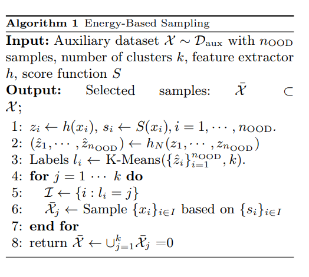

**Pseudocode of the energy-based sampling algorithm**

Overall, clustering is used to make the model exposed to diverse regions of the feature space, and sampling is used to select the most informative samples from these clusters.

## 2.2. Our interpretation

The paper specifies that these thresholds ($m_{in}$ and $m_{aux}$) filter out samples with acceptable energy levels but does not provide detailed guidance on how these values are chosen. As these values are not clearly mentioned, we will make a literature search to find appropriate values and try to adjust them manually.

Additionally, the hardware resources used and comptational complexity of experiments are not clearly stated. However, as used datasets are not very large and images are not high-resolution, we infered that we can train mentioned models with the hardware we have.

# 3. Experiments and Results

### 3.1. Experimental Setup
The original paper uses CIFAR-10, CIFAR-100 and ImageNet as ID datasets for training.
For CIFAR experiments, 300K RandomImages is used as auxiliary OOD dataset. The model is evaluated using six different OOD datasets including Textures, SVHN, Places365, LSUN-cropped, LSUN-resized and iSUN. Results are evaluated on ResNet-18, WRN-40 and DenseNet-101.
For ImageNet experiments, 10 random classes of ImageNet is used as ID dataset, and the rest of the dataset is used as the auxiliary OOD data. For evaluation of the model, 1000 random samples from Textures, Places, SUN and iNaturalist are used as OOD dataset. Results are evaluated on DenseNet-121.

- **CIFAR Benchmarks**
  - Corresponding architectures are fine-tuned for GReg experiments over 20 epochs using SGD (with momentum of 0.9 and weight decay of 0.0001) with cosine annealing (with a maximum learning rate of 1 and a minimum of 0.0001). 
  - For GReg+, models are trained from scratch for 50 epochs with an initial learning rate of 0.1, followed by an additional 10 epochs with a reduced learning rate of 0.01.
  - Following [], $\lambda_S$ and $\lambda_{\Delta S}$ are set as 0.1 and 1, respectively.
  - Batch size of 64 is used.

- **ImageNet Benchmarks**
  - The experiments involve only fine-tuning a DenseNet-121 model, using ADAM optimizer with an initial learning rate of 1e-4 and decrase the learning rate to 1e-5 at epoch 10. GReg and GReg+ are then runned to reach epochs 20 and 15, respectively.
  - Batch size of 32 is used.

- **Common Setup for All Datasets**
  - For all datasets, Greg+ uses energy-based sampling to select OOD (out-of-distribution) samples efficiently during training, as described in the original paper.

- **Adjustments in Our Implementation:**
  - In our experiments, we modified the initial learning rate for GReg on the CIFAR benchmarks. Instead of starting with 1.0, we used 0.01 as the initial learning rate for cosine annealing. This adjustment was made as we experienced NaN loss values with 1.0 as initial learning rate.

## 3.2. Running the code
Use corresponding notebooks for training and evaluation. Follow the comments and specifications on each code block to set models, datasets, and training/evaluation pipeline.

## 3.3. Results

## 3.3.1 GReg Experiments

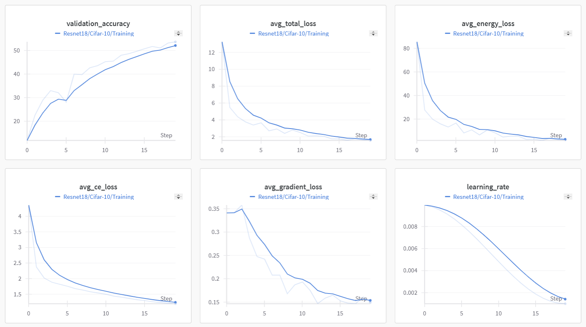

**Figure 1**: Training Plots of GReg Experiment with ResNet-18 and CIFAR-10

**Figure 2**: Evaluation Results of GReg Experiment with ResNet-18 and CIFAR-10

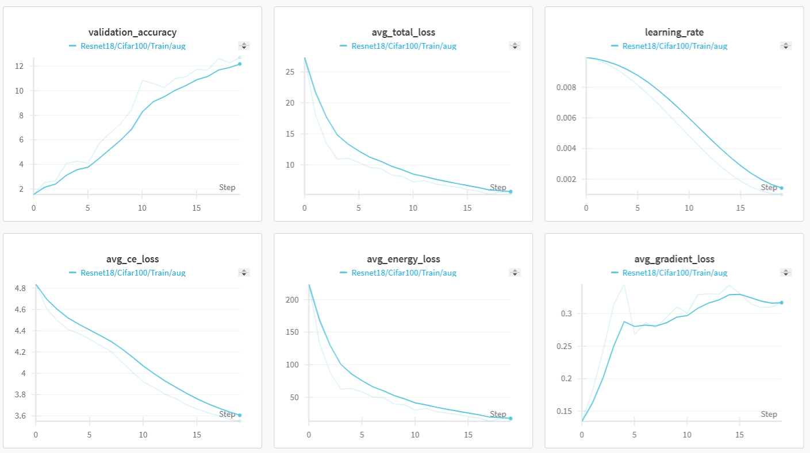

**Figure 3**: Training Plots of GReg Experiment with ResNet-18 and CIFAR-100

**Figure 4**: Evaluation Results of GReg Experiment with ResNet-18 and CIFAR-100

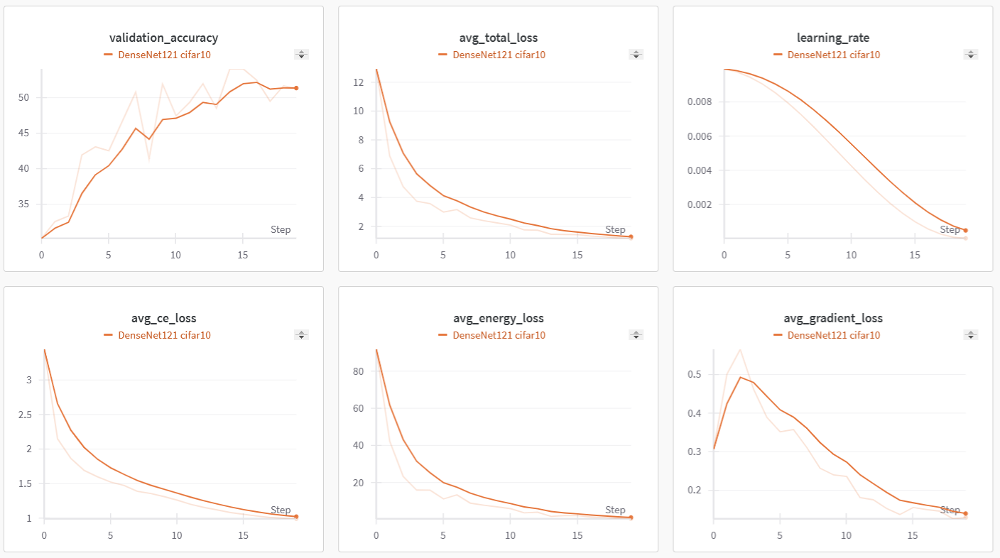

**Figure 5**: Training Plots of GReg Experiment with DenseNet-121 and CIFAR-10

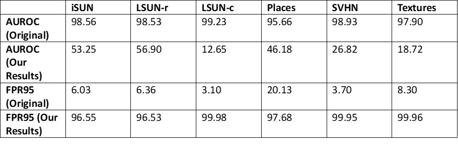

**Figure 6**: Evaluation Results of GReg Experiment with DenseNet-121 and CIFAR-10

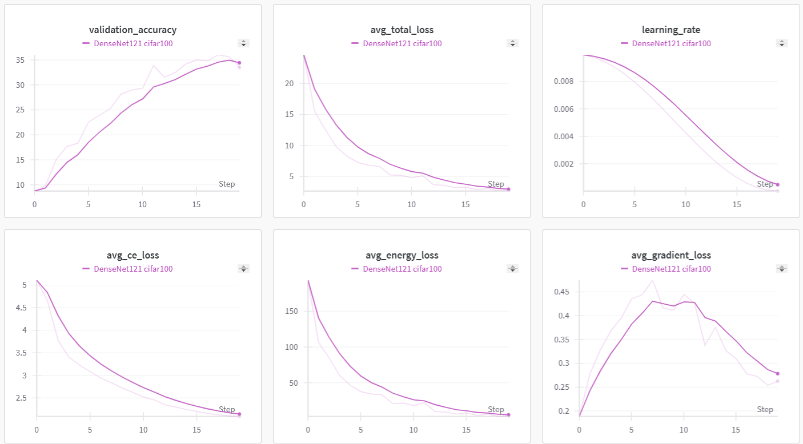

**Figure 7**: Training Plots of GReg Experiment with DenseNet-121 and CIFAR-100

## 3.3.2 GReg+ Experiments

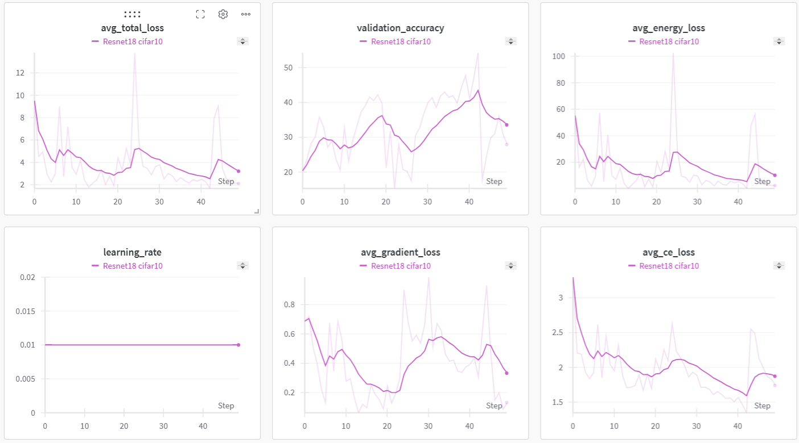

**Figure 9**: Training Plots of GReg+ Experiment with ResNet-18 and CIFAR-10

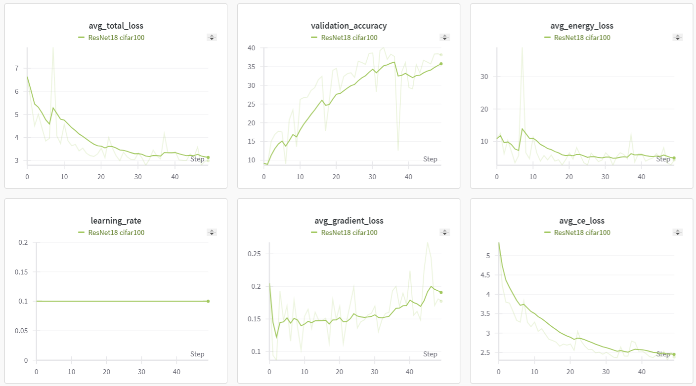

**Figure 11**: Training Plots of GReg+ Experiment with ResNet-18 and CIFAR-100

# 4. Conclusion

There is a significant deviation between our results and the original results. The main reason behind this could be the number of epochs and the initial learning rate. Although training loss was decreasing and validation accuracy was increasing, we finished training at epoch 20 to follow the experimental setup specified in the paper. In addition, we couldn't use the original initial learning rate (lr = 1.0), as we got NaN loss values for each epoch.

As implementing ImageNet experiments would not be feasible in terms of time, we skipped ImageNet experiments. Given GReg/GReg+ results in the "Experiments and Results" section are obtained using CIFAR-10 and CIFAR-100.

# 5. References

[1] Sharifi, S., Entesari, T., Safaei, B., Patel, V. M., & Fazlyab, M. (2025). Gradient-regularized out-of-distribution detection. In European Conference on Computer Vision (pp. 459-478). Springer, Cham.
[2] Liu, W., Wang, X., Owens, J., Li, Y.: Energy-based out-of-distribution detection. Advances in neural information processing systems 33, 21464–21475 (2020)
[3] Wang, L., Han, M., Li, X., Zhang, N., Cheng, H.: Review of classification methods on unbalanced data sets. IEEE Access 9, 64606–64628 (2021)

# Contact

@TODO: Provide your names & email addresses and any other info with which people can contact you.
