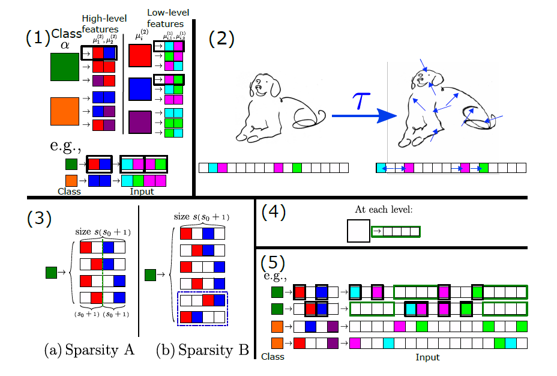

# How Deep Networks Learn Sparse and Hierarchical Data: the Sparse Random Hierarchy Model

This readme file is an outcome of the [CENG501 (Fall 2024)](https://ceng.metu.edu.tr/~skalkan/DL/) project for reproducing a paper without an implementation. See [CENG501 (Fall 2024) Project List](https://github.com/CENG501-Projects/CENG501-Fall2024) for a complete list of all paper reproduction projects.

# 1. Introduction

Deep Learning has become a foundational foot of the modern machine learning, exhibiting well performance across a wide range of problems.This success is often be evaluated to its ability to build hierarchical representations, progressing from simple features to more complex ones. In addition, the ability to learn invariance to task-specific transformations, such as spatial changes in image data, has been strongly correlated to this performance Still, there is a fundamental question needs to be answered **_What underlying properties make high-dimensional data effectively learnable by deep networks?_**

This work introduces the Sparse Random Hierarchy Model (SRHM), demonstrating that sparsity in hierarchical data enables networks to learn invariances to such transformations. Taking the RHM as a framework, this work introduces the Sparse Random Hierarchy Model (SRHM), demonstrating that sparsity in hierarchical data enables networks to learn invariances to such transformations, published at Proceedings of Machine Learning Research. It was shown as a spotlight poster at ICML 2024.

Our main goal is to create the dataset by using SRHM and reproducing the same results shared in this paper. Through systematically creation of the dataset, we aim to validate that deep networks can learn such invariances from the data that is polynominal in the input dimension, emphasising their advantage over shallow networks. Furthermore, we want to verify the theoretical relationships between sparsity, sample complexity and hierarchical representations.

## 1.1. Paper summary

Deep learning can solve high dimensional tasks. This is possible because learnable data is highly structured. Data is learnable when it has local features that are assembled hierarchically. This view is consistent with deep networks forming hierarchical representations or CNNs architectural choices. Hierarchical nature of data can be captured by using hierarchical models.

However, hierarchical models are discrete, whereas images are approximated as continuous functions. Labels on this view are invariant to smooth transformations. Enforcing stability to smooth transformations (diffeomorphisms) makes models generalize better. Thus, there is a strong correlation between a network's test error and its sensitivity to diffeomorphisms.

Authors argue that:

- Incorporating sparsity to hierarchical generative models leads to insensitivity to discrete versions of diffeomorphisms.
- To illustrate, they introduce the Sparse Random Hierarchy Model (SRHM), which captures the empirically observed correlation between sensitivity to diffeomorphisms and test error.
- Correlation between test error reduction and invariance to diffeomorphisms occur when a model has learnt a hierarchical representation.
- Number of training points needed to learn the task, called sample complexity, is the point where both diffeomorphism insensitivity and low test error is achieved.

### Prior Work

Deep networks can represent hierarchical compositional functions with less parameters compared to shallow networks. Specifically, deep networks can learn a hierarchical model polynomial in the dataset dimension. This work focuses on sparsity in feature space, which corresponds to smooth transformations of the input.

Sample complexity, number of training examples needed to learn the task is introduced by the authors in their previous paper: “How Deep Neural Networks Learn Compositional Data: The Random Hierarchy Model”. It depends on the nature of the dataset, and the learning networks architecture. For example, data points required by a deep network to learn a task is usually polynomial in data dimension, but it is exponential for a shallow network (Cagnetta et al., 2024).

### Aims

- Show and quantify strong correlation between feature sparsity and insensitivity to discretized diffeomorphisms
- Explain how invariance emerges during training and how it affects sample complexity.
- Work with generic perturbations of data, rather than adversarial-like worst-case perturbations.

# 2. The method and our interpretation

## 2.1. The original method

### Random Hierarchical Model (RHM)

The Random Hieararchy Model is a generative model that illustrates how hierarchical composition of features can be used by deep neural networks to a specific tasks. It is inspired by the structure of natural data like images and language, where features are composed hierarchically. In this model:

- **_Hierarchy of Features_**: The way of the data being It starts with the class labels at the top, which are like the “parents.” Each class then leads to a group of high-level features, these represent general characteristics like "face" or "background" in an image. These high-level features then break down further into smaller parts, like "eyes" or "nose." This process keeps going until we reach the very bottom, where we get the simplest building blocks, like edges or pixels in an image. It’s a bit like how real-world objects are made up of smaller, simpler pieces that come together to form something complex.
- **Randomness**: The generation rules for features at each level are chosen randomly, ensuring a wide variety of possible feature compositions.

Deep networks, then learn the "RHM task" by developing representations that are invariant to interchange of the synonymic features.

A core point of the RHM is its sample complexity $P^*$, the number of training points that is required to generalize the model to be trained. The $P^*$ is corraleted with:

- $n_c$: Number of classes.
- $m$: Number of equivalent sub-representations for each feature.
- $L$: Depth of the hierarchy.

The paper frames the sample complexity in two key questions:

- "_**Why are shallow networks cursed?**_": Shallow networks, such as two-layer networks, are unable to exploit the hierarchical structure of data. To learn tasks modeled by the RHM, these networks needs huge amount of data. This results in an exponential sample complexity $P^* \sim n_c m^{\frac{d-1}{s-1}}$ where $d$ is the input dimension. As $d$ grows, the required training data becomes huge, making it impractical for shallow networks to generalize effectively.

- "_**How do deep networks break the curse?**_": Deep networks are a great fit for hierarchical tasks because they follow the same structure as the RHM. They learn step by step, building representations at each level of the hierarchy. This approach simplifies the task by reducing its overall complexity. Thanks to this, their sample complexity is $P^* \propto n_c m^L$($\frac{P^*}{n_c}≃d^{\frac{ln(m)}{ln(s)}}$) which grows only polynomially with $d$. This makes deep networks capable of handling tasks effectively.

### Sparse Random Hierarchical Model (SRHM)

The **Sparse Random Hierarchical Model (SRHM)** extends the RHM by introducing **sparsity**, where a majority of features are "uninformative" (e.g., empty or irrelevant) while only a few features contain useful information for classification. This sparsity mimics real-world data, such as images where only a subset of pixels is relevant to the label.

Before diving into the generation process, we define the key symbols and terms:

- $C = \{1, \ldots, n_c\}$: The set of class labels, where \( n_c \) is the number of classes.
- $V_\ell$: The vocabulary at level $\ell$, containing possible features at that level.
- $\mu_i^{(\ell)}$: A specific feature at level $\ell$ within the vocabulary $V_\ell$.
- $s_\ell$: The number of lower-level features generated by each higher-level feature at level $\ell$.
- $L$: The total depth of the hierarchy, with level $\ell = L$ being the highest and $\ell = 1$ being the lowest.

The data generation can be summarized as:

1. **Class Label to High-Level Features**
   At the top of the hierarchy, a class label $\alpha\in C=\{1, \ldots,n_c\}$ generates $s_L$ high-level features $(\mu_i^{(L)} \in V_L)$, using rules: $\alpha\to \mu_1^{(L)}, \ldots, \mu_{s_L}^{(L)}.$
2. **High-Level to Low-Level Features**
   Each feature $\mu_i^{(\ell)} \in V_\ell$ at level $\ell$ generates $s_\ell$ lower-level features $\mu_1^{(\ell-1)}$ $, \ldots, \mu_{s_\ell}^{(\ell-1)},$, using rules $\mu_i^{(\ell)} \to \mu_1^{(\ell-1)}, \ldots, \mu_{s_\ell}^{(\ell-1)}, \quad \text{for } \ell = 2, \ldots, L$.
3. **Low-Level Features to Input**
   At the lowest level $(\ell = 1)$ the features $\mu_i^{(1)} \in V_1$ correspond to the input dimensions, such as pixels in an image.

#### Sparsity and Diffeomorphism

Sparsity in SRHM makes models robust to spatial transformations.This sparsity is introduced by adding **uninformative features** to each patch of data simulating diffeomorphisms. Informative features are embedded within these uninformative regions, making the data sparse and reducing the effective dimensionality of the informative components.


They register this sparsity in two ways:

- **Sparsity A (Fixed Positions):**

  - Each of the $s$ informative features is embedded in a fixed position within a sub-patch of size $s_0+1$, where $s_0$ denotes the number of uninformative features.
  - Example From _Figure-2_:
    - In a patch, $s=2$ informative features are surrounded by $s_0=1$ uninformative feature, forming a sub-patch of size $s(s_0+1)=6$.
    - Informative features remain in fixed positions across the hierarchy. For instance, the patch might always have "red" and "blue" in fixed spots, while "empty" spaces represent uninformative features.

- **Sparsity B (Flexible Positions):**
  - The $s$ informative features can occupy any position within the sub-patch of size $s(s_0+1)$, but their order remains consistent.
  - Example From _Figure-2_:
    - The two informative features ("red" and "blue") can move around within the patch, as long as their sequence is preserved. The uninformative features can appear anywhere else in the patch.

Sparsity propagates through the hierarchical generation process:

- At each level, only the $s$ informative features produce meaningful descendants, while the $s_0$ uninformative features produce further uninformative patches in the next level.
- This propagation creates a sparse representation where only a small subset of all input features contributes to the task.

#### Sample Complexity

The SRHM distinguishes itself from the RHM by incorporating a sparsity factor, impacts sample complexity. They find that sparsity factor influences the sample complexity in CNN and LCN in a different way while the keeping the synonmys $m = v^{s-1}$ as the $s, s0, v$ and $L$ are changed

- **LCN**
  For a LCN, each filter learns independent weights. The total number of parameters is proportional to the input dimension $d = \left( s (s_0 + 1) \right)^L$ and the number of filters at each level. Also The sparsity factor $(s0​+1)$ increases the number of uninformative features, making the task harder. The effective complexity grows exponentially with $L$ and the sparsity factor. By knowing these and from the experimental results, they found that sample complexity $P^*_{LCN} \sim C_0 (s_0 + 1)^L n_c m^L$($C_0$ is a constant dependent on the architecture and training conditions.).
- **CNN**
  For a CNN, The number of parameters is proportional to the filter size $s(s_0 + 1)$ and does not scale with the input size $d$. This reduction in parameters makes CNNs more efficient than LCNs.While sparsity still affects the effective input size, weight sharing reduces its impact. The sample complexity scales quadratically with $(s_0+1)$ instead of exponentially. By knowing these and from the experimental results, they found that sample complexity $P^*_{CNN} \sim C_1 (s_0 + 1)^2 n_c m^L$($C_1$ is a constant dependent on the architecture and training conditions.).

-> SHRM, Sample Complexity, Sparsity ve Diffeomorphism, Derivation of Sample complexity for CNN and LCN (CNN but no weight sharing)

@TODO: Explain the original method.

## 2.2. Our interpretation
The output of the Sparse Random Hierarchical Model (SRHM) is a **set of generated hierarchical data points** that follow a structured and sparse pattern. Specifically: 

- _**Data**_:Each data point consists of a sparse input $( x \in \mathbb{R}^{d \times v} )$, where:

     - $( d = (s(s_0 + 1))^L )$: The input dimension, representing the number of sub-features across all levels of the hierarchy. 
     -  $v$: The one-hot encoded(or many other encoding techniques) vocabulary size for each feature. 
   
The input $x$ represents a hierarchical composition of informative features (useful for classification) and uninformative features (noise or placeholders). 

- _**Label**_: Each data point also has a corresponding class label $y \in C = \{1, 2, \ldots, n_c\},$

The label $y$ is derived from the top-level (class-level) feature, which propagates down through the hierarchy to produce $x$.

Paper introduces $S_k$(sensitivity to synonymic exchanges) and $D_k$ (sensitivity to diffeomorphisms) as metrics to evalute success, how well a network learns invariances to transformations and exchanges.

_**$S_k$(Sensitivity to Synonymic Exchanges)**_

$S_k$​ measures how sensitive the activations of the $k$-th layer of the network are to synonymic exchanges at a  hierarchical level $\ell$.  This formula given as

$S_k = \frac{\langle \| f_k(x) - f_k(P_\ell x) \|_2 \rangle_{x, P_\ell}}{\langle \| f_k(x) - f_k(y) \|_2 \rangle_{x, y}}$ where:

- $f_k(x)$:Activations of the $k$-th layer for input $x$.
- $P_\ell$:A transformation operator that exchanges level-$\ell$ synonyms.
- $( \| \cdot \|_2 )$:Euclidean norm.
- $( \langle \cdot \rangle_{x, P_\ell} )$:Average over inputs $x$ and synonym transformations $( P_\ell )$.
- $( \langle \cdot \rangle_{x, y})$: Average over pairs of unrelated inputs $x$ and $y$.

This process can be summarized as:
-   The numerator computes the average change in layer $k$'s activations when synonyms at level $\ell$ are swapped in the input.
-   The denominator normalizes this by the average difference in activations between unrelated inputs.


_**$D_k$(Sensitivity to Diffeomorphisms)**_


$D_k$​ measures how sensitive the $k$-th layer is to diffeomorphic transformations, such as translations or small deformations, applied to the input. Calculating this kind of sensitivities as a metric requires below formula:

$D_k = \frac{\langle \| f_k(x) - f_k(\tau(x)) \|_2 \rangle_{x, \tau}}{\langle \| f_k(x) \|_2 \rangle_x}$ where

- $f_k(x)$:Activations of the $k$-th layer for input $x$.
- $\tau(x)$:Input $x$ after applying a diffeomorphic transformation $\tau$.
- $( \| \cdot \|_2 )$:Euclidean norm.
- $( \langle \cdot \rangle_{x, \tau} )$:Average over inputs $x$ and synonym transformations $( P_\ell )$.
- $( \langle \cdot \rangle_{x})$: Average over inputs $x$

This process can be summarrized as:
-   The numerator computes the average change in activations when the input is slightly transformed.
-   The denominator normalizes this by the average magnitude of the activations.

  **Low $S_k$​ and $D_k$:**
    
   -   Indicates that the network has successfully learned invariant representations.
   -   For example, if SkS_kSk​ is low, the network is insensitive to swapping synonyms, meaning it focuses on the overall structure rather than the specific representation of features.
    -   Similarly, low DkD_kDk​ shows robustness to small spatial transformations, such as shifts or deformations.
    
   **High $S_k$​ and $D_k$**
    
-  Indicates sensitivity to synonymic exchanges or transformations, meaning the network hasn’t fully generalized to the invariances of the task.


The RHM and the SHRM model parameters meaning nearly the same the only difference is coming from the registered uninformative results to the features. Meaning that:

- The total inut dimension is modified from $d=s^L$ to $d = (s(s_0 +1))^L$ where the $s_0$ is the sparsity factor(number of the uninformative elements in a chunk).
 
@TODO: Explain the parts that were not clearly explained in the original paper and how you interpreted them.

-> Interpret the output of SHRM, how should data look etc.
-> Interpret how S_k and D_k was calculated.
-> In RHM code, what does each parameter correspond to here

# 3. Experiments and results

## 3.1. Experimental setup

1. Making SHRM dataset -> main part of the paper, explain the code in relation to the 'our interpretation' part
2. Running CNN and LCN on them -> hyperparams come from appendix
3. Getting graphs from results
4. Running CIFAR10 with given architectures -> hyperparams come from appendix, nets come from citation
5. Getting graphs from here
6. Additional guidance on how to run Appendices

@TODO: Describe the setup of the original paper and whether you changed any settings.

## 3.2. Running the code

1. Explain the directory -> where what is stored -> nets in one folder, RHM and SHRM in another folder, main files in root, guided ipynb
2. TODO -> Add a helper script to download CIFAR dataset. Required for first milestone.
3. How to run -> venv creation, running files, reproducing images, requirements,

@TODO: Explain your code & directory structure and how other people can run it.

## 3.3. Results

@TODO: Present your results and compare them to the original paper. Please number your figures & tables as if this is a paper.

# 4. Conclusion

@TODO: Discuss the paper in relation to the results in the paper and your results.

# 5. References

@TODO: Provide your references here.

Main Paper: `How Deep Networks Learn Sparse and Hierarchical Data: the Sparse Random Hierarchy Model`

```bibtex
@InProceedings{pmlr-v235-tomasini24a,
  title = 	 {How Deep Networks Learn Sparse and Hierarchical Data: the Sparse Random Hierarchy Model},
  author =       {Tomasini, Umberto Maria and Wyart, Matthieu},
  booktitle = 	 {Proceedings of the 41st International Conference on Machine Learning},
  pages = 	 {48369--48389},
  year = 	 {2024},
  editor = 	 {Salakhutdinov, Ruslan and Kolter, Zico and Heller, Katherine and Weller, Adrian and Oliver, Nuria and Scarlett, Jonathan and Berkenkamp, Felix},
  volume = 	 {235},
  series = 	 {Proceedings of Machine Learning Research},
  month = 	 {21--27 Jul},
  publisher =    {PMLR},
  pdf = 	 {https://raw.githubusercontent.com/mlresearch/v235/main/assets/tomasini24a/tomasini24a.pdf},
}
```

Random Hierarchy Model Base Implementation From: `How Deep Neural Networks Learn Compositional Data: The Random Hierarchy Model`

```bibtex
@article{Cagnetta_2024,
   title={How Deep Neural Networks Learn Compositional Data: The Random Hierarchy Model},
   volume={14},
   ISSN={2160-3308},
   url={http://dx.doi.org/10.1103/PhysRevX.14.031001},
   DOI={10.1103/physrevx.14.031001},
   number={3},
   journal={Physical Review X},
   publisher={American Physical Society (APS)},
   author={Cagnetta, Francesco and Petrini, Leonardo and Tomasini, Umberto M. and Favero, Alessandro and Wyart, Matthieu},
   year={2024},
   month=jul }

```

CIFAR 10 Dataset From: `Learning Multiple Layers of Features from Tiny Images`

```bibtex
@inproceedings{Krizhevsky2009LearningML,
  title={Learning Multiple Layers of Features from Tiny Images},
  author={Alex Krizhevsky},
  year={2009},
  url={https://api.semanticscholar.org/CorpusID:18268744}
}
```

Model Implementations (VGG ResNet EfficientNetB0) are from: [diffeo-sota repository](https://github.com/leonardopetrini/diffeo-sota/tree/main/models)

# Contact

Burak Erinç Çetin - erinc.cetin@metu.edu.tr
Emin Sak - sak.emin@metu.edu.tr
