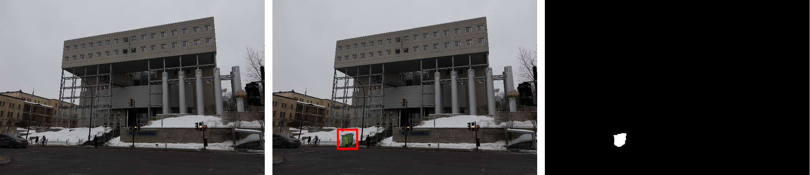
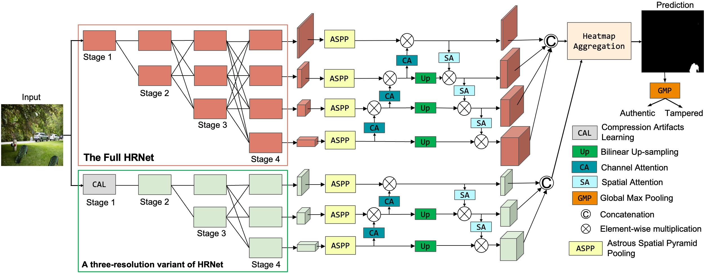
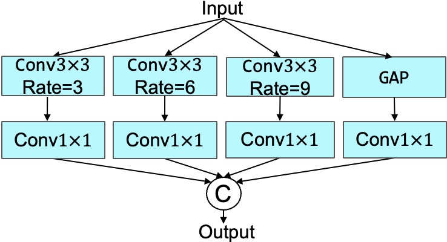
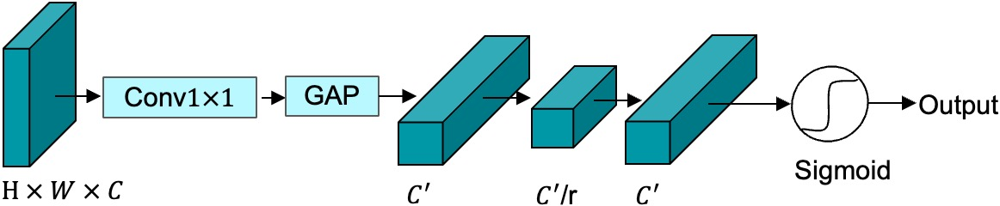
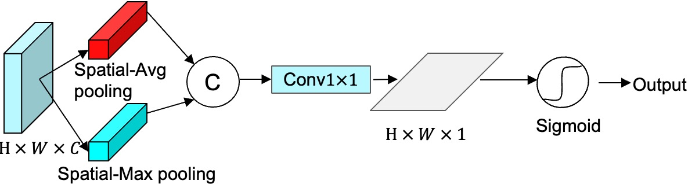

# A New Benchmark and Model for Challenging Image Manipulation Detection

This readme file is an outcome of the CENG501 (Fall 2024) project for reproducing a paper without an implementation. See [CENG501 (Fall 2024) Project List](https://github.com/CENG501-Projects/CENG501-Fall2024) for a complete list of all paper reproduction projects.

# 1. Introduction

In this repository we are implementing the paper "A New Benchmark and Model for Challenging Image Manipulation Detection" by Zhang, Z., Li, M., & Chang, M. C. (2024). The paper introduces a novel dataset for Image Manupulation Detection (IMD) namely Challenging Image Manupulation Detection (CIMD), and a two-branch IMD network that integrates RGB and frequency streams to detect anomaly features and compression artifacts. 

## 1.1. Paper summary

Image manipulation operations can generally be categorized into three types: (1) region splicing, where content from one image is extracted and inserted into a different image, (2) region copy-move, where a portion of an image is duplicated and placed in another area within the same image, and (3) region removal, where certain parts of an image are erased and replaced with synthesized content. Image manipulation detection (IMD) is becoming increasingly critical in digital forensics as image editing and AI content generation technologies advance. Current IMD methods perform well on mainstream public IMD datasets. However, they face significant challenges in two key areas. 

First, existing IMD methods face significant challenges in detecting small tampered regions due to their data-driven nature and the limited visual information available. Second, techniques that rely on identifying inconsistencies from double compression using different quantization matrices fail when the same Quality Factor (QF) is applied in both compression stages. This is because using identical Q-matrices minimizes the presence of double compression artifacts. Methods in this category typically detect tampered regions by analyzing missing histogram values caused by the two compression processes. However, when the same QF is used, the resulting histogram changes are minimal, making it difficult to identify double compression. Overall, as image tampering techniques rapidly evolve, forensic problems remain ill-defined, and IMD methods often struggle to address complex and challenging scenarios.

In order to overcome these challenges, the paper proposes a novel two-branch IMD network that integrates RGB and frequency streams, which enables the detection of anomaly features and compression artifacts. 

The paper introduces:

1. A novel Challenging Image Manipulation Detection (CIMD) benchmark dataset consisting of two specialized subsets:
   - CIMD-Raw: For evaluating image-editing based methods
   - CIMD-Compressed: For assessing compression-based methods

2. A new two-branch network architecture incorporating:
   - RGB stream for detecting anomalous features
   - Frequency stream for identifying compression artifacts
   - Adaptive weighted heatmap aggregation for combining both streams

The method achieves significant improvements over state-of-the-art approaches, particularly in challenging cases involving small manipulated regions and identical QF double compression.

# 2 The Proposed Dataset (CIMD: Challenging Image Manipulation Detection Dataset)

The paper also proposes a new dataset called CIMD (Challenging Image Manipulation Detection Dataset) dedicated to small region forgery which is less than 1.5% on average. Two separate subsets of the dataset have been offered to evaluate image editing-based and
compression-based methods. Original images was captured using Canon RP camera. The image set contains highly diverse season settings and challenging lighting conditions. The dataset comprises two seperate subsets.  

## 2.1 The CIMD-Raw (CIMD-R) Subset

The CIMD-R benchmark offers a thorough evaluation of image-editing models' ability to detect small tampered forgeries, including **copy-move**, **object-removal**, and **splicing forgeries**, **on uncompressed images**. Using uncompressed images avoids the unwanted compression artifacts in the forged regions, which neural networks might otherwise detect, allowing for a more accurate performance assessment on out-of-detection cases. CIMD-R consists of 600 TIFF images with a resolution of 2048 × 1365, and ground-truth masks are provided. 
<ul>
<li>For copy-move manipulation, a section of an image is duplicated and pasted within the same image, followed by five post-processing techniques: <strong> scaling, rotation, level/curve adjustments, illumination changes, and color redistribution </strong>.</li> 

<li>In the case of removal manipulation, forged images are created by removing a selected area from the image using Content-Aware Fill in Photoshop (PS). </li>  

<li>For splicing forgery, regions from one image are copied and inserted into another image, followed by the same post-processing methods applied in the copy-move case to make the forged region have smooth transition. </li>
</ul>

Below are some examples from the CIMD-R Dataset:

*Figure 1: Left: original image, Middle: spliced image, Right: ground truth mask of spliced image.*

*Figure 2: Left: original image, Middle: spliced image, Right: ground truth mask of spliced image.*

## 2.2 The CIMD-Compressed (CIMD-C) Subset

The CIMD-C benchmark is a dataset designed to evaluate the ability of compression-based models to detect double JPEG compression artifacts, specifically when the primary and secondary compressions use the same Quality Factor (QF).
<ul>
<li>The dataset includes 200 JPEG images, each with a resolution of 2048 × 1365, and the QFs are uniformly distributed between 50 and 99. </li>

<li>The original images are derived from RAW files and compressed into JPEG for the first time so as to  ensure a clean dataset without prior compression. </li>

<li> In the forged images, the background undergoes double compression, while <strong>the tampered regions are only  single-compressed</strong>, because when a region is copied and pasted into the target image, it is typically decompressed into its raw or uncompressed form during the editing process.</li>
</ul>

Below is a example from the CIMD-C Dataset:

*Figure 3: Left: original image, Middle: spliced image, Right: ground truth mask of spliced image.*

# 3. The Method

## 3.1. The Original Method

*Figure 4: The overall architecture of the proposed two-branch IMD network.*

The network feed the inputs to two parallel branches to extract features from both RGB and frequency domains:

### 3.1.1 HRNet Backbone
1. RGB Stream, which is responsible for detecting anomalous features and tries to detect image editing traces:
   - Uses a full HRNet backbone with four resolution outputs
   - Feature maps at resolutions: $F_1 \in \mathbb{R}^{H/4 \times W/4 \times C_1}$, $F_2 \in \mathbb{R}^{H/8 \times W/8 \times C_2}$, $F_3 \in \mathbb{R}^{H/16 \times W/16 \times C_3}$, $F_4 \in \mathbb{R}^{H/32 \times W/32 \times C_4}$ wtih channel dimensions: $C_1=48$, $C_2=96$, $C_3=192$, $C_4=384$

2. Frequency Stream, which is responsible for detecting compression artifacts and tries to detect double compression traces:
   - Uses a three-resolution variant of HRNet (1/8, 1/16, 1/32)
   - Processes DCT features from compression artifact learning model

Here the selection of HRNet backbone is due to three following benefits of HRNet:
1. With absence of pooling layers, HRNet can maintain high-resolution representations.
2. HRNet can capture multi-scale information by fusing high-to-low resolution features with effective information exchange.
3. HRNet's input size is ideal for processing 8x8 DCT blocks.

 
### 3.1.2 ASPP and Attention Mechanism
To succesfully identify small tampering regions, the model feeds the outputs of thse two branches (4 for RGB Stream and 3 for Frequency Stream) to Atrous Spatial Pyramid Pooling (ASPP) and Attention Mechanism modules.

The ASPP module, which consists of three dilated convolutional laters with different rates and a Global Average Pooling followed by 1x1 convolution, captures multi-scale information and long-range dependencies with various receptive fields.

*Figure 5: ASPP Module.*

The outputs of the ASPP module are then fed to the carefully designed Attention Mechanism module.
The proposed attention module tries to fully exploit the diverse range of semantic and spatial information of HRNet's outputs, where high-resolution features consists of rich spatial information and low-resolution features capture more semantic information. 
Their approach utilizes a bottom up channel attention path and a top down spatial attention path, where two attention modules collaborate to enhance feature representations.

The bottom-up channel attention features are calculated as:
$F_{n} = {\cal C}(F_{n+1})\odot F_{n}, \;\; n=1,2,3$
where ${\cal C}(\cdot)$ denotes the channel attention block shown in below figure and $\odot$ represents element-wise multiplication.

*Figure 6: Channel Attention Block.*

As $F_{4}$ contains the highest level of semantic information, it remains unchanged at the channel level. A 1x1 convolutional layer is applied to the the feature maps $F_{n+1}$ to equalise number of channels with $F_{n}$ enabling the element wise-multiplication in the channel dimension. The transformed features are then fed to a Global Average Pooling $GAP(\cdot)$, followed by the excitation process $E(\cdot) = C^{'} \rightarrow C^{'}/r \rightarrow C^{'} $, $r = 4$, where $C^{'}$ is the transformed channel number. The channel attention is calculated as:

${\cal C}(F) = \sigma \left( E(GAP(Conv_{1 \times 1}(F))) \right)$
where $\sigma(\cdot)$ is the Sigmoid activation function.

Then these feature maps $F_{2}$, $F_{3}$, and $F_{4}$ are upsampled using the bilinear upsampling to match the resolution of $F_{1}$. The spatial attention mechanism from the top-down pathway is then applied, which is given by:

$F_{m} = S(F_{m - 1}) \otimes F_{m}, \;\; m = 2, 3, 4$
where $S(\cdot)$ is the spatial-attention in below figure. 

*Figure 7: Spatial Attention Block.*

As $F_{1}$ contains the richest spatial information, it remains unchanged at the spatial level. 
The spatial attention is calculated using the Spatial Max Pooling $P_{max}$ and Spatial Average Pooling $P_{avg}$ as
$S(F) = \sigma \left( Conv_{1 \times 1}\left [ P_{max}(F);P_{avg}(F)\right ] \right)$
where $\left [ ; \right ]$ denotes concatenation.

After these attention operations are applied all of the feature maps have the same resolution. These features are then concatenated together to form final features for adaptive weighted heatmap aggregation. The proposed model generates two final heatmaps (one from RGB Stream, one from Frequency Stream), which are aggregated through soft selection. This soft selection is done by first upsampling heatmap of frequency stream to match the resolution of the RGB stream and then applying Softmax activation followed by Global Max Pooling to select the main heatmap and its corresponding weight. 
Then the weighted aggregated heatmap $h$ is generated using:

$h = GMP(h_{m}) \cdot h_{m} + (1 - GMP(h_{m})) \cdot h_{s}$
where $h_m$ is the main heatmap, $h_s$ is the secondary heatmap, and $GMP$ is the Global Max Pooling.

### 3.1.3 JPEG Compression Artifact Learning Model

The model introduces an innovative approach to detect compression artifacts in double-compressed images that works effectively regardless of whether the primary and secondary compressions use the same Quality Factor (QF) or different ones.

*Figure 8: The architecture of the proposed JPEG compression artifact learning model.*

Traditional methods that rely on DCT histogram inconsistencies fail when images are compressed twice with the same Q-matrix because compression artifacts are minimal. The paper leverages a key observation: when a JPEG image undergoes repeated compression with the same QF, quantized DCT coefficient differences between consecutive compressions decrease monotonically. This property is used to detect tampered regions because:
<ol>
<li> Manipulated regions are typically single-compressed. </li>
<li> Background regions are double-compressed. </li>
<li> Under repeated compression, unstable coefficients concentrate in tampered areas. </li>
</ol>

The paper only focuses on Y-channel DCT map since it is more sensitive to human eyes. Corresponding Q-matrix is obtained from JPEG header file. In order to match $Q_0$ dimensions, Q-matrix is repeated ($q$).

The model computes $(k+1)th$ recompression coefficients through sequential operations:

$$
\begin{cases}
D_{k} = Q_{k} \odot q \\
B_{k} = \text{IDCT}(D_{k}) \\
I_{k+1} = \text{RT}(B_{k}) \\
Q_{k+1} = [\text{DCT}(I_{k+1}) \oslash q]
\end{cases}
$$

   Where:
   - $D_k$: De-quantized DCT coefficients
   - $B_k$: Inverse DCT transformed blocks
   - $I_{k+1}$: Image blocks after rounding/truncation
   - $Q_{k+1}$: New quantized coefficients
   - $\odot$: Element-wise multiplication
   - $\oslash$: Element-wise division
   - $RT(\cdot)$: Rounding and truncation
   - $k = 7$ (determined in the experiments of the official paper)

Then, residual de-quantized coefficients after k compressions defined as:  $R = \frac{1}{k}\sum_{i=1}^{k}(Q_i - Q_{i-1})$

For the original Y-channel DCT coefficients $Q_0$​,  a clipping operation is applied with a threshold value T. Following this, the coefficients are converted into a binary volume. This binary conversion is represented as $f: Q_0^{H\times W} \rightarrow \{0,1\}^{(T+1) \times H \times W}$
   
   Research by Yousfi and Fridrich (2020) demonstrated that this conversion method effectively captures the correlation between individual coefficients in the DCT histogram. Accordingly, the DCT coefficients $Q_0$​ are transformed into binary volumes as follows:
   
$$
f(Q_0^t(i,j)) =
\begin{cases}
1, & \text{if } |clip(Q_0(i,j))| = t, t \in [0,T] \\
0, & \text{otherwise}
\end{cases}
$$

   where $clip(⋅)$ is used to extract histogram features within the range $[−T,T]$, which is crucial for optimizing GPU memory usage. Based on the experimental results, T is set to 20 in the paper.

The module includes two element-wise multiplication steps. The first involves multiplying the histogram features with the Q-matrix to replicate the JPEG de-quantization process. The second multiplication directs the histogram features to emphasize unstable coefficients, which is essential for identifying double-compressed images with the same QF.

In an $8×8$ block of DCT coefficients, each position corresponds to a specific frequency component. However, standard convolutional operations in the backbone network are tailored for RGB images and do not account for these frequency relationships. To effectively utilize both the spatial and frequency information of the DCT coefficients, a reshaping operation is performed. Specifically, each $8×8×1$ block is reshaped into a $1×1×64$ block, where the first two dimensions retain spatial information, and the third dimension encodes the frequency relationships. Following this, the de-quantized, quantized, and residual histogram features are concatenated along the channel dimension. These concatenated features are then passed through a $1×1$ convolutional layer and subsequently to the backbone network for the detection task.

## 3.2 Our Interpretation
While reading this paper we encountered a number of image processing and compression concepts that we were not familiar with. Assuming that the reader may also be unfamiliar with these concepts, we wanted to provide a brief explanation of these concepts. 

## 3.2.1 JPEG Compression
JPEG compression is a lossy compression method that reduces image file size by selectively discarding visual information that is less noticeable to human perception. This trade-off between file size and image quality allows for significant storage savings at the cost of some visual degradation, where the amount of quality loss can be controlled through compression parameters. The process involves several steps:

1. Color Space Conversion:
   - Convert RGB image to YCbCr color space
   - Y (luminance): brightness information
   - Cb and Cr (chrominance): color information
   - Human vision is less sensitive to color than brightness, allowing more aggressive compression of Cb and Cr

2. Block Division:
   - Image is divided into 8×8 pixel blocks
   - Each block is processed independently
   - Block size chosen as compromise between compression efficiency and visual artifacts

3. DCT Transformation:
   - Each 8×8 block transformed to frequency domain
   - Results in 64 DCT coefficients per block
   - DC coefficient (top-left) represents average block value
   - AC coefficients represent frequency variations

4. Quantization:
   - Each coefficient divided by corresponding Q-matrix value
   - Results rounded to nearest integer
   - Higher QF means less aggressive quantization
   - Main source of information loss in JPEG compression

5. Encoding:
   - Quantized coefficients encoded using entropy coding
   - Zigzag scanning to convert 2D array to 1D sequence
   - Run-length encoding followed by Huffman coding

*Figure 9: JPEG Compression Process. (Source: [Ri et al., 2020](https://doi.org/10.1007/s40799-019-00358-4))* 

### 3.2.2 JPEG Compression Concepts

1. DCT Coefficients:
   - JPEG compression converts image blocks into frequency domain using Discrete Cosine Transform
   - 8×8 blocks are transformed to represent different frequency components
   - Lower frequencies (top-left) contain main image structure
   - Higher frequencies (bottom-right) contain fine details
   - DCT transformation formula for 2D signals:
     $F(u,v) = \frac{2}{N}\alpha(u)\alpha(v)\sum_{x=0}^{N-1}\sum_{y=0}^{N-1}f(x,y)\cos[\frac{\pi u}{2N}(2x+1)]\cos[\frac{\pi v}{2N}(2y+1)]$
   - Coefficients represent spatial frequencies in horizontal and vertical directions

2. Y-Channel:
   - Part of YCbCr color space where Y represents luminance
   - Human eyes are more sensitive to luminance changes
   - Model focuses on Y-channel DCT coefficients for manipulation detection
   - Helps reduce computation while maintaining detection accuracy
   - Conversion from RGB:
     $Y = 0.299R + 0.587G + 0.114B$
   - Contains most of the image's structural information

3. Quantization Matrix (Q-matrix):
   - Used to compress DCT coefficients by dividing and rounding
   - Different quality factors (QF) use different Q-matrices
   - Same QF double compression is harder to detect as it uses identical Q-matrix
   - Standard JPEG quantization matrix scaled by QF
   - Higher values in higher frequencies allow more compression

4. Compression Artifacts:
   - Blocking: Visible boundaries between 8×8 blocks
   - Ringing: Oscillations near sharp edges
   - Color bleeding: Chromatic noise in high-frequency regions
   - Double compression artifacts:
     * Changes in DCT coefficient histograms
     * Different patterns in single vs. double compressed regions
     * More pronounced when using different QFs

5. Quality Factor (QF):
   - Controls compression ratio and quality
   - Range typically 1-100 (100 being highest quality)
   - Affects quantization matrix scaling:
     $Q_{scaled} = \begin{cases}
     Q_{base} \times (50/QF), & \text{if } QF \geq 50 \\
     Q_{base} \times (2 - QF/50), & \text{if } QF < 50
     \end{cases}$
   - Lower QF means more aggressive quantization and smaller file size

Knowing these JPEG compression concepts is crucial for following the paper's methodology, as the model leverages these compression artifacts and characteristics to detect image manipulations.

# 4. Experiments and results

## 4.1. Experimental setup

@TODO: Describe the setup of the original paper and whether you changed any settings.

## 4.2. Running the code

@TODO: Explain your code & directory structure and how other people can run it.

## 4.3. Results

@TODO: Present your results and compare them to the original paper. Please number your figures & tables as if this is a paper.

# 5. Conclusion

@TODO: Discuss the paper in relation to the results in the paper and your results.

# 6. References

[1]. Zhang, Z., Li, M., & Chang, M. C. (2024). A New Benchmark and Model for Challenging Image Manipulation Detection. AAAI Conference on Artificial Intelligence.

[2] Ri, S., Tsuda, H., Chang, K., Hsu, S., Lo, F., & Lee, T. (2020). Dynamic deformation measurement by the sampling Moiré method from video recording and its application to bridge engineering. Experimental Techniques, 44, 313-327.

# Contact

İsmail Talaz - ismail.talaz.16@gmail.com
Yusuf Meriç Karadağ - merickdag@gmail.com
