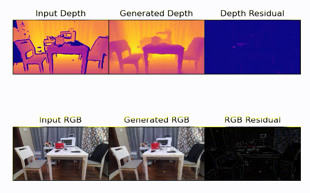
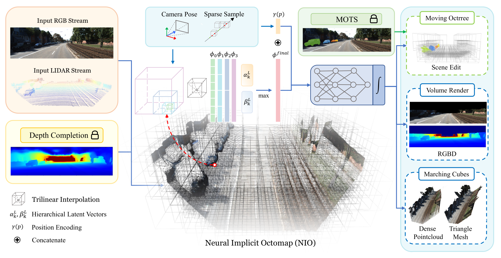
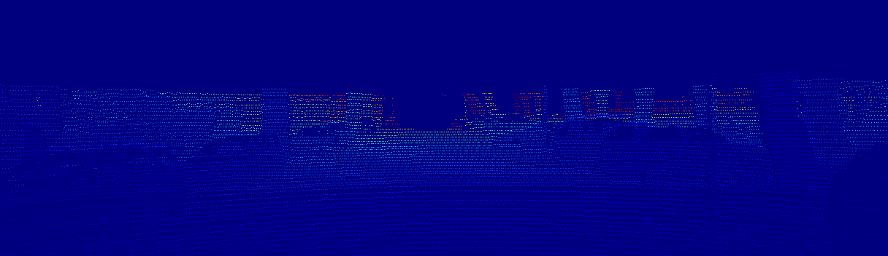
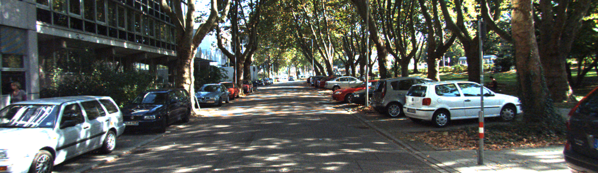
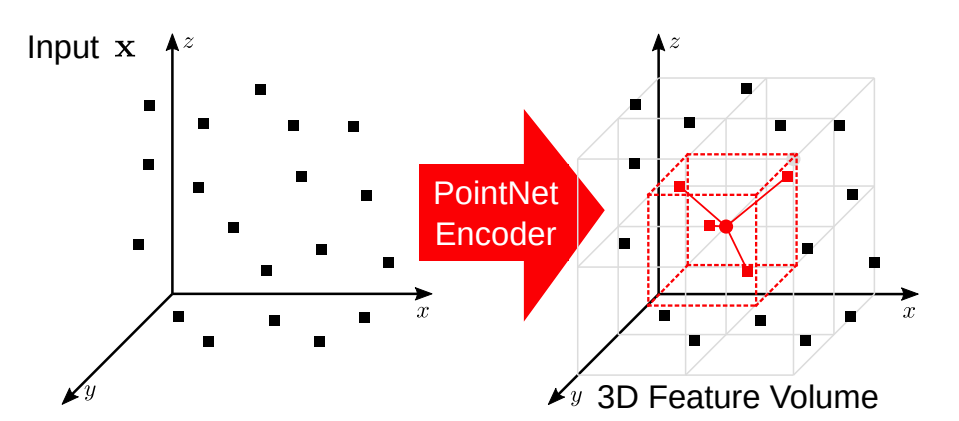
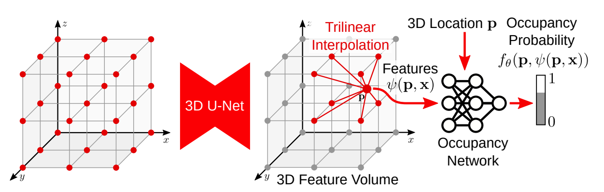
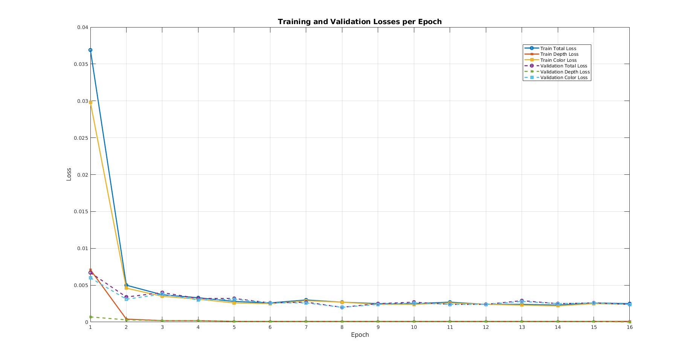
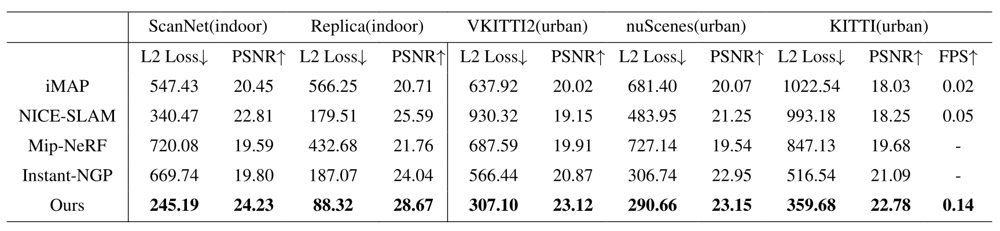
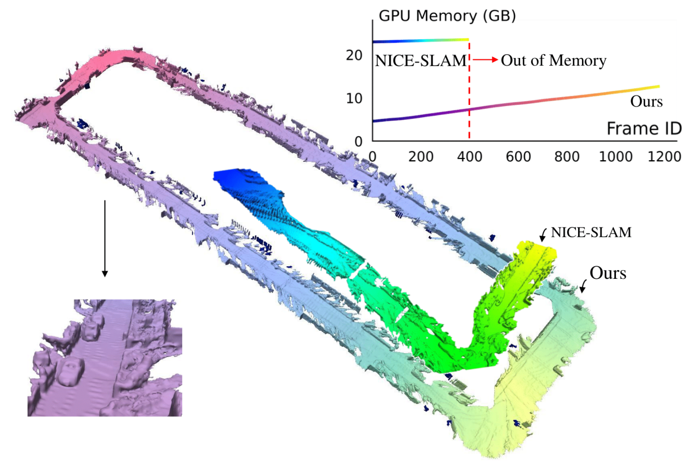

# Swift-Mapping: Online Neural Implicit Dense Mapping in Urban Scenes


# 1. Introduction

The paper, "Swift-Mapping: Online Neural Implicit Dense Mapping in Urban Scenes" [[1]](#1-wu-ke-kaizhao-zhang-mingzhe-gao-jieru-zhao-zhongxue-gan-and-wenchao-ding-swift-mapping-online-neural-implicit-dense-mapping-in-urban-scenes-proceedings-of-the-aaai-conference-on-artificial-intelligence-38-no-6-march-24-2024-604856-httpsdoiorg101609aaaiv38i628420) was presented at the Thirty-Eighth AAAI Conference on Artificial Intelligence (AAAI-24). It introduces an innovative framework for online dense mapping in urban environments using neural implicit representations. The proposed approach focuses on achieving high-fidelity and real-time 3D scene reconstruction while addressing computational challenges posed by dynamic and large-scale urban settings.

Our goal is to reproduce the results and gain a comprehensive understanding of the Swift-Mapping framework, including its Neural Implicit Octomap (NIO) and real-time mapping capabilities. This effort aims to ensure the reproducibility of the proposed methods and evaluate their applicability to broader domains such as robotics and autonomous navigation.

## 1.1. Paper summary

#### Context and Existing Literature

Traditional dense mapping approaches (e.g., SLAM, multi-view stereo) struggle in dynamic urban environments due to challenges like **occlusions**, **rapid motion**, and **scale variations**. Neural Radiance Fields (**NeRF**) offer high-fidelity reconstructions but are limited to **offline tasks** and require significant computational resources. Efforts like **iMAP** and **NICE-SLAM** bring neural implicit representations to online systems but are constrained to **indoor settings** or suffer from high memory demands.

<table>
  <tr>
    <td align="center">
      <br>
      <b>Reconstruction using NICE-SLAM</b>
    </td>
    <td align="center">
      <br>
      <b>Tracking operation</b>
    </td>
  </tr>
</table>

Swift-Mapping addresses these limitations with:
1. **Neural Implicit Octomap (NIO):**
   - A sparse octree-based voxel structure optimized for large-scale and dynamic urban scenes, using adaptive resolutions for efficient memory usage and accuracy.
2. **Online Dense Mapping Framework:**
   - Real-time updates through hybrid sampling, hierarchical latent features, and dynamic object modeling.
3. **Performance Innovations:**
   - Achieves **10x faster reconstruction** with **state-of-the-art accuracy** and robustness to challenges like **fast ego motion**.

#### Key Contributions

1. A scalable neural implicit mapping method designed for urban scenes.
2. Supports **dynamic obstacle modeling** and **scene editing** via feature voxel manipulation.
3. Demonstrates superior performance in speed and accuracy compared to both existing online and offline methods, enabling real-time applications for autonomous navigation.


# 2. The method and our interpretation

## 2.1. The original method

<div align="center">
  
  <p><em>Figure 1: The Swift-Mapping pipeline</em></p>
</div>

### Methodology Overview
The method introduced in this paper primarily fuses RGB data from a camera and sparse point cloud data from a LiDAR using an MLP decoder to generate a map in the form of an octree structure. Initially, it takes RGB and sparse point cloud data, utilizing the CompletionFormer [[2]](#2-y-zhang-x-guo-m-poggi-z-zhu-g-huang-and-s-mattoccia-completionformer-depth-completion-with-convolutions-and-vision-transformers-2023-ieeecvf-conference-on-computer-vision-and-pattern-recognition-cvpr-vancouver-bc-canada-2023-pp-18527-18536-doi-101109cvpr52729202301777) framework for depth completion to interpolate sparse depth information and produce dense depth inputs.

Next, it initializes the octree structure to generate an octomap using this information by sparsely sampling the depth information along each ray and incorporating the camera pose. After initializing the octomap, feature vectors representing color and depth are generated using trilinear interpolation. Simultaneously, positional encoding is applied to create feature vectors representing the position of each voxel within the map. The generated color and depth feature vectors are combined with learnable memorization parameters to manage the retention and forgetting of features between frames. The resulting feature vectors, including positional encodings, are concatenated into a single feature vector and fed into an MLP decoder. This decoder adopts the ConvOnet architecture, which consists of five fully connected layers with a residual connection added to the third layer.

The network is trained using a combination of photometric loss, which penalizes the loss of RGB information, and geometric loss, which penalizes the loss of depth information. Finally, the output of the MLP decoder is used to reconstruct dense RGBD maps or generate 3D meshes using the Marching Cubes algorithm. Additionally, the MOTSFusion [[3]](#3-j-luiten-t-fischer-and-b-leibe-track-to-reconstruct-and-reconstruct-to-track-in-ieee-robotics-and-automation-letters-vol-5-no-2-pp-1803-1810-april-2020-doi-101109lra20202969183) framework is employed to generate a moving octree structure, enabling the modeling of dynamic environments without the need to retrain the network. The generated moving octree can also be utilized to modify the position of objects offline.

### Steps of the Algorithm
1. *Depth Completion:*
   - Utilizes the CompletionFormer framework to interpolate sparse depth into dense depth inputs.

2. *Octree Initialization:*
   - Initializes the Neural Implicit Octomap (NIO) associating valid octree voxels with latent features.
   - Sparse sampling of depth information along rays using the camera pose.

3. *Distance Adaptive Voxel Initialization:*
   - Voxels are initialized with resolutions that adapt to the distance of the region from the camera.
   - Nearby regions use finer resolution, while distant regions use coarser resolution to optimize memory and computational efficiency.
   - Voxel resolution at level $` k `$ is calculated as:
   
   $$\text{Voxel Resolution at Level } k = l \cdot 2^k$$, 
   
   where $` l = \text{minimum resolution} `$.
   
   - Voxel resolutions are dynamically selected based on scale variation at different distances:
   
   $$2^{k-K} \cdot d_{\text{max}} \leq \text{distance} < 2^{k-K+1} \cdot d_{\text{max}},$$
   
   where $` d_{\text{max}} `$ is the maximum sampling distance.

4. *Feature Vector Generation:*
   - *Depth and Color Features:* Generated via trilinear interpolation from neighboring voxels.
   - *Position Encoding:* Encodes spatial position of voxels in the map.
   - *Trainable Memorization Parameters ($` \alpha_k `$ and $` \beta_k `$):* Control the forgetting and retention of features across frames.

   Each voxel at level $` k `$ is associated with latent feature vectors for depth ($` \phi_d^k `$) and color ($` \phi_c^k `$):

   $$\phi_d^k(p) = (\phi_d^k(p), \alpha_k \phi_d^k(p), \alpha_k^2 \phi_d^k(p), \dots, \alpha_k^{2^{K-k}} \phi_d^k(p))$$

   $$\phi_c^k(p) = (\phi_c^k(p), \beta_k \phi_c^k(p), \beta_k^2 \phi_c^k(p), \dots, \beta_k^{2^{K-k}} \phi_c^k(p)).$$

   These latent vectors are concatenated across all levels $` k `$ using a max-pooling operation:

   $$\phi_d(p) = \max_k (|\phi_d^k(p)|), \quad \phi_c(p) = \max_k (|\phi_c^k(p)|).$$

5. *MLP Decoding:*
   - Combines feature vectors and feeds them into an MLP decoder following the ConvOnet architecture.
   - The decoder comprises 5 fully connected layers with residual connections on the third layer.
   - Predictions for occupancy ($` o_p `$) and color ($` c_p `$) are made as follows:
   
   $$o_p = f_\theta^d(p, \phi_d(p)), \quad c_p = f_\omega^c(p, \phi_c(p)).$$

6. *Training Objectives:*
   - *Photometric Loss ($` L_p `$):* Penalizes RGB information loss.
   
   $$L_p = \frac{1}{M} \sum_{m=1}^M || I_m - \hat{I}_m ||^2$$

   - *Geometric Loss ($` L_d `$):* Penalizes depth information loss.
   
   $$L_d = \frac{1}{M} \sum_{m=1}^M || D_m - \hat{D}_m ||^2$$

   - Combined optimization target:
   
   $$\min_{\theta, \omega, \alpha, \beta, \phi_d, \phi_c} (\lambda_d L_d + \lambda_p L_p)$$

7. *Output Generation:*
   - Dense RGB-D maps.
   - 3D meshes generated using *Marching Cubes*.

8. *Dynamic Scene Handling:*
   - Utilizes MOTSFusion to create a Moving Octree, modeling dynamic obstacles without retraining.
   - Supports scene editing by manipulating voxel features offline.


### Main Steps
1. Feed RGB and sparse point cloud data.
2. Initialize the Neural Implicit Octomap with adaptive voxel resolutions.
3. Train the MLP decoder using photometric and geometric losses.
4. Generate dense RGB-D maps or 3D meshes.
5. Optionally, use the Moving Octree for dynamic scene modeling or offline editing.

## 2.2. Our interpretation

### Depth Completion
In the KITTI dataset, we can only obtain the lidar and RGB data along with the camera pose. Since the lidar data is sparse, we need to find a way to calculate the depth information to be able to construct Octree structure. As is it addressed in Swift-Mapping, we are utilizing CompletionFormer to obtain the depth frame. 

<table>
  <tr>
    <td align="center">
      <br>
    </td>
  </tr>
  <tr>
    <td align="center">
      <br>
    </td>
  </tr>
  <tr>
    <td align="center">
      <br>
      <b>Figure 2: Lidar and RGB frames processed to obtain depth frame using CompletionFormer Network [2]</b>
    </td>
  </tr>
</table>

### Octree Structure
We are simply utilizing the OctoMap API to obtain the octree voxel structure. The result is given in the below figure. Note that the octree structure is created in C++ and we used Pybind11 library to bind the octree API to the training code written Python.

<div align="center">
  
  <p><em>Figure 3: Volume encoder, 3D features</em></p>
</div>

### Dataset Usage
We directly use the KITTI dataset as it provides depth frames corresponding to RGB frames, along with intrinsic and extrinsic camera parameters. These parameters enable the construction of a point cloud for each frame at any given time using depth and RGB frames. Additionally, the camera pose information is utilized to accurately localize the generated point cloud during each iteration.

### Neural Implicit Octomap Structure
We constructed the octree using the well-known OctoMap library. This library includes built-in features that allow for the efficient storage of data and facilitate various tasks, such as ray casting for sparse sampling. 

By employing ConvOnet [[5]](#5-songyou-peng-and-michael-niemeyer-and-lars-mescheder-and-marc-pollefeys-and-andreas-geiger-2020-convolutional-occupancy-networks-httpsarxivorgabs200304618) we encode the RGB and depth data to obtain latent vectors for each valid voxel in the octree structure. Only using the relevant part of ConvOnet, which is the encoder of it, we are able to extract the depth and RGB feature vectors to feed them into MLPs.  

<div align="center">
  
  <p><em>Figure 4: Volume encoder, 3D features</em></p>
</div>

After the 3D feature volume (assigning a feature vector for sampled voxels) is obtained using PointNet encoder, latent vectors are extracted for each of the sampled voxels in the neural implicit octomap using 3D U-Net. Lastly, hierarchical latent vectors are extracted as explained before.

<div align="center">
  
  <p><em>Figure 5: Feature vectors in a voxel grid (left), latent vectors are extracted using 3D U-Net (middle), latent vectors are fed to two different occupancy networks to predict depth and color (right)</em></p>
</div>

After the hierarchical latent vectors are extracted, they are passed through an MLP decoder with two heads (for depth and color, seperately) named as occupancy network to predict depth and color values for an input point. The encoder and decoder are traned together for this purpose.

### Sparse Sampling
We randomly cast rays at an order of ten thousands from camera pose in octomap. If the a ray does not hit any voxel, we recast another random ray until it hits a voxel in the octomap. Doing this for a number of times we generate a dataset for the network to extract latent vectors.  


# 3. Experiments and results

## 3.1. Experimental setup
We trained the encoder-decoder pair for 5000 samples sampled from the octomap generated from a single depth-color frame pair taken from KITTI dataset. We trained our network with a batch size of 32 for 16 epochs with Adam Optimizer.

## 3.2. Running the code
We first set the software environment to be able to use different software packages at once. To do that we first generate a docker container since each user has the possibility to face a compability issue while dealing with the third party software packages. We are using the same or similar software as it is used by the authors of Swift-Mapping.

One can setup the software environment following the below steps:
-  Install [Docker Engine](https://docs.docker.com/engine/install/) and create a docker usergroup and add the user in it following [the guide](https://docs.docker.com/engine/install/linux-postinstall/#manage-docker-as-a-non-root-user).
-  Install [VS Code](https://code.visualstudio.com/) and the required [Dev Containers](https://marketplace.visualstudio.com/items?itemName=ms-vscode-remote.remote-containers) extension pack.
-  After setting up the container inside VS Code, run [the script](https://github.com/CENG501-Projects/CENG501-Fall2024/blob/main/KoyuncuOzkaya/script.sh) with sudo privileges.
-  At the last stage, follow the guides written inside the software package's README files.

The following directory structure is used with the datasets included:

```
.
├── CMakeLists.txt
├── data
├── dataset.py
├── extern
├── generate_octomap_and_cast.py
├── interpolate.py
├── media
├── net.py
├── nice-slam
├── octomap_pybind.cpp
├── positional_encode.py
├── Readme.md
├── script.sh
├── trainer.py
├── unet3d.py
└── voxel_utils.py
```

One can train the model following the upcoming commands:
- `mkdir build && cd build && cmake .. && make`
- `python generate_octomap_and_cast.py`

You can download the pretrained checkpoints from [Google Drive](https://drive.google.com/drive/folders/1V7iCZmOJwOopxQHPaP3lY6scvVIz2jMV?usp=sharing) 


## 3.3. Results
After training the model for 16 epochs, we obtained the following loss graph. As it is shown in the graph, losses converges after nearly 8 epochs for the mentioned dataset. The quick convergence of the network can be related to the small size of the dataset that we trained on. Higher the dataset size, longer it takes and the validation accuracy can be further increased.

<div align="center">
  
  <p><em>Figure 6: Training and Validation Losses after 16 Epochs</em></p>
</div>

The expected end results are given in Swift-Mapping as n the below figure.

<div align="center">
  
  <p><em>Figure 7: Quantitative evaluation of volume rendering (from Swift-Mapping)</em></p>
</div>

After running the model the following output is expected to be obtained and NICE-SLAM comparison is also given.

<div align="center">
  
  <p><em>Figure 8: Expected result (from Swift-Mapping)</em></p>
</div>


# 4. Conclusion
The focus of this project is mainly trying to reproduce the results obtained in the paper Swift-Mapping. However, due to the non-clear language used in the paper and not mentioning some of the most important details about the work such as the encoder network usage to generate latent feature vectors, training setting details, how to utilize and/or construct Octree structure and unclear performence metrics we were able to produce the work with high number of assumptions. The paper claims that the work can be run in real time; however, even generating a simple Octree structure from a single depth-color frame pair takes more time than a second. Overall, with some more time the implementation can be improved further and optimized to make it perform better but in the limited time of the project implementation the progress is still satisfactory. The work here is promising real time urban area mapping. However, there is a gap to be filled with a serious attention. 


# 5. References

#### [1] Wu, Ke, Kaizhao Zhang, Mingzhe Gao, Jieru Zhao, Zhongxue Gan, and Wenchao Ding. “Swift-Mapping: Online Neural Implicit Dense Mapping in Urban Scenes.” Proceedings of the AAAI Conference on Artificial Intelligence 38, no. 6 (March 24, 2024): 6048–56. https://doi.org/10.1609/aaai.v38i6.28420.
#### [2] Y. Zhang, X. Guo, M. Poggi, Z. Zhu, G. Huang and S. Mattoccia, "CompletionFormer: Depth Completion with Convolutions and Vision Transformers," 2023 IEEE/CVF Conference on Computer Vision and Pattern Recognition (CVPR), Vancouver, BC, Canada, 2023, pp. 18527-18536, doi: 10.1109/CVPR52729.2023.01777.
#### [3] J. Luiten, T. Fischer and B. Leibe, "Track to Reconstruct and Reconstruct to Track," in IEEE Robotics and Automation Letters, vol. 5, no. 2, pp. 1803-1810, April 2020, doi: 10.1109/LRA.2020.2969183.
#### [4] Zhu, Z., Peng, S., Larsson, V., Xu, W., Bao, H., Cui, Z., Oswald, M. R., & Pollefeys, M. (2022). Nice-slam: Neural implicit scalable encoding for slam. 2022 IEEE/CVF Conference on Computer Vision and Pattern Recognition (CVPR). https://doi.org/10.1109/cvpr52688.2022.01245
#### [5] Songyou Peng and Michael Niemeyer and Lars Mescheder and Marc Pollefeys and Andreas Geiger (2020). Convolutional Occupancy Networks. https://arxiv.org/abs/2003.04618

# Contact

- **Yavuz Selim Özkaya**  
  Email: [e230518@metu.edu.tr](mailto:e230518@metu.edu.tr)  
  LinkedIn: [yavuzselimozkaya](https://www.linkedin.com/in/yavuzselimozkaya/)  
  GitHub: [ysozkaya](https://github.com/ysozkaya)

- **Eminalp Koyuncu**  
  Email: [e230788@metu.edu.tr](mailto:e230788@metu.edu.tr)  
  LinkedIn: [eminalp-koyuncu](https://www.linkedin.com/in/eminalp-koyuncu/)  
  GitHub: [eminalpkoyuncu](https://github.com/eminalpkoyuncu)
  
