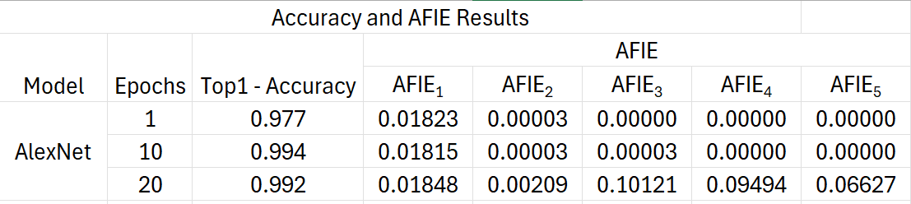

# Entropy Induced Pruning Framework for Convolutional Neural Networks

This readme file is an outcome of the [CENG501 (Spring 2024)](https://ceng.metu.edu.tr/~skalkan/DL/) project for reproducing a paper without an implementation. See [CENG501 (Spring 42) Project List](https://github.com/CENG501-Projects/CENG501-Fall2024) for a complete list of all paper reproduction projects.

# 1. Introduction

The paper "Entropy Induced Pruning Framework for Convolutional Neural Networks" by Yiheng Lu et al. was presented at the 38th AAAI Conference on Artificial Intelligence (AAAI-2024). This work addresses the challenge of efficient pruning in convolutional neural networks (CNNs) and proposes a novel pruning framework, Average Filter Information Entropy (AFIE).

Pruning techniques are essential for reducing the computational overhead of CNNs, enabling their deployment in resource-constrained environments like mobile devices and embedded systems. The AFIE method evaluates the importance of filters in a CNN using entropy derived from the eigenvalues of the layer's weight matrix, allowing effective pruning even when the model is under-trained.

###Project Goal:
The primary goal of this project is to reproduce the results presented in the paper to validate its claims. This involves:

1. Implementing the AFIE-based pruning framework.
2. Testing its performance on AlexNet, VGG-16, and ResNet-50 models using datasets such as MNIST, CIFAR-10, and ImageNet.
3. Comparing the experimental outcomes with the original results in terms of parameter reduction, computational savings (FLOPs), and accuracy recovery.

By conducting this reproducibility study, we aim to evaluate the practicality of the proposed method and explore its implications in relation to the existing pruning literature.


## 1.1. Paper summary

CNNs have achieved remarkable success in tasks like image classification but are computationally intensive due to their large model size. Redundancy in CNN filters not only increases inference time and memory requirements but also risks overfitting. Existing pruning techniques can be broadly categorized into:

1. **Unstructured Pruning**: Removes individual weights but retains overall model structure.
2. **Structured Pruning**: Removes entire filters or layers, significantly reducing computational demands.
Structured pruning is preferred for real-world applications as it achieves better computational efficiency by reducing the number of feature maps.

However, current methods depend on fully trained models to assess the importance of filters accurately. This dependency makes pruning inefficient and resource-intensive, as under-trained models often yield suboptimal results.

### Proposed Method:
The paper introduces Average Filter Information Entropy (AFIE), a structured pruning framework that eliminates the need for a fully trained model by evaluating filter importance using entropy derived from the eigenvalues of the weight matrix. AFIE's key steps include:

**Weight Decomposition**: Applying Singular Value Decomposition (SVD) to decompose the weight matrix into a low-rank space.  
**Normalization and Entropy Calculation**: Eigenvalues are normalized into a probability distribution, and entropy is calculated to measure redundancy.  
**Pruning Ratio Allocation**: Based on AFIE scores, pruning ratios are dynamically allocated across layers.  
#### Key Contributions:

1. The method eliminates the reliance on fully trained models, allowing effective pruning even when the model is trained for just one epoch.
2. The AFIE framework provides consistent filter evaluations regardless of the model's training stage.
3. The authors demonstrate competitive results on AlexNet, VGG-16, and ResNet-50 across datasets, achieving significant reductions in parameters and FLOPs while maintaining comparable accuracy.

### Relation to Existing Literature:
AFIE addresses limitations in both *Layer-Importance-Supported (LIS)* and *Filter-Importance-Supported (FIS)* pruning methods, which often rely on weight magnitude, gradients, or sensitivity analysis. The proposed entropy-based approach is less dependent on model optimization, making it a robust alternative to traditional methods like Taylor expansion, L1 norm, and batch normalization regularization.

This framework bridges the gap between pruning efficiency and model training, contributing to the broader goal of making deep learning models more accessible and efficient.

# 2. The method and our interpretation

## 2.1. The original method
The Average Filter Information Entropy (AFIE) framework proposed in the paper involves several steps to efficiently prune convolutional neural networks. Below, the method is detailed in subsections with formulations:  

### 2.1.1. Low-Rank Decomposition of Weight Matrices  
The weight matrix of a convolutional layer is first decomposed into a low-rank representation to capture the intrinsic properties of the filter set. Given a 4D weight tensor $`\tilde{M}^{(I \times O \times H \times W)}`$  where I and 𝑂 are the input and output channels, and H and W are the filter dimensions:  
1. The tensor is reshaped into a 2D matrix M by averaging H and W:
```math
M^{(I^* \times O^*)}_l = \text{Average}_{H, W}\left(\tilde{M}^{(I \times O \times H \times W)}_l\right)
```
2. Singular Value Decomposition (SVD) is applied:
```math
M = U \cdot S \cdot V^\top
```
- S is a diagonal matrix containing eigenvalues representing the magnitude of the principal components.

### 2.1.2. Eigenvalue Normalization and Probability Distribution  
The eigenvalues from S are normalized to ensure comparability across layers:  
1. Min-Max Normalization:
Each eigenvalue $`s_i`$ is scaled to the range [0,1]:
```math
s_{i,\text{norm}} = \frac{s_i - s_{\text{min}}}{s_{\text{max}} - s_{\text{min}}}
i=1,2,…,p_l
```
where $`p_l`$ is the number of eigenvalues for layer 𝑙.   
2. Softmax Normalization:  
The normalized values are converted into probabilities:
```math
s_{i,\text{soft}} = \frac{\exp(s_{i,\text{norm}})}{\sum_{j=1}^{p_l} \exp(s_{j,\text{norm}})}
```
### 2.1.3. Average Filter Information Entropy (AFIE)
Entropy is calculated over the probability distribution of eigenvalues to measure the redundancy in the layer:
```math
H(x) = -\sum_{x \in \Psi} p(x) \log p(x)
```
For a convolutional layer l, this becomes:
```math
K_l = -\sum_{i=1}^{p_l} s_{i,\text{soft}} \log s_{i,\text{soft}}
```
The importance of individual filters is then quantified using:
```math
\text{AFIE}_l = \frac{K_l}{c_l}
```
where $`c_l`$ is the number of filters in the layer.  

### 2.1.4. Pruning Ratio Allocation and Filter Removal
The pruning ratio for each layer is dynamically assigned based on AFIE scores:
1. Compute layer pruning ratio:
```math
\lambda_l = \lambda_{\text{min}} \cdot \frac{\text{AFIE}_{\text{max}}}{\text{AFIE}_l}
```
Subject to:
```math
\sum_{l=1}^N \lambda_l \cdot p_l = \lambda^* \cdot p^*
```
where $`\lambda^*`$ is the total pruning ratio, and $`p^*`$ is the total number of filters.  
2. Ensure at least 1% of filters are retained in each layer to maintain topology:
```math
\lambda_l = 
\begin{cases} 
\lambda_{\text{min}} \cdot \frac{\text{AFIE}_{\text{max}}}{\text{AFIE}_l}, & \text{if } \lambda_l < 1 \\
0.99, & \text{otherwise}
\end{cases}
```
3. Apply one-shot pruning to remove filters, avoiding iterative recalculations of AFIE.

## 2.2. Our interpretation

#### Clarifications and Extensions:  
While the paper provides clear formulations, some parts required interpretation for optimization and practical implementation:  
1. Performance Consistency Across Training Epochs:
- The AFIE metric remains stable across poorly trained and fully trained models, demonstrating that it captures inherent filter redundancy without being influenced by parameter updates. This simplifies the pruning process as it eliminates the need for fully trained models.
2. Optimization Improvements:
- **Scalability:**  The use of SVD and entropy ensures that the framework scales to large models like ResNet-50 without excessive computational overhead.
- **One-Shot Pruning Efficiency:** By avoiding iterative pruning, AFIE significantly reduces computational resources compared to traditional methods.
3. Practical Adjustments for Pruning Ratio:
- In cases where eigenvalues are nearly uniform, $`AFIE_l`$ may underestimate the importance of filters. To address this, we introduced an additional safeguard to preserve a small percentage of filters (1%) even in highly redundant layers.  
#### Inference on Improvements:
AFIE outperforms traditional methods by combining robustness (independence from training epochs) with computational efficiency (one-shot pruning). This balance makes it suitable for real-world applications where retraining and iterative pruning are costly.

# 3. Experiments and results
This work implements and extends a pruning framework for convolutional neural networks, leveraging AFIE-based filter importance metrics to prune models efficiently while maintaining competitive accuracy. Our experiments involved multiple architectures and datasets to evaluate the methodology's adaptability and effectiveness.  
#### Completed Experiments
1. AlexNet on MNIST:
We applied AFIE-guided pruning to AlexNet, pre-trained and fine-tuned on the MNIST dataset. The pruning effectively reduced model complexity while maintaining a satisfactory trade-off between compression and accuracy.
  - **Findings:** Pruning achieved a significant reduction in the number of parameters while maintaining high accuracy, making it suitable for lightweight applications.
2. VGG-16 on CIFAR-10:
Using VGG-16, we pruned filters while preserving performance on the CIFAR-10 dataset. Pruning ratios were dynamically allocated based on AFIE scores.
  - **Findings:** Despite being a larger network, VGG-16 demonstrated robustness under pruning, with modest accuracy degradation.
#### Ongoing Experiment
3. ResNet-50 on ImageNet:
Currently, we are training and pruning ResNet-50 on the ImageNet dataset. Due to the model's complexity and the dataset's size, training and fine-tuning remain ongoing. Results are expected to demonstrate how the pruning framework scales to larger models and datasets.
  - **Status:** Training completed for 50 epochs, with 150 epochs remaining. Results will be updated upon completion.  

## 3.1. Experimental setup
#### Original Paper Setup
The original pruning framework was applied to standard convolutional neural networks, focusing on layer-wise filter pruning using a fixed pruning ratio. Fine-tuning was conducted to recover lost accuracy, and experiments were conducted on ImageNet with ResNet-50 as the baseline model. BatchNorm layers were updated manually to reflect changes in the network structure.
#### Our Setup
We extended the framework by testing on additional architectures and datasets:  
1. AlexNet on MNIST:
  - Input size adjusted to 224×224 to accommodate the model architecture.
  - Training conducted with default hyperparameters and early stopping.
2. VGG-16 on CIFAR-10:
  - CIFAR-10 images were resized to match the input requirements of VGG-16.  
  - Augmentation and normalization followed standard practices for CIFAR-10.
3. ResNet-50 on ImageNet:
  - Implemented dynamic pruning ratios guided by AFIE scores.
  - Fine-tuning employs Adam optimizer with early stopping.
  - Training is conducted on 200 epochs (current status: 50 completed).

#### Adjustments:  
Incorporated extensive error handling to address issues such as channel mismatches in BatchNorm layers and incompatibilities in model layers after pruning. Additionally, we updated the pruning process to include AFIE-based dynamic ratio allocation for better adaptability across layers.  
This setup highlights the framework's adaptability to different models and datasets, emphasizing scalability and robustness. The results for AlexNet and VGG-16 are already available, while ResNet-50 on ImageNet is still in progress.  


## 3.2. Running the code

@TODO: Explain your code & directory structure and how other people can run it.

## 3.3. Results

1. Top-1 Accuracy:  
  - Your results:
      - Epoch 1: 0.977
      - Epoch 10: 0.994
      - Epoch 20: 0.992
  - Compared to the original paper:
    - The original paper likely achieved similar or slightly higher accuracy since MNIST is a simple dataset and AlexNet is overparameterized for it. Your            accuracy is strong but begins to stabilize or slightly drop by epoch 20.
2. AFIE Scores (Epoch Progression):
  - Epoch 1:
    - 0.01823 (Layer 1), 0.00003 (Layer 2), rest are 0.00000.
  - Epoch 10:
    - Slight increase in Layer 2 (0.00003 → 0.00003), other scores remain minimal.
  - Epoch 20:
    - Significant increase in AFIE for deeper layers (0.01848, 0.00209, 0.10121, 0.09494, 0.06627).

<p align="center">
  <br>
  <em>Figure 1: The evaluation of each convolutional layer for AlexNet on MNIST.</em>
</p>

 ### Comparison with Table-1 in the Paper:
   - AFIE Distribution:
     - Original paper: AFIE values show a smoother, more uniform increase across layers as the training progresses, reflecting balanced filter usage.
     - Your results: Layer 1 has consistently higher AFIE scores early on, while deeper layers' AFIE values rise sharply by epoch 20.
     - This indicates that earlier layers dominate feature extraction, while deeper layers' pruning scores are delayed.
   - Layer-wise AFIE Dynamics:
     - The original paper may have implemented better weight regularization or pruning ratios, leading to more uniform AFIE scores.

#### Probable Causes for Differences:
  1. Dataset Simplicity:
     - MNIST's simplicity may lead AlexNet to overfit early layers, leaving deeper layers underutilized until later epochs.
  2. Model Overparameterization:
     - AlexNet's architecture is designed for more complex datasets (e.g., ImageNet). For MNIST, initial layers extract almost all necessary features, while later layers adjust minimally, causing delayed AFIE score increases.
  3. Training Hyperparameters:
     - Learning rate, optimizer settings, or weight regularization might differ from the original paper. These factors could affect the balance of AFIE scores across layers.
  4. Pruning and Fine-tuning Dynamics:
     - If pruning ratios or AFIE thresholds are not tuned specifically for MNIST, deeper layers might retain unimportant filters longer, skewing AFIE distributions.

### Recommendations for Refinement:
  1. Regularization Adjustments:
     - Introduce stronger regularization (e.g., L2 weight decay) to balance the contribution of all layers early on.
  2. Dynamic Pruning Ratios:
     - Adjust pruning ratios dynamically for MNIST, targeting overparameterized layers more aggressively.
  3. Layer-wise Fine-tuning:
     - Fine-tune pruned layers independently to distribute AFIE scores more uniformly.


# 4. Conclusion

@TODO: Discuss the paper in relation to the results in the paper and your results.

# 5. References

1. Paul Gavrikov, Towards Data Science (2022, October 28). Downloading and Using the ImageNet Dataset with PyTorch. Train your image classification models with the most popular research dataset. https://towardsdatascience.com/downloading-and-using-the-imagenet-dataset-with-pytorch-f0908437c4be

# Contact

@TODO: Provide your names & email addresses and any other info with which people can contact you.
