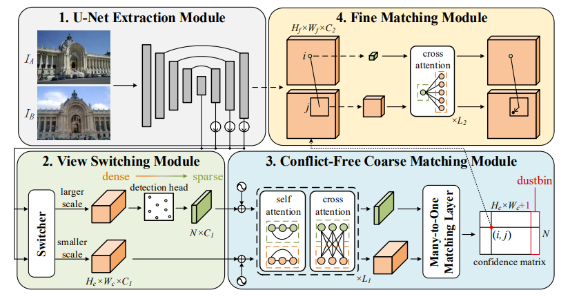
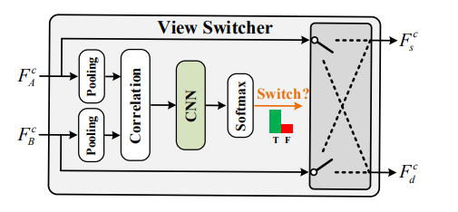

# Raising the Ceiling: Conflict-Free Local Feature Matching with Dynamic View Switching (RCM)

This readme file is an outcome of the [CENG501 (Spring 2024)](https://ceng.metu.edu.tr/~skalkan/DL/) project for reproducing a paper without an implementation. See [CENG501 (Spring 42) Project List](https://github.com/CENG501-Projects/CENG501-Fall2024) for a complete list of all paper reproduction projects.

# 1. Introduction

This folder presents an unofficial implementation of the method proposed in the paper "Raising the Ceiling: Conflict-Free Local Feature Matching with Dynamic View Switching" from ECCV 2024. The paper introduces a novel local feature matching method that significantly improves matchability by addressing common limitations in sparse and dense matching methods. RCM (Raising the Ceiling Matching) leverages a **dynamic view switching** mechanism and a **conflict-free matching strategy** to enhance matching accuracy and efficiency, achieving substantial improvements over previous approaches.

## 1.1. Paper summary

In this section, a summary of the paper "Raising the Ceiling: Conflict-Free Local Feature Matching with Dynamic View Switching" will be provided. This overview will highlight the motivations and contributions discussed in the paper. Key concepts such as conflict-free local feature matching and dynamic view switching will be introduced, giving a clear understanding of the novel approach proposed and its significance in the field of computer vision.

**RCM** is designed to overcome key challenges in feature matching, specifically:
1. Limited matchable keypoints in small-scale images.
2. Conflicts arising from traditional one-to-one matching strategies.
3. Dependence on keypoint repeatability in sparse methods.

By introducing a dynamic view switcher and a many-to-one matching layer, RCM enables high-accuracy matching in a variety of challenging scenarios, including scale variations and occlusions.

### Key Contributions

- **Dynamic View Switching:** Optimizes the selection of source and target images by considering image scale, enabling more matchable points in overlapping regions.
- **Conflict-Free Coarse Matching:** Adopts a many-to-one matching strategy, mitigating conflicts and preserving match quality in target images.
- **Semi-Sparse Paradigm with Coarse-to-Fine Matching:** Combines the efficiency of sparse methods with the coverage of dense methods, allowing a robust, efficient global search.

### Architecture

The RCM architecture comprises four main modules.
1. **U-Net Feature Extraction Module**
2. **View Switching Module**
3. **Conflict-Free Coarse Matching Module**
4. **Fine Matching Module**

# 2. The method and our interpretation

## 2.1. The original method

In this section, we will provide a detailed explanation of the four key modules that make up the proposed approach. Each module plays a crucial role in ensuring conflict-free local feature matching with dynamic view switching. Each module's functionality, design, and implementation will be discussed comprehensively to provide a clear understanding of how they contribute to the overall system's effectiveness.

#### 2.1.1. **U-Net Feature Extraction**: 
Extends a VGG-style encoder from SuperPoint [2] to generate fine features (used in RCM and RCMLite variants).
#### 2.1.2. **View Switching**: 
The View Switching Module is one of the core innovations of RCM, designed to dynamically adjust the roles of source and target images based on their scale differences. By detecting and addressing scale variations between image pairs, this module ensures that the larger-scale image is designated as the source, maximizing the number of matchable points and significantly improving the overall matching accuracy.

##### **How It Works**
- **Analyzing the Image Pair**:
The coarse feature maps (F_c^A and F_c^B) of the two images are used to compute a correlation map (Corr) that captures the similarity between their features. This correlation map is processed by a lightweight CNN (Convolutional Neural Network). 
- **Detecting Scale Differences**:
The module estimates the scale difference between the images by analyzing the correlation map. Using average distance measurements, it determines which image has a larger scale.
- **Dynamic Role Switching**:
The image with the larger scale is assigned as the source image. The smaller-scale image is assigned as the target image. This strategic reassignment increases the number of matchable keypoints in the source image's overlapping regions.
- **Decision Making**: 
A binary classifier processes the features extracted from the correlation map to decide whether the roles of the images need to be switched. If a switch is deemed necessary, the roles of the images are swapped accordingly.
##### **Outputs and Benefits**
- **Increased Matchable Points**:
By ensuring the larger-scale image is the source, the number of matchable keypoints in overlapping regions is significantly increased.
This directly raises the theoretical upper bound (or ceiling) of potential matches.
- **Conflict-Free Matching**:
The reassignment of roles ensures more consistent feature matching, avoiding conflicts during the matching process.
##### **Technical Details**

- **Network Architecture**: 
The correlation map is processed by a lightweight CNN consisting of two Conv-BN-ReLU-MaxPool layers.
The final layer reduces the spatial dimensions to a single value using adaptive average pooling, followed by a linear layer that outputs a 2D confidence vector.
A Softmax operation is applied to determine the likelihood of switching.
- **Training and Optimization**:
The view switching module is trained by calculating the average scale difference for each image pair.
A binary cross-entropy loss function is used to optimize the correct assignment of source and target roles.
- **Why Is It Important?**
The View Switching Module is particularly beneficial in scenarios with significant scale differences (e.g., when one image contains a smaller-scale subset of the other). 

#### 2.1.3. **Conflict Free Coarse Matching**: 
The **Conflict-Free Coarse Matching Module** is a critical component of RCM, addressing the challenges of traditional one-to-one matching strategies that often result in **matching conflicts**. These conflicts occur when multiple features in the source image correspond to the same feature in the target image, particularly in scenarios with **large scale variations**. The module introduces a **many-to-one matching** approach, ensuring conflict-free matching while maintaining high precision and efficiency.

##### Key Features and Mechanism

1. **Position Encoding for Context Awareness:**
   - **Problem:** Attention mechanisms lack inherent awareness of feature positions, making it challenging to distinguish spatial relationships.
   - **Solution:** A **position encoder** embeds spatial information (e.g., x, y coordinates and confidence scores) into the features. 
     - This is achieved through a lightweight **MLP (multi-layer perceptron)** that transforms position information into the same dimensionality as the feature vectors.
     - The position-encoded features enhance the module’s ability to match features with greater spatial accuracy.

2. **Attention Layer:**
   - **Details:**
     - The **Vanilla Attention** mechanism is employed for its robustness, unlike linear attention used in dense methods.
     - Enhanced features are computed iteratively over several layers (5 layers in RCM), producing refined representations for coarse matching.

3. **Many-to-One Matching Strategy:**
   - **Traditional Issue:** Existing methods enforce a **one-to-one matching** constraint, discarding valid matches and introducing conflicts in scenes with large scale variations.
   - **RCM Solution:** Adopts a **many-to-one matching** approach where:
     - Each feature in the **source image** can independently search for its best match in the **target image**.
     - A **dustbin** feature is introduced to handle non-matchable points (e.g., occlusions or non-overlapping regions).

4. **Dustbin for Outliers:**
   - Non-matchable points in the source image are assigned to the dustbin, ensuring they do not interfere with valid matches.
   - This mechanism effectively handles occluded areas or non-overlapping regions between images.

5. **Thresholding for Coarse Matches:**
   - Only matches with a confidence score above a defined threshold are retained.
   - This step ensures that only reliable matches are passed to the **fine matching module** for further refinement.

##### Outputs and Benefits

1. **Conflict-Free Matching:**
   - By allowing many-to-one associations, the module eliminates conflicts, ensuring that valid matches are not discarded.
   - This leads to higher matching accuracy, particularly in scenes with scale variations or dense feature distributions.

2. **Improved Efficiency:**
   - The use of attention layers and the dustbin mechanism reduces redundant computations, optimizing the coarse matching process.

   

   
#### 2.1.4. **Fine Matching**: 

The **Fine Matching Module** is the final stage in RCM that refines the coarse matches obtained in the earlier stage. After the **Conflict-Free Coarse Matching** module selects potential matches, the **Fine Matching Module** further enhances these matches by refining the keypoint positions at a sub-pixel level. This ensures that only the most accurate and precise keypoints are retained.

##### Key Features and Mechanism

1. **Coarse Match Refinement:**
   - The input to the Fine Matching module is the set of coarse matches produced by the Conflict-Free Coarse Matching module.
   - These coarse matches are often imprecise due to factors like large-scale variations, occlusions, or non-discriminative keypoints.
   - The Fine Matching module aims to improve the **spatial accuracy** of these matches by refining the coordinates of keypoints.

2. **Refinement Through Attention:**
   - The module applies a series of **attention layers** to enhance the features around the initial coarse match locations.
   - **Self-attention** mechanisms are used to capture local dependencies within the image, enabling more accurate keypoint alignment.
   - **Cross-attention** is employed to strengthen the connection between the source and target features, guiding the refinement of matches.

3. **Sub-Pixel Accuracy:**
   - The Fine Matching module uses a **sub-pixel refinement technique** to adjust the keypoint locations to a much finer precision than the initial coarse matches.
   - This technique ensures that the matched keypoints are aligned with higher precision (sub-pixel level), significantly improving the overall matching accuracy.
   - **Bilateral Refinement** is used, where the keypoints are iteratively adjusted by considering neighboring keypoints, ensuring smooth and accurate localization.

4. **Window-Based Matching:**
   - Instead of using the raw feature vectors directly, the module defines **fine matching windows** around the initial match locations. 
   - These windows are of a small size (e.g., 5×5 or 9×9 pixels) to focus on fine details around the keypoints.
   - Within each window, the local context is analyzed to correct and fine-tune the match locations.

5. **Confidence Scoring:**
   - The refined matches are assigned a confidence score based on their spatial consistency and alignment accuracy.
   - Matches with a confidence score above a predefined threshold are retained, ensuring that only reliable and high-quality matches are passed to subsequent stages, such as pose estimation or 3D reconstruction.

##### Outputs and Benefits

1. **Improved Matching Precision:**
   - The primary output of the Fine Matching module is a set of **sub-pixel accurate matches**. These refined matches provide significantly higher precision than the initial coarse matches, making them suitable for high-accuracy applications.

2. **Higher Robustness:**
   - By refining coarse matches, the module ensures that the final set of matches is more robust to challenging conditions like occlusions, lighting changes, and large viewpoint variations.

3. **Better Match Filtering:**
   - Only matches that pass a **confidence threshold** are kept, ensuring that the set of final matches is both accurate and reliable. This filtering step helps avoid potential errors that could be introduced by low-confidence or poor-quality matches.

4. **Enhanced Downstream Task Performance:**
   - The refined matches are used in downstream tasks like **pose estimation** and **3D reconstruction**, significantly improving the performance of these tasks by providing high-quality keypoint correspondences.

### Parameters

- **Dataset:** MegaDepth Dataset
- **Training Epochs:** 30
- **Batch Size:** 4
- **Learning Rate:** 0.0002 (with cosine decay schedule)
- **Optimizer:** AdamW
- **Image Resizing:** All images are resized to 832×832 during training.
- **Keypoints:** Up to 1024 keypoints are detected per image in the source branch.
- **Feature Dimensions:**
  - Coarse Features (`C1`): 256
  - Fine Features (`C2`): 64
- **Attention Layers:**
  - Coarse: 5 layers
  - Fine: 2 layers
- **Fine Matching Window:**
  - RCM: 5×5 pixels
  - RCMLite: 9×9 pixels

## 2.2. Our interpretation

@TODO: Explain the parts that were not clearly explained in the original paper and how you interpreted them.

# 3. Experiments and results

## 3.1. Experimental setup

@TODO: Describe the setup of the original paper and whether you changed any settings.

## 3.2. Running the code

@TODO: Explain your code & directory structure and how other people can run it.

## 3.3. Results

@TODO: Present your results and compare them to the original paper. Please number your figures & tables as if this is a paper.

# 4. Conclusion

@TODO: Discuss the paper in relation to the results in the paper and your results.

# 5. References

- RCM: Conflict-Free Local Feature Matching with Dynamic View Switching [1]
- SuperPoint: Self-Supervised Interest Point Detection and Description [2]

# Contact

@TODO: Provide your names & email addresses and any other info with which people can contact you.
