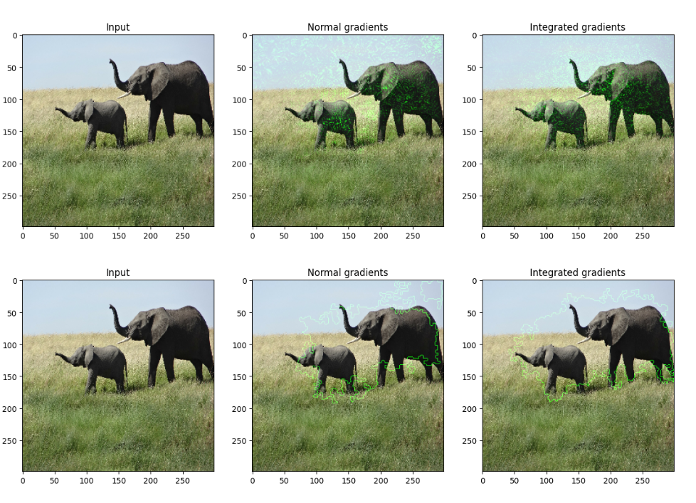
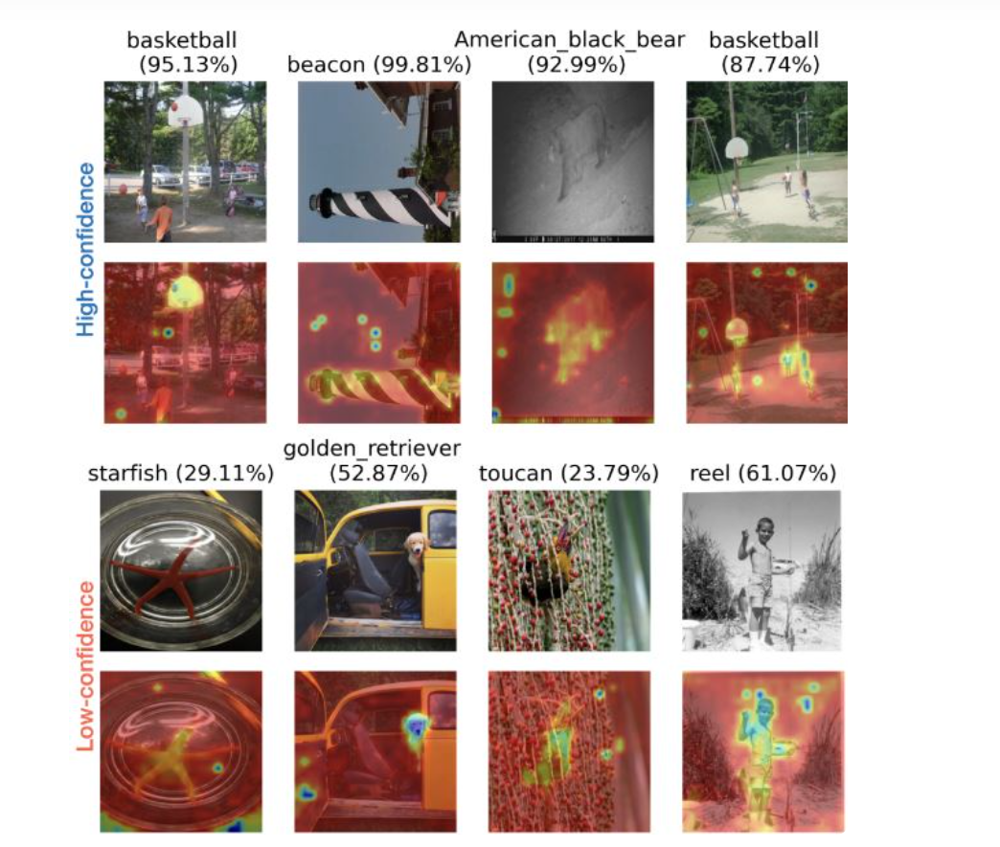

# On the Faithfulness of Vision Transformer Explanations

---
- [x] **Introduction**
 
- [x] **Methodology**
  
- [ ] **Experiments and Results**
  
- [ ] **Conclusion**
- [ ] **References**
- [x] **Contact Information**

---

1. [Introduction](#1-introduction)
   - [Background: Vision Transformers](#11-background-vision-transformers-and-their-rise)
   - [Explainable AI in Vision Transformers](#12-explainable-ai-and-vision-transformers)
   - [Paper Context and Research Problem](#13-paper-context-and-research-problem)
   - [Project Goals](#14-my-goal)
   - [Visuals and Examples](#15-visuals-and-examples)
2. [Methodology](#2-the-method-and-our-interpretation)
   - [The Paper’s Approach](#21-methodology-the-papers-approach)
   - [My Interpretation](#22-our-interpretation-evaluating-saco-and-suggestions-for-improvement)
3. [Experiments and Results](#3-experiments-and-results)
   - [Experimental Setup](#31-experimental-setup)
   - [Results](#32-results)
4. [Conclusion](#4-conclusion)
5. [References](#5-references)
6. [Contact](#6-contact)

---
## 1. Introduction

### 1.1 Background: Vision Transformers and Their Rise
Vision Transformers (ViTs) have emerged as a groundbreaking architecture in deep learning for image classification tasks. Unlike Convolutional Neural Networks, which rely on local fields to understand spatial patterns, ViTs leverage a **self-attention mechanism** to model global relationships across the entire input image. This key difference allows ViTs to
- Understand long-range dependencies between different regions of the image.
- Adapt flexibly to different input scales and structures.
- Achieve superior performance on various vision benchmarks when trained on large datasets.

While ViTs have achieved remarkable success, they are considered "black-box" models due to the complexity of the attention mechanism. Understanding **why** and **how** these models make specific predictions is crucial, particularly for safety-critical applications, such as medical imaging or autonomous driving.

### 1.2 Explainable AI and Vision Transformers
**Explainable AI (XAI)** refers to methods and techniques that make machine learning models more interpretable, ensuring that their decisions are understandable to humans. In the case of ViTs, interpretability is essential for
- Building trust in model predictions.
- Diagnosing model failures.
- Ensuring fairness and transparency in AI systems.

To achieve this, **post-hoc explanation methods** are employed to generate **salience maps** that highlight the most important regions of an input image, showing which parts of the image influenced the model’s decision the most. These methods can be divided into two primary categories such as
1. **Gradient-based methods**: These methods compute salience scores by calculating gradients with respect to the input image. Examples include
   - Integrated Gradients [1]
   - Grad-CAM [2]
   - SmoothGrad [3]
2. **Attention-based methods**: These methods use attention weights from the ViT model to determine the relative importance of different tokens (parts of the image). Examples include:
   - Raw Attention [4]
   - Rollout [5]

While these techniques help explain model predictions, their **faithfulness**—the degree to which the salience map accurately reflects the model's true decision-making process—remains as a challenge.

### 1.3 Paper Context and Research Problem
The paper that introduces the **Salience-Guided Faithfulness Coefficient (SaCo)** addresses the problem of **faithfulness** in post-hoc explanations for ViTs. Specifically, it focuses on the fact that
- Current evaluation metrics, such as those based on cumulative perturbation, fail to properly assess the individual contributions of pixel groups with different salience levels.
- These metrics also overlook the absolute values of salience scores, focusing only on their relative rankings, which can lead to misleading interpretations.

**SaCo** offers a new approach by introducing a pair-wise evaluation of pixel groups based on their salience scores and comparing their impact on the model's predictions. The contributions of the paper include
- Proposing a more accurate and **faithful** method for evaluating post-hoc explanations in ViTs.
- Providing a **robust framework** to assess the true influence of different pixel groups on model predictions, setting a new standard for explainability in ViTs.
- Demonstrating that **existing methods** often fail to distinguish between meaningful explanations and random attributions, highlighting the need for more reliable evaluation techniques.

### 1.4 My Goal
The goal of this project is to
- **Reproduce the SaCo metric** as described in the paper to verify its reproducibility and reliability.
- **Explore its application** across different datasets and model architectures to test its generalizability.

---

## 1.5 Visuals and Examples

### 1.5.1 ViT Architecture Overview
Below is a simplified diagram of the Vision Transformer architecture, showing how the self-attention mechanism processes input image patches to form a global representation.

### 1.5.2 Post-hoc Explanation Methods

#### Gradient-based Explanation Example
This heatmap demonstrates how a **Gradient-based method** (e.g., Integrated Gradients) highlights the regions of an image most relevant to the model's decision.

#### Attention-based Explanation Example
This image shows the salience map generated by using **attention weights** from a ViT model. The map indicates which image tokens (patches) the model paid attention to the most when making a prediction.

### 1.6 Comparison of Explanation Methods

| Method          | Approach           | Strengths                  | Weaknesses                      |
|-----------------|--------------------|----------------------------|----------------------------------|
| Gradient-based  | Uses gradients     | Precise, detailed          | Computationally expensive       |
| Attention-based | Uses attention     | Intuitive for ViTs         | May not always align with true model behavior|

---

## 2. The Method and My Interpretation

### 2.1 Methodology: The Paper's Approach

The Salience-Guided Faithfulness Coefficient (SaCo) is an evaluation metric designed to assess the faithfulness of post-hoc explanations in Vision Transformers (ViTs). Faithfulness means that the degree to which salience scores accurately represent the true influence of input features on a model's predictions. The SaCo methodology involves the following steps

#### **1. Core Idea: Faithfulness Assumption**
- The fundamental assumption of faithfulness is
  - If a pixel group $G_i$ has higher salience scores than $G_j$, it should have a greater impact on the model's confidence.
  - Mathematically $$s(G_i) \geq s(G_j) \implies \nabla_{\text{pred}}(x, G_i) \geq \nabla_{\text{pred}}(x, G_j)$$
    where $s(G_i)$ is the salience score of the group $G_i$, and  $\nabla_{\text{pred}}(x, G_i)$ represents the change in the model's confidence when  $G_i$ is perturbed.

#### **2. Salience Ranking**
- Input pixels are assigned salience scores based on their contribution to the model's prediction.
- These scores are ranked in descending order of importance.

#### **3. Grouping into Subsets**
- Ranked pixels are divided into  $K$ equally sized subsets  $G_1, G_2, ..., G_K$
  - $G_1$: Pixels with the highest salience scores.
  - $G_K$: Pixels with the lowest salience scores.

#### **4. Perturbation**
- To test the influence of each subset, the pixels in $G_i$ are replaced with a neutral value (e.g., the per-sample mean).
- The perturbed image is represented as $R_p(x, G_i)$.

#### **5. Model Response Measurement**
- The impact of the perturbed subset $G_i$ is calculated as the change in the model's confidence
  
  $$\nabla_{\text{pred}}(x, G_i) = p(\hat{y}(x)|x) - p(\hat{y}(x)|R_p(x, G_i))$$
  
  where $p(\hat{y}(x)|x)$ is the model's confidence before perturbation and $p(\hat{y}(x)|R_p(x, G_i))$ is the confidence after perturbation.

#### **6. Faithfulness Testing**
- The faithfulness of the salience map is tested by comparing subsets pairwise
  - For each pair $G_i$ and $G_j$:
    - If $s(G_i) \geq s(G_j)$, then $\nabla_{\text{pred}}(x, G_i) \geq \nabla_{\text{pred}}(x, G_j)$ should hold.
  - Violations of this inequality result in penalties to the faithfulness score.

#### **7. Final Metric: Faithfulness Coefficient**
- The SaCo metric computes a faithfulness coefficient  $F \in [-1, 1]$
  -  $F > 0$ : Indicates that the salience scores align with the model's behavior.
  -  $F < 0$ : Indicates violations of faithfulness.
  - The absolute value $|F|$ measures the degree of alignment.

#### **8. Comparison to Existing Methods**
- Unlike cumulative perturbation-based metrics, SaCo
  - Evaluates pixel subsets individually, providing a more granular assessment.
  - Considers the absolute values of salience scores, not just their relative rankings.

---

### 2.2 My Interpretation: Evaluating SaCo and Some Suggestions for Improvement

The Salience-Guided Faithfulness Coefficient (SaCo) provides a structured and versatile framework for assessing the faithfulness of salience-based explanations in Vision Transformers (ViTs). While SaCo introduces significant advancements, its design also raises important considerations about its assumptions, practical applications, and potential areas for refinement. Below, I try to combine clarifications, strengths, and actionable improvements for SaCo.

---

#### **1. Clarifications and Potential Improvements**

1. **Perturbation Strategy**
   - SaCo relies on perturbing pixel subsets by replacing them with their mean value. While computationally simple, this approach may introduce bias or distort the data distribution. Alternative strategies to improve robustness include:
     - **Gaussian Noise**: Replace pixels with noise sampled from a Gaussian distribution centered on the mean.
     - **Blackout Perturbation**: Mask pixels entirely by setting their values to zero.
     - **Semantic Perturbation**: Replace pixels with semantically similar features extracted from the image to preserve contextual integrity.

2. **Subset Size  $K$**
   - The choice of  $K$, which determines the number of pixel subsets, directly impacts evaluation granularity:
     - Smaller  $K$: Provides coarser evaluations with reduced computational cost.
     - Larger $K$: Enables finer evaluations at the expense of higher computational complexity.
   - Dynamically adjusting $K$ based on the complexity of the salience map or the dataset could strike a balance between computational efficiency and evaluation accuracy.

3. **Cross-layer Aggregation**
   - Salience scores often reflect hierarchical patterns in ViTs. Incorporating attention maps or gradients across multiple layers can provide a more holistic evaluation of the model’s decision-making process. Layer-wise salience aggregation or gradient-weighted attention fusion are promising approaches to extend SaCo’s capabilities.

---

#### **2. Connections to Related Metrics**

1. Inspired by Kendall $\tau$ 
   - SaCo’s pairwise comparisons echo the principles of Kendall  $\tau$, a rank correlation metric. This similarity ensures robustness when assessing the consistency of salience maps across subsets.

2. **Scale Invariance**
   - Unlike traditional metrics like AOPC or AUC, SaCo is inherently invariant to transformations applied to salience scores (e.g., normalization or scaling). This makes it adaptable to a wide range of salience-based methods and preprocessing techniques.

---

#### **3. Key Strengths of SaCo**

1. **Direct Evaluation**
   - SaCo evaluates the true impact of individual pixel subsets on model predictions, avoiding biases introduced by cumulative perturbation.

2. **Noise Sensitivity**
   - SaCo assigns heavier penalties for larger mismatches between salience scores and actual influence, making it highly sensitive to inconsistencies in salience maps.

3. **Broad Applicability**
   - SaCo has proven effective across datasets and models, demonstrating its versatility in evaluating gradient-based and attention-based explanation methods alike.

---

#### **4. Limitations and Practical Considerations**

1. **Granularity vs. Scalability**
   - While SaCo’s granular evaluation provides detailed insights, it comes with significant computational overhead, particularly for high-resolution datasets.

2. **Dependence on Salience Rankings**
   - SaCo assumes that higher-ranked pixels consistently exert greater influence on predictions. This assumption may not hold for models that distribute decision-making across multiple regions or layers.

3. **Neutrality Assumption in Perturbation**
   - Replacing pixels with the mean value is treated as equivalent to "removing" their influence. However, as noted in [9], this approach could distort the input distribution, leading to potential inaccuracies.

---

# 3. Experiments and results

## 3.1. Experimental setup

@TODO: Describe the setup of the original paper and whether you changed any settings.

## 3.2. Running the code

@TODO: Explain your code & directory structure and how other people can run it.

## 3.3. Results

@TODO: Present your results and compare them to the original paper. Please number your figures & tables as if this is a paper.

# 4. Conclusion

@TODO: Discuss the paper in relation to the results in the paper and your results.

# 5. References

1. Sundararajan, M., Taly, A., & Yan, Q. (2017). "Axiomatic Attribution for Deep Networks". Integrated Gradients. [Link](https://arxiv.org/abs/1703.01365)
2. Selvaraju, R. R., et al. (2017). "Grad-CAM: Visual Explanations from Deep Networks". [Link](https://arxiv.org/abs/1610.02391)
3. Smilkov, D., et al. (2017). "SmoothGrad: Removing Noise by Adding Noise". [Link](https://arxiv.org/abs/1706.03825)
4. Hooker, S., et al. (2019). "A Benchmark for Interpretability Methods in Deep Learning". [Link](https://arxiv.org/abs/1806.10758)
5. Doshi-Velez, F., & Kim, B. (2017). "Towards A Rigorous Science of Interpretable Machine Learning". [Link](https://arxiv.org/abs/1702.08608)
6. Ribeiro, M. T., Singh, S., & Guestrin, C. (2016). "Why Should I Trust You?". LIME. [Link](https://arxiv.org/abs/1602.04938)
7. Fong, R. C., & Vedaldi, A. (2017). "Interpretable Explanations of Black Boxes by Meaningful Perturbation". [Link](https://arxiv.org/abs/1704.03296)
8. Jain, S., & Wallace, B. C. (2019). "Attention is not Explanation". [Link](https://arxiv.org/abs/1902.10186)
9. Hooker, S., et al. (2019). "What Do Compressed Deep Neural Networks Forget?". [Link](https://arxiv.org/abs/1911.05248)
10. Lipton, Z. C. (2018). "The Mythos of Model Interpretability". [Link](https://arxiv.org/abs/1606.03490)
11. Vaswani, A., et al. (2017). "Attention is All You Need". [Link](https://arxiv.org/abs/1706.03762)
12. Gilpin, L. H., et al. (2018). "Explaining Explanations: An Approach to Evaluating Interpretability of Machine Learning". [Link](https://arxiv.org/abs/1806.00069)

# Contact

email: kerem.zengin@metu.edu.tr

