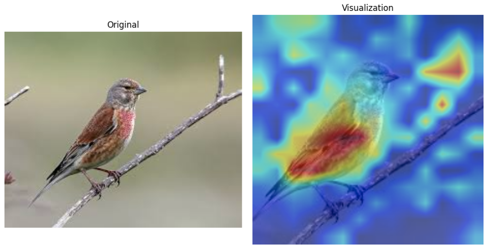
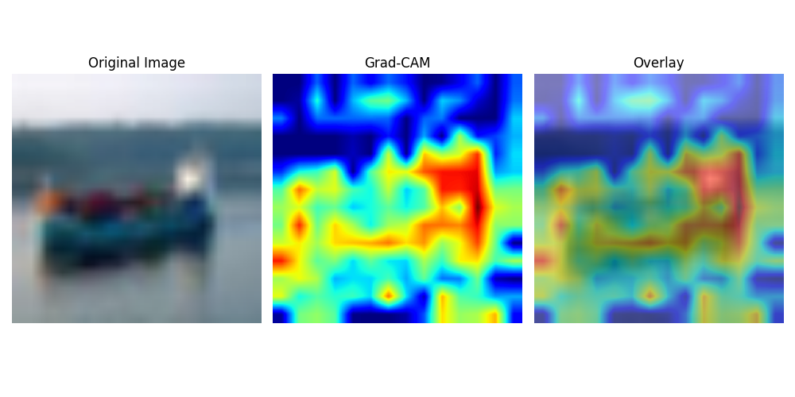

# On the Faithfulness of Vision Transformer Explanations


---
- [x] **Introduction**
 
- [x] **Methodology**
  
- [ ] **Experiments and Results**
  
- [ ] **Conclusion**
- [ ] **References**
- [x] **Contact Information**


---

1. [Introduction](#1-introduction)
   - [Background: Vision Transformers](#11-background-vision-transformers-and-their-rise)
   - [Explainable AI in Vision Transformers](#12-explainable-ai-and-vision-transformers)
   - [Paper Context and Research Problem](#13-paper-context-and-research-problem)
   - [Project Goals](#14-my-goal)
   - [Visuals and Examples](#15-visuals-and-examples)
2. [Methodology](#2-the-method-and-our-interpretation)
   - [The Paper’s Approach](#21-methodology-the-papers-approach)
   - [My Interpretation](#22-our-interpretation-evaluating-saco-and-suggestions-for-improvement)
3. [Experiments and Results](#3-experiments-and-results)
   - [Experimental Setup](#31-experimental-setup)
   - [Results](#32-results)
4. [Conclusion](#4-conclusion)
5. [References](#5-references)
6. [Contact](#6-contact)

---
## 1. Introduction

### 1.1 Background: Vision Transformers and Their Rise
Vision Transformers (ViTs) have emerged as a groundbreaking architecture in deep learning for image classification tasks. Unlike Convolutional Neural Networks, which rely on local fields to understand spatial patterns, ViTs leverage a **self-attention mechanism** to model global relationships across the entire input image. This key difference allows ViTs to
- Understand long-range dependencies between different regions of the image.
- Adapt flexibly to different input scales and structures.
- Achieve superior performance on various vision benchmarks when trained on large datasets.

While ViTs have achieved remarkable success, they are considered "black-box" models due to the complexity of the attention mechanism. Understanding **why** and **how** these models make specific predictions is crucial, particularly for safety-critical applications, such as medical imaging or autonomous driving.

### 1.2 Explainable AI and Vision Transformers
**Explainable AI (XAI)** refers to methods and techniques that make machine learning models more interpretable, ensuring that their decisions are understandable to humans. In the case of ViTs, interpretability is essential for
- Building trust in model predictions.
- Diagnosing model failures.
- Ensuring fairness and transparency in AI systems.

To achieve this, **post-hoc explanation methods** are employed to generate **salience maps** that highlight the most important regions of an input image, showing which parts of the image influenced the model’s decision the most. These methods can be divided into two primary categories such as
1. **Gradient-based methods**: These methods compute salience scores by calculating gradients with respect to the input image. Examples include
   - Integrated Gradients [1]
   - Grad-CAM [2]
   - SmoothGrad [3]
2. **Attention-based methods**: These methods use attention weights from the ViT model to determine the relative importance of different tokens (parts of the image). Examples include:
   - Raw Attention [4]
   - Rollout [5]
 3. **Attribution-Based Methods**
Attribution-based methods focus on modifying the input and observing the model’s response to determine the importance of specific regions. These methods directly evaluate the contribution of different parts of the image by perturbing them.


While these techniques help explain model predictions, their **faithfulness**—the degree to which the salience map accurately reflects the model's true decision-making process—remains as a challenge.

### 1.3 Paper Context and Research Problem
The paper that introduces the **Salience-Guided Faithfulness Coefficient (SaCo)** addresses the problem of **faithfulness** in post-hoc explanations for ViTs. Specifically, it focuses on the fact that
- Current evaluation metrics, such as those based on cumulative perturbation, fail to properly assess the individual contributions of pixel groups with different salience levels.
- These metrics also overlook the absolute values of salience scores, focusing only on their relative rankings, which can lead to misleading interpretations.

**SaCo** offers a new approach by introducing a pair-wise evaluation of pixel groups based on their salience scores and comparing their impact on the model's predictions. The contributions of the paper include
- Proposing a more accurate and **faithful** method for evaluating post-hoc explanations in ViTs.
- Providing a **robust framework** to assess the true influence of different pixel groups on model predictions, setting a new standard for explainability in ViTs.
- Demonstrating that **existing methods** often fail to distinguish between meaningful explanations and random attributions, highlighting the need for more reliable evaluation techniques.

### 1.4 My Goal
The goal of this project is to
- **Reproduce the SaCo metric** as described in the paper to verify its reproducibility and reliability.
- **Explore its application** across different datasets and model architectures to test its generalizability.


---

## 1.5 Visuals and Examples

### 1.5.1 ViT Architecture Overview
Below is a simplified diagram of the Vision Transformer architecture, showing how the self-attention mechanism processes input image patches to form a global representation.


### 1.5.2 Post-hoc Explanation Methods

#### Gradient-based Explanation Example
This heatmap demonstrates how a **Gradient-based method** (e.g., Integrated Gradients) highlights the regions of an image most relevant to the model's decision.


#### Attention-based Explanation Example
This image shows the salience map generated by using **attention weights** from a ViT model. The map indicates which image tokens (patches) the model paid attention to the most when making a prediction.


### 1.6 Comparison of Explanation Methods

| Method            | Approach               | Strengths                           | Weaknesses                                |
|-------------------|------------------------|-------------------------------------|------------------------------------------|
| Gradient-based    | Uses gradients         | Precise, detailed                  | Computationally expensive                |
| Attention-based   | Uses attention         | Intuitive for ViTs                 | May not always align with true model behavior |
| Attribution-based | Modifies input regions | Directly evaluates feature impact  | May introduce artifacts with perturbations |

---


## 2. The Method and My Interpretation

### 2.1 Methodology: The Paper's Approach

The Salience-Guided Faithfulness Coefficient (SaCo) is an evaluation metric designed to assess the faithfulness of post-hoc explanations in Vision Transformers (ViTs). Faithfulness means that the degree to which salience scores accurately represent the true influence of input features on a model's predictions. The SaCo methodology involves the following steps

#### **1. Core Idea: Faithfulness Assumption**
- The fundamental assumption of faithfulness is
  - If a pixel group $G_i$ has higher salience scores than $G_j$, it should have a greater impact on the model's confidence.
  - Mathematically $$s(G_i) \geq s(G_j) \implies \nabla_{\text{pred}}(x, G_i) \geq \nabla_{\text{pred}}(x, G_j)$$
    where $s(G_i)$ is the salience score of the group $G_i$, and  $\nabla_{\text{pred}}(x, G_i)$ represents the change in the model's confidence when  $G_i$ is perturbed.

#### **2. Salience Ranking**
- Input pixels are assigned salience scores based on their contribution to the model's prediction.
- These scores are ranked in descending order of importance.

#### **3. Grouping into Subsets**
- Ranked pixels are divided into  $K$ equally sized subsets  $G_1, G_2, ..., G_K$
  - $G_1$: Pixels with the highest salience scores.
  - $G_K$: Pixels with the lowest salience scores.

#### **4. Perturbation**
- To test the influence of each subset, the pixels in $G_i$ are replaced with a neutral value (e.g., the per-sample mean).
- The perturbed image is represented as $R_p(x, G_i)$.

#### **5. Model Response Measurement**
- The impact of the perturbed subset $G_i$ is calculated as the change in the model's confidence
  
  $$\nabla_{\text{pred}}(x, G_i) = p(\hat{y}(x)|x) - p(\hat{y}(x)|R_p(x, G_i))$$
  
  where $p(\hat{y}(x)|x)$ is the model's confidence before perturbation and $p(\hat{y}(x)|R_p(x, G_i))$ is the confidence after perturbation.

#### **6. Faithfulness Testing**
- The faithfulness of the salience map is tested by comparing subsets pairwise
  - For each pair $G_i$ and $G_j$:
    - If $s(G_i) \geq s(G_j)$, then $\nabla_{\text{pred}}(x, G_i) \geq \nabla_{\text{pred}}(x, G_j)$ should hold.
  - Violations of this inequality result in penalties to the faithfulness score.

#### **7. Final Metric: Faithfulness Coefficient**
- The SaCo metric computes a faithfulness coefficient  $F \in [-1, 1]$
  -  $F > 0$ : Indicates that the salience scores align with the model's behavior.
  -  $F < 0$ : Indicates violations of faithfulness.
  - The absolute value $|F|$ measures the degree of alignment.

#### **8. Comparison to Existing Methods**
- Unlike cumulative perturbation-based metrics, SaCo
  - Evaluates pixel subsets individually, providing a more granular assessment.
  - Considers the absolute values of salience scores, not just their relative rankings.

---

### 2.2 My Interpretation: Evaluating SaCo and Some Suggestions for Improvement

The Salience-Guided Faithfulness Coefficient (SaCo) provides a structured and versatile framework for assessing the faithfulness of salience-based explanations in Vision Transformers (ViTs). While SaCo introduces significant advancements, its design also raises important considerations about its assumptions, practical applications, and potential areas for refinement. Below, I try to combine clarifications, strengths, and actionable improvements for SaCo.

---

#### **1. Clarifications and Potential Improvements**

1. **Perturbation Strategy**
   - SaCo relies on perturbing pixel subsets by replacing them with their mean value. While computationally simple, this approach may introduce bias or distort the data distribution. Alternative strategies to improve robustness include:
     - **Gaussian Noise**: Replace pixels with noise sampled from a Gaussian distribution centered on the mean.
     - **Blackout Perturbation**: Mask pixels entirely by setting their values to zero.
     - **Semantic Perturbation**: Replace pixels with semantically similar features extracted from the image to preserve contextual integrity.

2. **Subset Size  $K$**
   - The choice of  $K$, which determines the number of pixel subsets, directly impacts evaluation granularity:
     - Smaller  $K$: Provides coarser evaluations with reduced computational cost.
     - Larger $K$: Enables finer evaluations at the expense of higher computational complexity.
   - Dynamically adjusting $K$ based on the complexity of the salience map or the dataset could strike a balance between computational efficiency and evaluation accuracy.

3. **Cross-layer Aggregation**
   - Salience scores often reflect hierarchical patterns in ViTs. Incorporating attention maps or gradients across multiple layers can provide a more holistic evaluation of the model’s decision-making process. Layer-wise salience aggregation or gradient-weighted attention fusion are promising approaches to extend SaCo’s capabilities.

---

#### **2. Connections to Related Metrics**

1. Inspired by Kendall $\tau$ 
   - SaCo’s pairwise comparisons echo the principles of Kendall  $\tau$, a rank correlation metric. This similarity ensures robustness when assessing the consistency of salience maps across subsets.

2. **Scale Invariance**
   - Unlike traditional metrics like AOPC or AUC, SaCo is inherently invariant to transformations applied to salience scores (e.g., normalization or scaling). This makes it adaptable to a wide range of salience-based methods and preprocessing techniques.

---

#### **3. Key Strengths of SaCo**

1. **Direct Evaluation**
   - SaCo evaluates the true impact of individual pixel subsets on model predictions, avoiding biases introduced by cumulative perturbation.

2. **Noise Sensitivity**
   - SaCo assigns heavier penalties for larger mismatches between salience scores and actual influence, making it highly sensitive to inconsistencies in salience maps.

3. **Broad Applicability**
   - SaCo has proven effective across datasets and models, demonstrating its versatility in evaluating gradient-based and attention-based explanation methods alike.

---


### 3. Experiments and Results

#### 3.1 Experimental Setup

The experimental setup in this project is designed to align closely with the methodology described in the original paper, with necessary adaptations for computational feasibility.

---

##### **Paper's Experimental Setup**
The original paper evaluates the faithfulness of post-hoc explanation methods for Vision Transformers using their proposed **Salience-guided Faithfulness Coefficient (SaCo)** alongside several established metrics. The details of the setup are as follows:

1. **Datasets**:
   - **CIFAR-10**: 60,000 images (32x32 resolution), 10 classes.
   - **CIFAR-100**: 60,000 images (32x32 resolution), 100 classes.
   - **ImageNet (ILSVRC 2012)**: High-resolution images (224x224 resolution), 1,000 classes.
   - Images in all datasets are resized to **224x224** to match the input requirements of Vision Transformers.

2. **Models**:
   - The paper experiments with three widely used Vision Transformer models:
     - **ViT-B**: Vision Transformer Base with 16x16 patches.
     - **ViT-L**: Vision Transformer Large with 16x16 patches.
     - **DeiT-B**: Data-efficient Image Transformer Base with 16x16 patches.
   - The models tokenize the input images into patches and add a special classification token (`[CLS]`) for prediction.

3. **Explanation Methods**:
   The paper investigates 10 post-hoc explanation methods across three categories:
   - **Gradient-Based Methods**:
     - Integrated Gradients
     - Grad-CAM
   - **Attention-Based Methods**:
     - Raw Attention
     - Rollout
     - Transformer-MM
     - ATTCAT
   - **Attribution-Based Methods**:
     - Layer-wise Relevance Propagation (LRP)
     - Partial LRP
     - Conservative LRP
     - Transformer Attribution

4. **Evaluation Metrics**:
   The following metrics are used to evaluate the faithfulness of explanation methods:
   - **Salience-guided Faithfulness Coefficient (SaCo)**: Measures the alignment of salience scores with the actual influence of input regions.
   - **Area Under the Curve (AUC)**: Measures the degradation in model accuracy as high-salience pixels are progressively perturbed. Lower AUC indicates a better explanation.
   - **Area Over the Perturbation Curve (AOPC)**: Quantifies the variation in output probabilities when perturbing high-salience regions. Higher AOPC indicates a better explanation.
   - **Log Odds (LOdds)**: Evaluates whether high-salience regions sustain predictions. Lower LOdds indicates better explanations.
   - **Comprehensiveness**: Assesses whether low-salience regions are dispensable for predictions. Lower comprehensiveness indicates better explanations.

5. **Perturbation Setup**:
   - Images are divided into 10 subsets of pixels, ordered by salience scores.
   - Systematic perturbations are applied to these subsets to measure the impact on predictions.

---

##### **Progress Up to Now**

1. **Datasets**:
   - **CIFAR-10** and **CIFAR-100** datasets have been used as alternatives to ImageNet for computational efficiency.
   - Images were resized to **224x224**.
   - Fine-tune and evaluation splits were created, and indices saved for reproducibility.

2. **Models**:
   - Pretrained Vision Transformers (ViT-B-16, ViT-L-16, and DeiT-B) have been fine-tuned on CIFAR-10 and CIFAR-100 datasets.
   - Fine-tuned models are saved in the `models` directory for evaluation.

3. **Explanation Methods**:
   The following explanation methods have been implemented:
   - **Gradient-Based Methods**:
     - **Grad-CAM**: Salience maps generated and saved for evaluation images.
     - **Integrated Gradients**: Salience maps generated and saved for evaluation images.
   - **Attention-Based Methods**:
     - **Raw Attention**: Implemented; salience maps generated and saved.
   - **Attribution-Based Methods**:
     - **Transformer Attribution**: Fully implemented; salience maps generated and saved.

4. **Evaluation Metrics**:
   All metrics from the original paper have been implemented but not yet calculated:
   - **AUC**: Implemented.
   - **AOPC**: Implemented.
   - **Log Odds (LOdds)**: Implemented.
   - **Comprehensiveness**: Implemented.
   - **SaCo**: Implemented.
   - Salience scores for all methods are yet to be computed for metric evaluation.

5. **Outputs Generated**:
   - Salience maps for Grad-CAM, Integrated Gradients, Transformer Attribution, and Raw Attention are stored in `results/salience_maps`.
   - Predictions for evaluation images are saved in `results/predictions`.

---

##### **Next Steps**
1. Compute salience scores for all explanation methods.
2. Evaluate explanation methods using the metrics (AUC, AOPC, LOdds, Comprehensiveness, and SaCo).
3. Compare results with the original paper and report on faithfulness and comprehensiveness of explanations.

---
### 3.2 Running the Code

This repository is organized as follows

```plaintext
assets/                        
data/                          
├── dataloaders.py            
├── process_dataset.py        
experiments/                               
explanation_methods/           
├── __init__.py                
├── gradcam.py                 # Grad-CAM implementation
├── integrated_gradients.py    # Integrated Gradients implementation
├── raw_attention.py           # Raw Attention implementation
├── transformer_attribution.py # Transformer Attribution implementation
metrics/                       
├── aopc.py                   
├── comprehensiveness.py       
├── log_odds.py                
├── robustness.py              
├── saCo.py                    # Proposed SaCo metric
├── sufficiency.py             
models/                      
├── __init__.py                
├── deit_b.py                 
├── vit_b.py                   
├── vit_l.py                   
notebooks/                    
results/                       
├── predictions/               
├── salience_maps/             # Salience maps generated by explanation methods
├── salience_scores/           # Salience score calculations
│   ├── gradcam/               # Grad-CAM salience scores
│   ├── raw_attention/         # Raw Attention salience scores
│   ├── transformer_attribution/ # Transformer Attribution salience scores
├── perturbation_analysis/     # Perturbation-based evaluation results
│   ├── gradcam/               # Perturbation analysis for Grad-CAM
│   ├── raw_attention/         # Perturbation analysis for Raw Attention
│   ├── transformer_attribution/ # Perturbation analysis for Transformer Attribution
config.yaml                    # Configuration file for the project
readme.md                      
```


## 3.3. Results

### 3.3.1. Visualization of Explanation Methods
I present the visualizations generated by the explanation methods for various test images. These include **Transformer Attribution**, **Grad-CAM**, and **Integrated Gradients**.

#### Example 1: Transformer Attribution

- **Description**: Highlights key regions attended by the Vision Transformer using token-level importance weights.
- **Observation**: The explanation aligns with the discriminative regions of the object in the image, such as the bird's body.

#### Example 2: Grad-CAM

- **Description**: Heatmaps generated using Grad-CAM show regions most influential for the model's decision.
- **Observation**: The focus of the salience map aligns with the salient regions, such as the ship in the image.

#### Example 3: Perturbed Salience Map

- **Description**: Salience maps with perturbations illustrate how the model's predictions change as important regions are removed.
- **Observation**: The predictions weaken when the most influential regions are perturbed.

### 3.3.2. Quantitative Metrics
We evaluate the reliability of explanation methods using the following metrics:
1. **AUC** (Area Under the Curve) ↓: Lower values indicate better explanations.
2. **AOPC** (Area Over Perturbation Curve) ↑: Higher values indicate better alignment with predictions.
3. **Log-Odds** (LOdds) ↓: Measures the importance of salient regions for sustaining predictions.
4. **Comprehensiveness** (Comp.) ↓: Evaluates the necessity of low-salience regions.

### Salience-guided Faithfulness Coefficient (SaCo)


#### Algorithm:


**Input:** Pre-trained model Φ, explanation method ℰ, input image x  
**Output:** Faithfulness coefficient F

1. **Initialization:**
   - F ← 0
   - totalWeight ← 0

2. Compute the salience map M(x, ŷ) based on Φ, ℰ, and x

3. Generate G_i and obtain corresponding s(G_i) and ∇pred(x, G_i), for i = 1, 2, ..., K

4. **for** i = 1 to K − 1 **do**
   - **for** j = i + 1 to K **do**
     - **if** ∇pred(x, G_i) ≥ ∇pred(x, G_j) **then**
       - weight ← s(G_i) − s(G_j)
     - **else**
       - weight ← −(s(G_i) − s(G_j))
     - **end if**
     - F ← F + weight
     - totalWeight ← totalWeight + |weight|
   - **end for**
- **end for**

5. F ← F/totalWeight

6. **Return** F

#### Example: Salience Scores for CIFAR-10 (Class: Ship)
```json
{
    "image_index": 0,
    "class_names": ["airplane", "automobile", "bird", "cat", "deer", "dog", "frog", "horse", "ship", "truck"],
    "original_class": "ship",
    "predicted_class": "ship",
    "salience_scores": [3982.85, 2890.86, 2315.02, 1876.66, 1507.57, 1203.62, 946.34, 653.51, 360.68, 84.09, 0.0],
    "confidence_changes": [0.40, 0.36, 0.18, 0.03, 0.20, 0.16, 0.12, 0.47, 0.51, 0.003, -0.005]
}
```
# 4. Conclusion

@TODO: Discuss the paper in relation to the results in the paper and your results.

# 5. References

1. Sundararajan, M., Taly, A., & Yan, Q. (2017). "Axiomatic Attribution for Deep Networks". Integrated Gradients. [Link](https://arxiv.org/abs/1703.01365)
2. Selvaraju, R. R., et al. (2017). "Grad-CAM: Visual Explanations from Deep Networks". [Link](https://arxiv.org/abs/1610.02391)
3. Smilkov, D., et al. (2017). "SmoothGrad: Removing Noise by Adding Noise". [Link](https://arxiv.org/abs/1706.03825)
4. Hooker, S., et al. (2019). "A Benchmark for Interpretability Methods in Deep Learning". [Link](https://arxiv.org/abs/1806.10758)
5. Doshi-Velez, F., & Kim, B. (2017). "Towards A Rigorous Science of Interpretable Machine Learning". [Link](https://arxiv.org/abs/1702.08608)
6. Ribeiro, M. T., Singh, S., & Guestrin, C. (2016). "Why Should I Trust You?". LIME. [Link](https://arxiv.org/abs/1602.04938)
7. Fong, R. C., & Vedaldi, A. (2017). "Interpretable Explanations of Black Boxes by Meaningful Perturbation". [Link](https://arxiv.org/abs/1704.03296)
8. Jain, S., & Wallace, B. C. (2019). "Attention is not Explanation". [Link](https://arxiv.org/abs/1902.10186)
9. Hooker, S., et al. (2019). "What Do Compressed Deep Neural Networks Forget?". [Link](https://arxiv.org/abs/1911.05248)
10. Lipton, Z. C. (2018). "The Mythos of Model Interpretability". [Link](https://arxiv.org/abs/1606.03490)
11. Vaswani, A., et al. (2017). "Attention is All You Need". [Link](https://arxiv.org/abs/1706.03762)
12. Gilpin, L. H., et al. (2018). "Explaining Explanations: An Approach to Evaluating Interpretability of Machine Learning". [Link](https://arxiv.org/abs/1806.00069)

# Contact

email: kerem.zengin@metu.edu.tr

